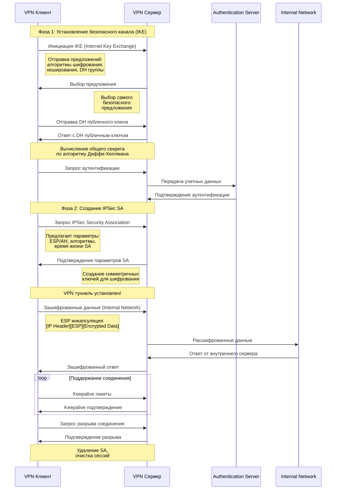
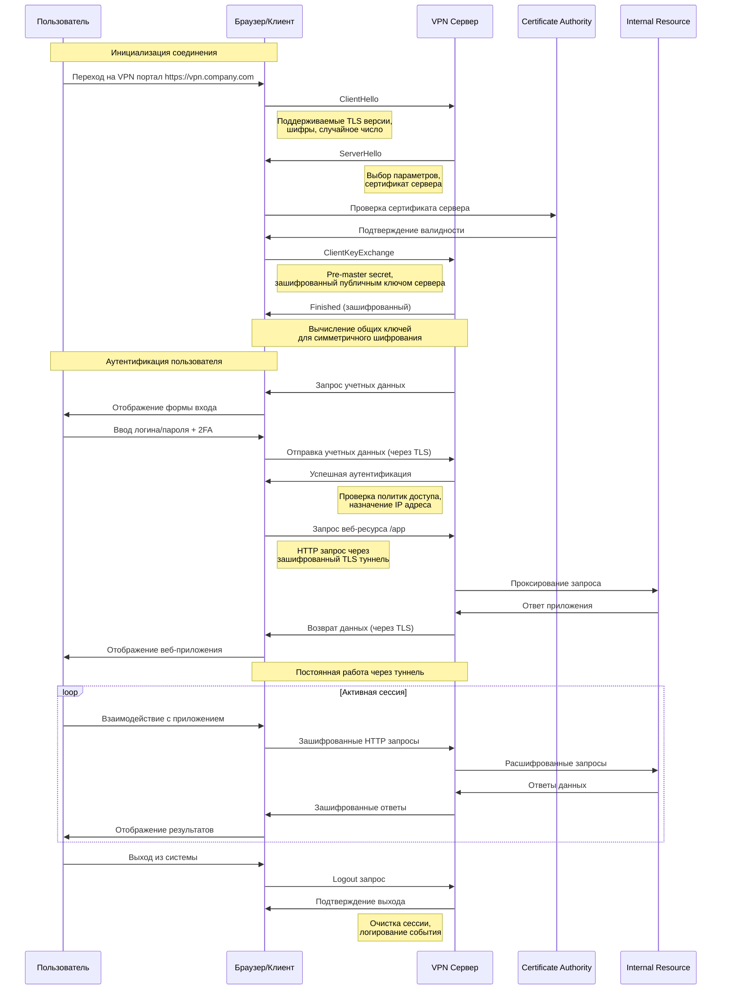
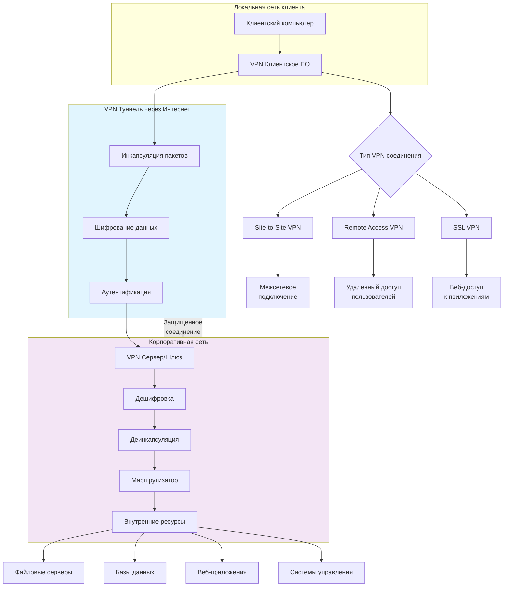
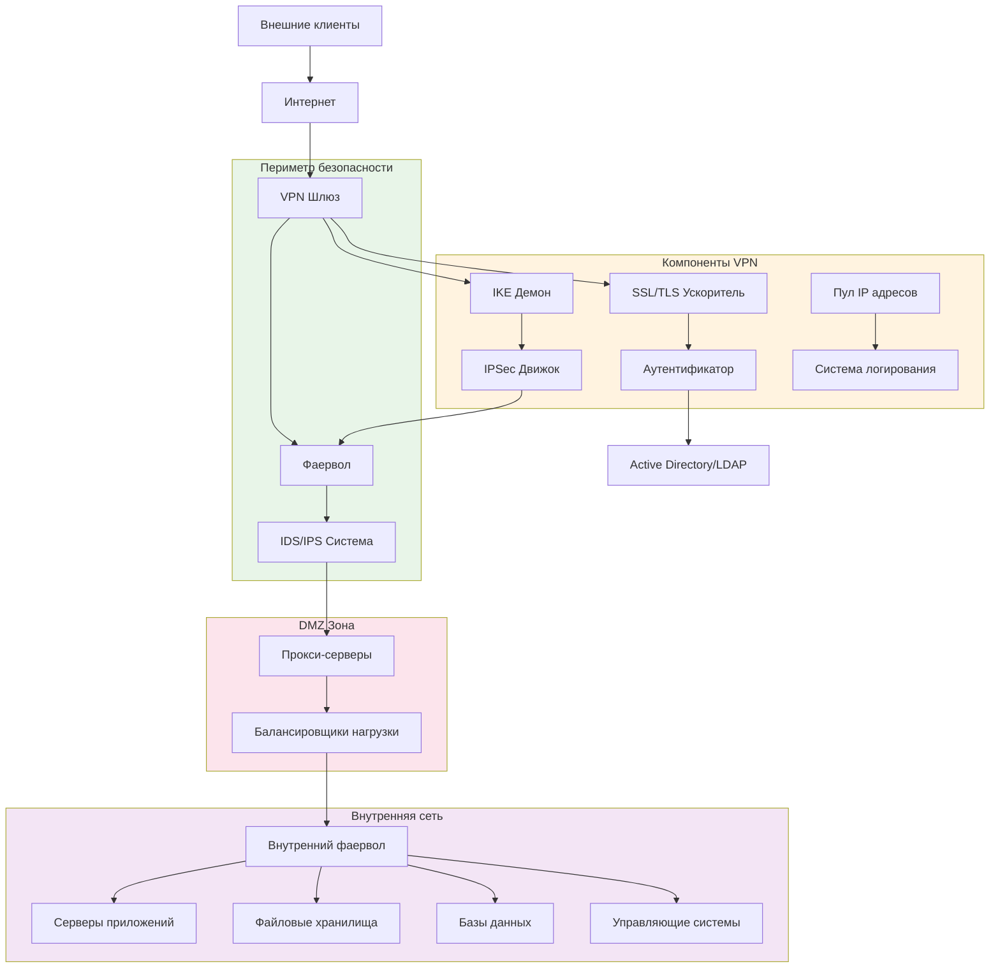

---

## **🔒 ДИАГРАММА ПОСЛЕДОВАТЕЛЬНОСТЕЙ РАБОТЫ VPN СЕРВЕРА**

### **1. Процесс установления VPN соединения (IPSec)**

---

### **2. Процесс работы SSL/TLS VPN (современный подход)**

---

### **3. Диаграмма туннелирования трафика через VPN**

---

### **4. Компоненты VPN архитектуры**

---

## **🎯 КЛЮЧЕВЫЕ ЭТАПЫ РАБОТЫ VPN СЕРВЕРА:**

### **1. Установление соединения:**
- **Negotiation** - согласование параметров безопасности
- **Authentication** - взаимная аутентификация сторон
- **Key Exchange** - обмен криптографическими ключами

### **2. Туннелирование трафика:**
- **Encapsulation** - упаковка пакетов в VPN заголовки
- **Encryption** - шифрование данных
- **Transmission** - передача через интернет

### **3. Обработка на стороне сервера:**
- **Decryption** - расшифровка данных
- **Decapsulation** - распаковка оригинальных пакетов
- **Routing** - маршрутизация во внутреннюю сеть

### **4. Управление сессией:**
- **Keepalive** - поддержание соединения
- **Rekeying** - периодическая смена ключей
- **Termination** - корректное завершение сессии

Эти диаграммы показывают комплексный процесс работы VPN сервера от установления безопасного соединения до передачи данных между клиентом и внутренними ресурсами организации! 🔐