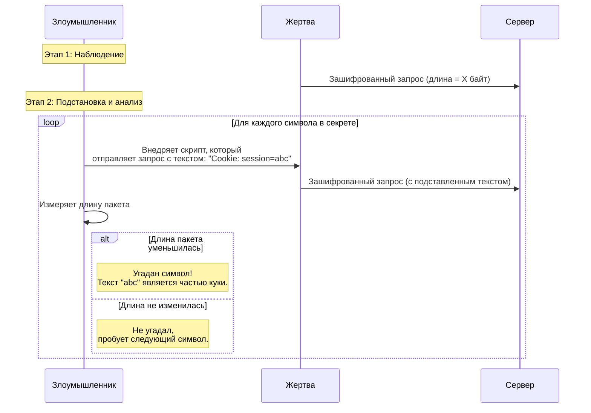
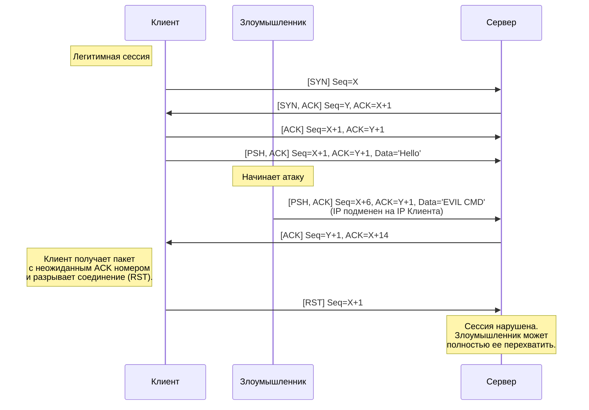
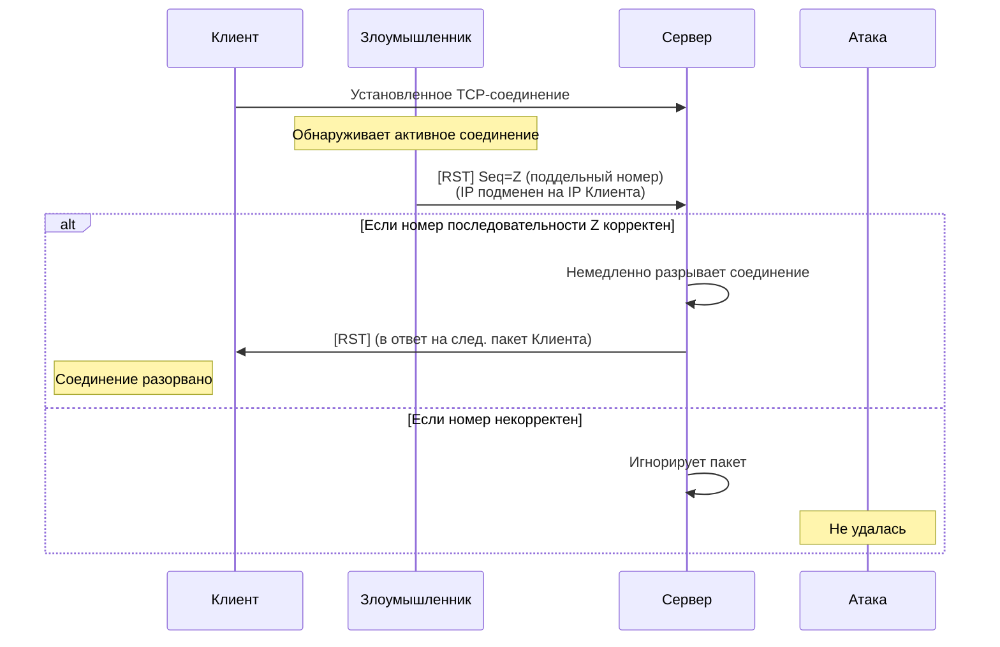
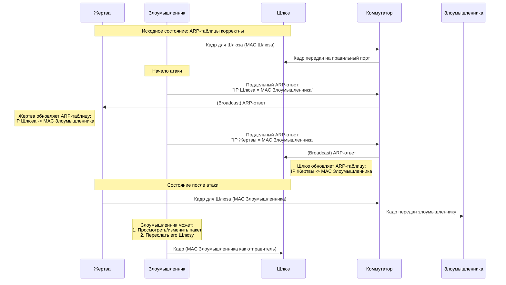

---

### 611. Атака CRIME (Compression Ratio Info-leak Made Easy)

**Объяснение:**
CRIME — это атака, которая использует уязвимости в механизмах сжатия данных (таких как DEFLATE, используемый в TLS/SSL и SPDY) для кражи конфиденциальной информации, например, куки аутентификации или токенов CSRF.

**Механизм атаки:**
1.  Злоумышленник может наблюдать за зашифрованным трафиком жертвы (например, находясь в одной сети).
2.  Он заставляет браузер жертвы отправлять множество запросов, в которые он подставляет предполагаемый секретный текст (например, `Cookie: session=abc123`).
3.  Если сжатие включено, и секретный текст совпадает с частью данных в запросе, общий размер сжатых данных будет меньше.
4.  Анализируя длину зашифрованных пакетов, злоумышленник может пошагово угадать содержимое секрета.

**Диаграмма последовательности CRIME:**

**Меры противодействия:**
*   **Отключить сжатие TLS** на сервере.
*   Использовать современные протоколы, такие как HTTP/2 и TLS 1.3, которые были разработаны с учетом уязвимостей типа CRIME.

---

### 612. Атака Forbidden

**Объяснение:**
Строго говоря, "Forbidden" — это не конкретная атака, а HTTP-статус ответа `403 Forbidden`, который сервер возвращает, когда доступ к ресурсу запрещен. Однако в контексте пентеста или поиска уязвимостей "атакой Forbidden" могут называть попытку обойти механизмы авторизации для доступа к ресурсам, которые должны возвращать статус 403.

**Механизм "атаки":**
1.  Злоумышленник, имея учетную запись с низкими привилегиями, пытается получить доступ к ресурсам, предназначенным для администраторов или других пользователей (например, прямая ссылка на чужой профиль `/admin/panel` или `/users/123/edit`).
2.  Если система неправильно проверяет права доступа на стороне сервера (т.н. "Broken Access Control"), вместо кода 403 злоумышленник может получить доступ к данным или функционалу.

**Меры противодействия:**
*   Строгая проверка прав доступа **на стороне сервера** для каждого запроса.
*   Принцип минимальных привилегий.
*   Регулярный аудит кода и пентест систем авторизации.

---

### 613. Перехват на сетевом уровне

**Объяснение:**
Это общее понятие, обозначающее перехват сетевых пакетов по мере их передачи через сетевые устройства (коммутаторы, маршрутизаторы). Это основа для многих других атак.

**Механизм атаки:**
*   Использование программ-снифферов (например, Wireshark, tcpdump) для прослушивания сетевого интерфейса.
*   Если сеть построена на хабах (концентраторах), весь трафик широковещательный, и его может прослушать любой узел в сегменте сети.
*   В современных сетях на коммутаторах для этого требуются специальные техники, такие как ARP Spoofing (см. ниже) или наводнение MAC-таблицы.

**Меры противодействия:**
*   **Шифрование трафика:** HTTPS, SSH, VPN. Это делает перехваченные данные бесполезными без ключа дешифрования.
*   Сегментация сети (VLAN).
*   Использование защищенных протоколов, таких как ARP с динамической защитой (DAI) на коммутаторах.

---

### 614. Перехват TCP/IP (TCP Session Hijacking)

**Объяснение:**
Атака, при которой злоумышленник "вмешивается" в установленное TCP-соединение между двумя узлами, чтобы перехватить его и выдать себя за одного из участников.

**Механизм атаки:**
1.  Злоумышленник отслеживает трафик между Клиентом и Сервером, чтобы узнать номера последовательности (Sequence Numbers) и подтверждения (ACK) пакетов.
2.  Используя эти данные, он отправляет на Сервер поддельный TCP-пакет с IP-адресом Клиента и правильным номером последовательности.
3.  Сервер, получив пакет с ожидаемым номером последовательности, принимает его и отправляет ответ. Если злоумышленник правильно предсказал номер, он может "перехватить" сессию и начать отправлять данные от имени Клиента.

**Диаграмма последовательности Перехвата TCP/IP:**

**Меры противодействия:**
*   Использование **шифрования на транспортном или прикладном уровне** (TLS, SSH). Это основная мера.
*   Сложные, случайные начальные номера последовательностей (ISN) в TCP-стеке операционных систем.

---

### 615. IP спуфинг (IP Spoofing)

**Объяснение:**
Создание IP-пакетов с поддельным исходным IP-адресом с целью сокрытия идентификации отправителя или имитации другого компьютера.

**Механизм атаки:**
Злоумышленник вручную создает пакет, в поле "Source IP Address" которого указывает адрес жертвы, а не свой собственный. Это используется как компонент для других атак:
*   **Атаки типа "отказ в обслуживании" (DoS):** чтобы скрыть источник атаки или чтобы ответы от сервера шли на IP-адрес жертвы, усиливая атаку.
*   **Обход контроля доступа по IP.**

**Меры противодействия:**
*   **Входная фильтрация (Ingress Filtering)** на маршрутизаторах провайдеров: отбрасывание пакетов, поступающих из внешней сети, с исходным IP, принадлежащим внутренней сети.
*   **Выходная фильтрация (Egress Filtering):** отбрасывание пакетов, исходящих из внутренней сети, с исходным IP, не принадлежащим этой сети.
*   Использование IPsec.

---

### 616. Подделка RST (RST Injection / TCP Reset Attack)

**Объяснение:**
Атака, при которой злоумышленник отправляет поддельный пакет с флагом RST (reset) для принудительного разрыва установленного TCP-соединения.

**Механизм атаки:**
1.  Злоумышленник наблюдает за соединением между Клиентом и Сервером.
2.  Он создает пакет с флагом RST, правильными номерами последовательности и IP-адресом одного из участников.
3.  Получив такой пакет, узел считает, что его корреспондент разорвал соединение, и закрывает свою сторону сессии.

**Диаграмма последовательности Подделки RST:**

**Меры противодействия:**
*   Шифрование (TLS) защищает от наблюдения за номерами последовательностей.
*   Использование более сложных и случайных ISN делает предсказание номера сложным.

---

### 617. Перехват вслепую (Blind Hijacking)

**Объяснение:**
Разновидность перехвата сессии, когда злоумышленник не может видеть трафик между жертвами (например, он находится в другой сети), но может отправлять им поддельные пакеты.

**Механизм атаки:**
Злоумышленник отправляет пакеты с предсказанными или угаданными номерами последовательностей. Если ему это удается, он может внедрить свои команды в сессию, не видя ответов. Это сложнее, чем классический перехват, так как требует точного угадывания номеров последовательностей.

**Меры противодействия:**
*   Все те же, что и для перехвата TCP/IP: шифрование и надежные ISN.

---

### 618. Перехват UDP (UDP Session Hijacking)

**Объяснение:**
Аналогичен перехвату TCP, но проще, поскольку UDP — это протокол без установления соединения и без состояний. В нем нет номеров последовательности.

**Механизм атаки:**
1.  Злоумышленник наблюдает за UDP-трафиком (например, DNS, VoIP).
2.  Он просто отправляет поддельный UDP-пакет на сервер, используя IP-адрес и порт жертвы, до того как жертва отправит свой следующий пакет.
3.  Сервер принимает пакет злоумышленника как легитимный и обрабатывает его.

**Меры противодействия:**
*   Шифрование UDP-трафика (например, с помощью DTLS, VPN).
*   Использование механизмов аутентификации на прикладном уровне.

---

### 619. Подделка ICMP

**Объяснение:**
Использование протокола ICMP (например, для ping или сообщений об ошибках) для проведения атак.

**Механизм атаки:**
*   **ICMP Redirect:** отправка поддельного сообщения "ICMP Redirect", чтобы заставить жертву использовать маршрутизатор злоумышленника для определенного трафика.
*   **Smurf-атака:** отправка ping-запросов на широковещательный адрес сети с подменой IP-адреса отправителя на адрес жертвы. Все хочи в сети отвечают жертве, вызывая DoS.
*   **Ping of Death:** отправка фрагментированного ping-пакета, который после сборки превышает максимальный размер, что приводит к сбою системы.

**Меры противодействия:**
*   Фильтрация входящих ICMP-пакетов на маршрутизаторе.
*   Отключение обработки ICMP-редиректов на хостах.
*   Запрет ответа на широковещательные ping-запросы.

---

### 620. ARP спуфинг (ARP Poisoning)

**Объяснение:**
Это ключевая атака для перехвата трафика в локальной сети (LAN). Она позволяет связать MAC-адрес злоумышленника с IP-адресом другого узла (например, шлюза по умолчанию).

**Механизм атаки:**
1.  В локальной сети коммутатор отправляет кадры на порт, соответствующий MAC-адресу получателя.
2.  Злоумышленник рассылает поддельные ARP-ответы (без ARP-запроса), объявляя: "IP-адрес шлюза (192.168.1.1) имеет MAC-адрес AA:BB:CC:DD:EE:FF" (где это MAC злоумышленника).
3.  Жертва обновляет свою ARP-таблицу этой ложной информацией.
4.  Весь трафик, предназначенный для шлюза, жертва отправляет на MAC-адрес злоумышленника. Злоумышленник может перенаправлять его на настоящий шлюз (атака "man-in-the-middle") или просто анализировать.

**Диаграмма последовательности ARP Spoofing:**

**Меры противодействия:**
*   **Статические ARP-записи** (не масштабируемо).
*   **Dynamic ARP Inspection (DAI)** на управляемых коммутаторах.
*   Использование **VPN** для всего трафика.
*   Средства защиты от ARP-спуфинга на хостах (например, Arpwatch).

---

### 621. Инструменты для перехвата сеанса

**Объяснение:**
Это программы, используемые для проведения атак, описанных выше.

**Примеры инструментов:**
*   **Ettercap:** комплексный инструмент для атак "человек посередине" в LAN. Умеет делать ARP spoofing, перехватывать пароли, внедрять свой код в страницы.
*   **Wireshark:** мощный сетевой анализатор (сниффер) для захвата и детального анализа сетевого трафика.
*   **tcpdump:** консольный сниффер.
*   **Burp Suite:** в основном веб-прокси для тестирования веб-приложений, но его функции включают перехват и модификацию HTTP/S трафика.
*   **BetterCAP:** мощный фреймворк для проведения различных атак, связанных с перехватом трафика, Wi-Fi, Bluetooth и др.
*   **arpspoof** (из пакета dsniff): утилита для проведения ARP spoofing.

---

### 622. Меры противодействия перехвату сеанса (обобщение)

**Объяснение:**
Комплексный подход к защите от всех видов перехвата сеанса.

**Основные меры:**

1.  **Шифрование всего трафика (наиболее эффективная мера):**
    *   **HTTPS (TLS/SSL)** для веб-трафика.
    *   **SSH** для удаленного доступа.
    *   **VPN (IPsec, OpenVPN, WireGuard)** для защиты всего трафика между узлами или между узлом и сетью.
    *   **SFTP/SCP** вместо FTP.
    *   **Защищенные протоколы для почты (SMTPS, IMAPS).**

2.  **Защита на сетевом уровне:**
    *   **Сегментация сети (VLAN)** для ограничения области атаки.
    *   **Настройка портов на коммутаторах:** Port Security, DHCP Snooping, Dynamic ARP Inspection (DAI).
    *   **Фильтрация на маршрутизаторах и фаерволах** (входная/выходная, отбрасывание подозрительных пакетов).

3.  **Аутентификация и управление сессиями:**
    *   Использование **сложных, одноразовых или короткоживущих токенов сессии**.
    *   **Привязка сессии к IP-адресу** (может быть проблематично при смене IP).
    *   **Регулярная регенерация идентификатора сессии**.

4.  **Общие рекомендации по безопасности:**
    *   **Регулярное обновление ПО** для устранения уязвимостей.
    *   **Обучение пользователей** (не использовать открытые Wi-Fi без VPN, не переходить по подозрительным ссылкам).
    *   **Мониторинг сети** для обнаружения аномальной активности (например, неожиданные ARP-запросы).
    *   **Применение принципа минимальных привилегий**.