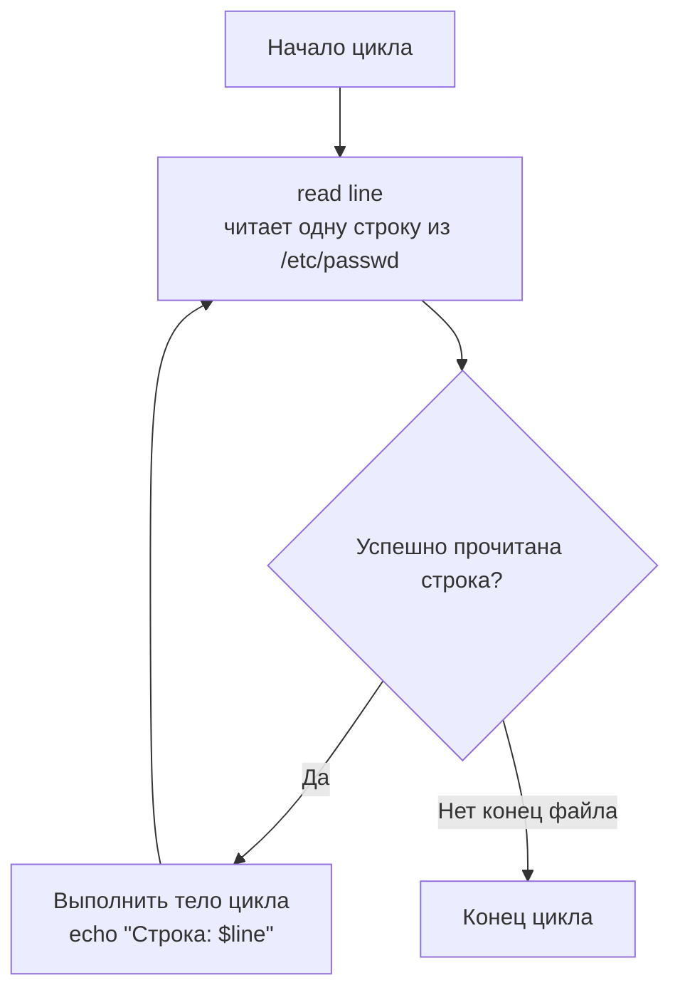
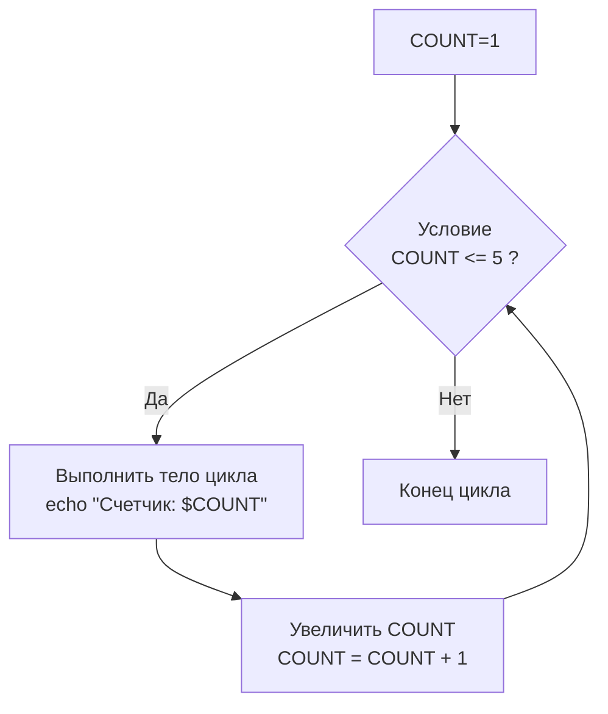
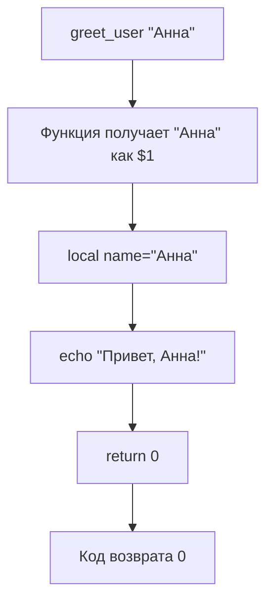
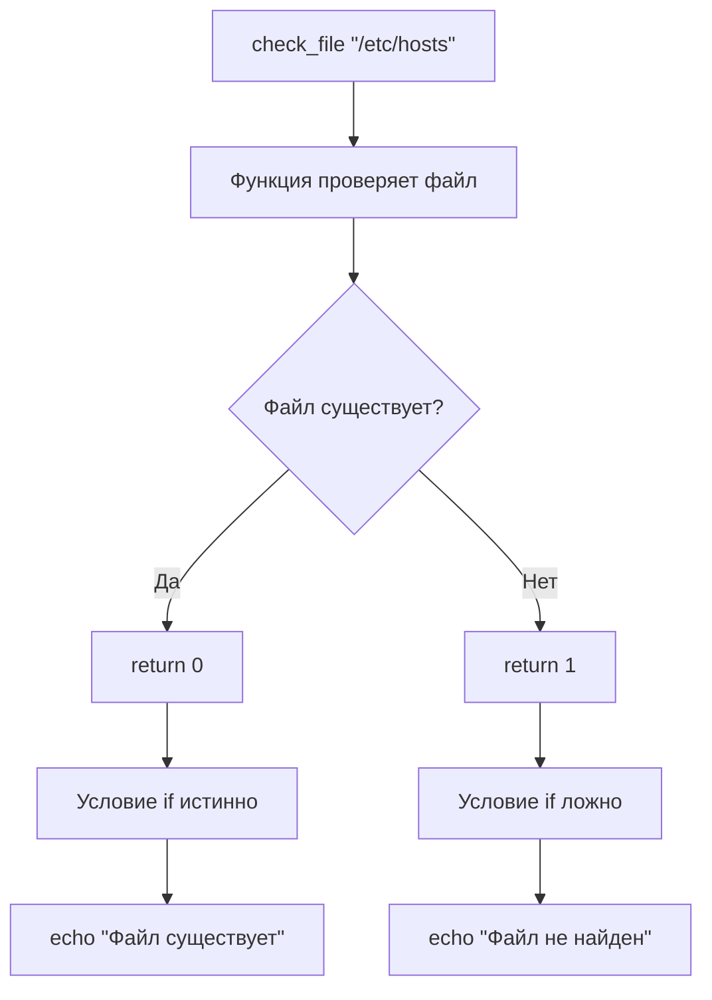
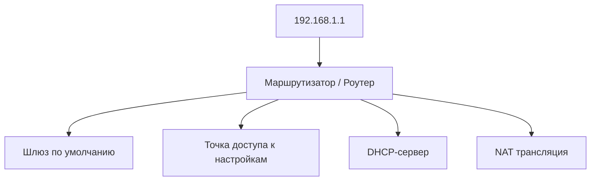
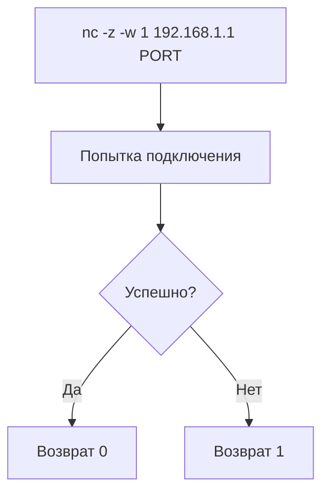
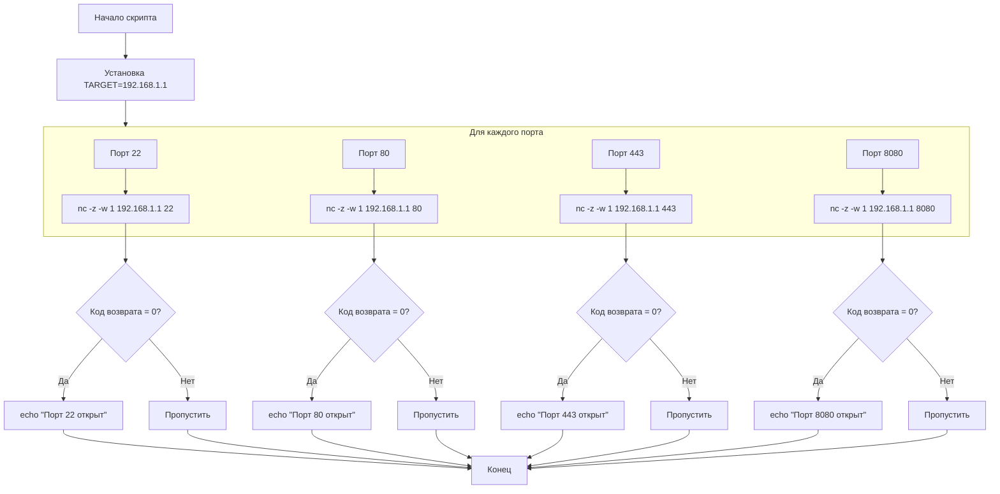

## 1. Создание и использование переменных

### Базовый синтаксис переменных

```bash
#!/bin/bash

# ==========================================
# ОБЪЯВЛЕНИЕ ПЕРЕМЕННЫХ
# ==========================================

# Простое присвоение (БЕЗ пробелов вокруг =)
name="John"
age=25
price=19.99

# Присвоение результата команды
current_date=$(date)
# или старый синтаксис: current_date=`date`

# Чтение ввода от пользователя
echo "Введите ваше имя:"
read user_name

# ==========================================
# ИСПОЛЬЗОВАНИЕ ПЕРЕМЕННЫХ
# ==========================================

# Обращение к переменной через $ 
echo "Привет, $name!"        # Рекомендуемый способ
echo "Привет, ${name}!"      # Более явный способ (лучшая практика)

# Без $ - это просто текст
echo "name"                  # Выведет "name", а не значение переменной

# Примеры использования
echo "Имя: $name, Возраст: $age"
echo "Текущая дата: $current_date"
echo "Введенное имя: $user_name"
```

### Особенности работы с переменными

```bash
#!/bin/bash

# Конкатенация строк
first_name="John"
last_name="Doe"
full_name="$first_name $last_name"
echo "Полное имя: $full_name"

# Арифметические операции
x=10
y=5

# Для арифметики используем (( ))
sum=$((x + y))
product=$((x * y))
echo "Сумма: $sum, Произведение: $product"

# Переменные окружения
echo "Домашняя директория: $HOME"
echo "Текущий пользователь: $USER"

# Переменные с специальными символами в имени (не рекомендуется, но возможно)
var_with_space="value with spaces"
echo "Переменная: ${var_with_space}"
```

## 2. Условные конструкции (if/else)

### Базовый синтаксис if/else

```bash
#!/bin/bash

# ==========================================
# ПРОСТОЕ УСЛОВИЕ
# ==========================================

number=10

if [ $number -gt 5 ]; then
    echo "Число больше 5"
fi

# ==========================================
# ПОЛНАЯ ВЕТКА IF/ELSE/ELIF
# ==========================================

score=85

if [ $score -ge 90 ]; then
    echo "Оценка: A"
elif [ $score -ge 80 ]; then
    echo "Оценка: B"
elif [ $score -ge 70 ]; then
    echo "Оценка: C"
else
    echo "Оценка: F"
fi

# ==========================================
# ПРОВЕРКА ФАЙЛОВ
# ==========================================

filename="script.sh"

if [ -f "$filename" ]; then
    echo "Файл $filename существует"
else
    echo "Файл $filename не существует"
fi

# Другие проверки файлов:
# -d : существует ли директория
# -r : доступен для чтения  
# -w : доступен для записи
# -x : исполняемый
```

### Операторы сравнения

```bash
#!/bin/bash

# Строковые сравнения
string1="hello"
string2="world"

if [ "$string1" = "$string2" ]; then
    echo "Строки равны"
else
    echo "Строки разные"
fi

# Числовые сравнения
a=10
b=20

if [ $a -eq $b ]; then echo "a равно b"; fi          # equal
if [ $a -ne $b ]; then echo "a не равно b"; fi       # not equal
if [ $a -lt $b ]; then echo "a меньше b"; fi         # less than
if [ $a -le $b ]; then echo "a меньше или равно b"; fi # less or equal
if [ $a -gt $b ]; then echo "a больше b"; fi         # greater than
if [ $a -ge $b ]; then echo "a больше или равно b"; fi # greater or equal

# Логические операторы
if [ $a -gt 5 ] && [ $a -lt 15 ]; then
    echo "a между 5 и 15"
fi

if [ $a -lt 5 ] || [ $a -gt 15 ]; then
    echo "a меньше 5 или больше 15"
fi
```

## 3. Циклы

### Цикл for

```bash
#!/bin/bash

# ==========================================
# ЦИКЛ FOR - ПЕРЕБОР СПИСКА
# ==========================================

echo "=== Перебор списка значений ==="
for fruit in "apple" "banana" "orange" "grape"
do
    echo "Фрукт: $fruit"
done

# ==========================================
# ЦИКЛ FOR - ЧИСЛОВОЙ ДИАПАЗОН
# ==========================================

echo "=== Числовой диапазон ==="
for i in {1..5}
do
    echo "Число: $i"
done

# С шагом
for i in {1..10..2}
do
    echo "Нечетное: $i"
done

# ==========================================
# ЦИКЛ FOR - C-ПОДОБНЫЙ СИНТАКСИС
# ==========================================

echo "=== C-подобный синтаксис ==="
for ((i=1; i<=5; i++))
do
    echo "Итерация: $i"
done

# ==========================================
# ЦИКЛ FOR - ПЕРЕБОР ФАЙЛОВ
# ==========================================

echo "=== Перебор файлов ==="
for file in *.txt
do
    if [ -f "$file" ]; then
        echo "Найден текстовый файл: $file"
    fi
done

# ==========================================
# ЦИКЛ FOR - ПЕРЕБОР РЕЗУЛЬТАТА КОМАНДЫ
# ==========================================

echo "=== Перебор процессов ==="
for process in $(ps aux | grep "bash" | awk '{print $2}')
do
    echo "PID процесса bash: $process"
done
```

### Цикл while

```bash
#!/bin/bash

# ==========================================
# ЦИКЛ WHILE - С УСЛОВИЕМ
# ==========================================

echo "=== Цикл while с условием ==="
counter=1
while [ $counter -le 5 ]
do
    echo "Счетчик: $counter"
    counter=$((counter + 1))
done

# ==========================================
# ЦИКЛ WHILE - ЧТЕНИЕ ФАЙЛА
# ==========================================

echo "=== Чтение файла построчно ==="
while IFS= read -r line
do
    echo "Строка: $line"
done < "example.txt"

# ==========================================
# ЦИКЛ WHILE - БЕСКОНЕЧНЫЙ ЦИКЛ
# ==========================================

echo "=== Бесконечный цикл (нажмите Ctrl+C для выхода) ==="
while true
do
    echo "Цикл выполняется..."
    sleep 1
done
```

### Цикл until

```bash
#!/bin/bash

# ==========================================
# ЦИКЛ UNTIL - ВЫПОЛНЯЕТСЯ ДО ИСТИННОСТИ УСЛОВИЯ
# ==========================================

echo "=== Цикл until ==="
count=1
until [ $count -gt 5 ]
do
    echo "Count: $count"
    count=$((count + 1))
done

# Практический пример - ожидание доступности сервиса
echo "=== Ожидание запуска сервиса ==="
attempt=1
until ping -c 1 google.com &> /dev/null
do
    echo "Попытка $attempt: Сервис недоступен"
    sleep 2
    attempt=$((attempt + 1))
    
    if [ $attempt -gt 10 ]; then
        echo "Сервис не доступен после 10 попыток"
        exit 1
    fi
done
echo "Сервис доступен!"
```

## 4. Управление циклами (break, continue)

```bash
#!/bin/bash

# ==========================================
# OPERATOR BREAK - ПРЕРЫВАНИЕ ЦИКЛА
# ==========================================

echo "=== break - прерывание цикла ==="
for i in {1..10}
do
    if [ $i -eq 6 ]; then
        echo "Достигнуто 6 - прерывание цикла"
        break
    fi
    echo "Текущее число: $i"
done

# ==========================================
# OPERATOR CONTINUE - ПЕРЕХОД К СЛЕДУЮЩЕЙ ИТЕРАЦИИ
# ==========================================

echo "=== continue - пропуск итерации ==="
for i in {1..5}
do
    if [ $i -eq 3 ]; then
        echo "Пропускаем 3"
        continue
    fi
    echo "Текущее число: $i"
done
```

## 1. Типы переменных окружения

### Временные переменные (на время сессии)

```bash
# Создание временной переменной
export MY_VAR="hello_kali"
export TOOLS_PATH="/usr/share/tools"
export API_KEY="abc123def456"

# Проверка
echo $MY_VAR
echo $TOOLS_PATH

# Просмотр всех переменных окружения
printenv
env
```

**Особенности:**
- Существуют только в текущей сессии терминала
- Исчезают после закрытия терминала/перезагрузки
- Не видны в других открытых терминалах

### Постоянные переменные (для пользователя)

```bash
# Редактируем файл ~/.bashrc
nano ~/.bashrc

# Добавляем в конец файла:
export JAVA_HOME="/usr/lib/jvm/java-11-openjdk-amd64"
export PATH="$PATH:/home/kali/my_tools"
export EDITOR="nano"
export LANG="en_US.UTF-8"

# Применяем изменения
source ~/.bashrc
# или
. ~/.bashrc
```

### Глобальные переменные (для всех пользователей)

```bash
# Редактируем системный файл (требует sudo)
sudo nano /etc/environment

# Добавляем переменные (БЕЗ export!)
GLOBAL_VAR="system_wide_value"
CUSTOM_PATH="/opt/custom/bin"

# Или создаем файл в /etc/profile.d/
sudo nano /etc/profile.d/custom_vars.sh
# Содержимое файла:
export SYSTEM_TOOLS="/opt/tools"
export BACKUP_DIR="/var/backups"
```

## 2. Практические примеры для Kali Linux

### Настройка путей для инструментов

```bash
# Добавляем в ~/.bashrc
export PATH="$PATH:/usr/share/windows-binaries"
export PATH="$PATH:/usr/share/webshells"
export PATH="$PATH:/usr/share/sqlmap"
export PATH="$PATH:$HOME/custom_scripts"

# Специфичные для Kali переменные
export METASPLOOT_DATABASE="postgresql"
export ARACHNI_DIR="/usr/share/arachni"
export BURP_SUITE_PATH="/usr/share/burpsuite"
```

### Настройка для разработки и тестирования

```bash
# Python development
export PYTHONPATH="$PYTHONPATH:/usr/share/payloads"
export PYTHONIOENCODING="utf-8"

# Web application testing
export TARGET_URL="https://test.example.com"
export PROXY_URL="http://127.0.0.1:8080"
export COOKIES_FILE="$HOME/cookies.txt"

# Network testing
export TARGET_IP="192.168.1.100"
export TARGET_NETWORK="192.168.1.0/24"
export LISTENER_IP="192.168.1.50"
```

## 3. Создание скрипта для автоматической настройки

Создаем файл `setup_kali_env.sh`:

```bash
#!/bin/bash
# ==========================================
# SCRIPT: setup_kali_env.sh
# AUTOMATIC KALI LINUX ENVIRONMENT SETUP
# ==========================================

echo "Setting up Kali Linux environment variables..."

# Backup original .bashrc
cp ~/.bashrc ~/.bashrc.backup.$(date +%Y%m%d)

# Define environment variables
cat >> ~/.bashrc << 'EOF'

# ==========================================
# KALI CUSTOM ENVIRONMENT VARIABLES
# ==========================================

# Tool Paths
export TOOLS_DIR="/usr/share/tools"
export PAYLOADS_DIR="/usr/share/payloads"
export SCRIPTS_DIR="$HOME/scripts"

# Add custom directories to PATH
export PATH="$PATH:$TOOLS_DIR:$SCRIPTS_DIR:/usr/local/sbin"

# Programming and Development
export PYTHONPATH="$PYTHONPATH:$PAYLOADS_DIR"
export RUBYLIB="$RUBYLIB:/usr/share/metasploit-framework/lib"
export GOPATH="$HOME/go"
export PATH="$PATH:$GOPATH/bin"

# Security Testing Variables
export DEFAULT_WORDLIST="/usr/share/wordlists/rockyou.txt"
export DEFAULT_USERLIST="/usr/share/wordlists/usernames.txt"
export DEFAULT_PASSLIST="/usr/share/wordlists/passwords.txt"

# Network Testing
export NMAP_PRIVILEGED=""  # Run nmap without root if needed
export HTTP_USER_AGENT="Mozilla/5.0 (X11; Linux x86_64) Kali-Scanner"

# Web Application Testing
export BURP_PROXY="http://127.0.0.1:8080"
export ZAP_PROXY="http://127.0.0.1:8090"
export DEFAULT_EXTENSIONS="php,html,js,txt"

# Database Connections
export POSTGRES_HOST="localhost"
export POSTGRES_USER="postgres"

# Custom Aliases for frequently used tools
alias scan-common-ports='nmap -sS -sV -sC -O'
alias quick-web-scan='gobuster dir -u $TARGET_URL -w $DEFAULT_WORDLIST'
alias update-tools='sudo apt update && sudo apt upgrade -y'

# Function to set target
set-target() {
    export TARGET_IP=$1
    export TARGET_URL=$2
    echo "Target set: IP=$TARGET_IP, URL=$TARGET_URL"
}

# Function to reset testing environment
reset-test() {
    unset TARGET_IP
    unset TARGET_URL
    echo "Testing environment reset"
}

EOF

# Apply changes
source ~/.bashrc

echo "Environment setup complete!"
echo "New variables available:"
echo "- TOOLS_DIR: $TOOLS_DIR"
echo "- PAYLOADS_DIR: $PAYLOADS_DIR"
echo "- SCRIPTS_DIR: $SCRIPTS_DIR"
echo ""
echo "Usage examples:"
echo "  set-target 192.168.1.100 http://target.com"
echo "  scan-common-ports \$TARGET_IP"
echo "  reset-test"
```

Делаем скрипт исполняемым и запускаем:
```bash
chmod +x setup_kali_env.sh
./setup_kali_env.sh
```

## 4. Управление переменными через командную строку

### Создание и модификация

```bash
# Создать временную переменную
export SCAN_TYPE="comprehensive"

# Добавить к существующей переменной PATH
export PATH="$PATH:/new/tool/directory"

# Создать переменную только для текущей сессии (без export)
TEMPORARY_VAR="temporary_value"

# Удалить переменную
unset SCAN_TYPE
unset TEMPORARY_VAR
```

### Просмотр и проверка

```bash
# Показать значение конкретной переменной
echo $PATH
echo $HOME

# Проверить существует ли переменная
if [ -z "$CUSTOM_VAR" ]; then
    echo "Переменная не установлена"
else
    echo "Переменная: $CUSTOM_VAR"
fi

# Показать все переменные с фильтром
printenv | grep PATH
env | grep KALI
```

## 5. Специфичные переменные для безопасности

### Для инструментов пентеста

```bash
# Metasploit
export MSF_DATABASE_CONFIG="$HOME/.msf4/database.yml"
export MSF_LOGDIR="$HOME/msf_logs"

# Social Engineering Toolkit
export SETOOLKIT_DIR="/usr/share/setoolkit"
export SETOOLKIT_LANG="en"

# Aircrack-ng
export AIRCRACK_WORKDIR="$HOME/aircrack"
export IVS_DIR="$AIRCRACK_WORKDIR/ivs"

# Wireshark/Tshark
export WIRESHARK_CONFIG_DIR="$HOME/.wireshark"
```

## 6. Решение проблем и отладка

### Скрипт проверки окружения

```bash
#!/bin/bash
# check_environment.sh

echo "=== Kali Linux Environment Check ==="

# Check critical variables
echo "1. PATH: $PATH"
echo "2. HOME: $HOME"
echo "3. USER: $USER"

# Check tool-specific variables
important_vars=("JAVA_HOME" "PYTHONPATH" "GOPATH" "TOOLS_DIR")

for var in "${important_vars[@]}"; do
    if [ -z "${!var}" ]; then
        echo "⚠️  $var is not set"
    else
        echo "✅ $var: ${!var}"
    fi
done

# Check directory existence
important_dirs=("$HOME/scripts" "$TOOLS_DIR" "$PAYLOADS_DIR")

for dir in "${important_dirs[@]}"; do
    if [ -d "$dir" ]; then
        echo "✅ Directory exists: $dir"
    else
        echo "⚠️  Directory missing: $dir"
    fi
done
```

### Восстановление стандартного окружения

```bash
# Если что-то пошло не так, можно восстановить .bashrc
cp ~/.bashrc.backup.* ~/.bashrc
source ~/.bashrc

# Или создать чистый .bashrc
cp /etc/skel/.bashrc ~/.bashrc
source ~/.bashrc
```


## 1. Просмотр всех переменных окружения

Сначала основные команды для просмотра:

```bash
# Показать все переменные окружения
printenv

# Или
env

# Показать с сортировкой
printenv | sort

# Поиск конкретной переменной
printenv | grep PATH
```

## 2. Системные и базовые переменные

### Информация о системе и пользователе
```bash
USER        # Текущий пользователь (kali)
HOME        # Домашняя директория (/home/kali)
SHELL       # Текущая оболочка (/bin/bash)
PWD         # Текущая рабочая директория
OLDPWD      # Предыдущая рабочая директория
HOSTNAME    # Имя хоста (kali)
HOSTTYPE    # Архитектура процессора (x86_64)
```

### Пути и директории
```bash
PATH        # Пути для поиска исполняемых файлов
MANPATH     # Пути для поиска man-страниц
INFOPATH    # Пути для поиска info-документации
LD_LIBRARY_PATH  # Пути для поиска shared libraries
```

### Язык и локализация
```bash
LANG        # Основная локаль (en_US.UTF-8)
LANGUAGE    # Язык интерфейса
LC_ALL      # Принудительная установка локали
LC_CTYPE    # Локаль для символов
LC_TIME     # Локаль для времени
LC_NUMERIC  # Локаль для чисел
LC_MONETARY # Локаль для валюты
```

## 3. Полный список переменных (команда для вывода)

```bash
#!/bin/bash
echo "=== ALL ENVIRONMENT VARIABLES IN KALI LINUX ==="
echo ""

# Системные переменные
echo "=== SYSTEM VARIABLES ==="
printenv | grep -E "(USER|HOME|SHELL|PWD|HOST|TERM)" | sort

echo ""
echo "=== PATH VARIABLES ==="
printenv | grep -E "(PATH|MANPATH|INFOPATH)" | sort

echo ""
echo "=== LOCALE VARIABLES ==="
printenv | grep -E "(LANG|LC_|LANGUAGE)" | sort

echo ""
echo "=== TERMINAL AND DISPLAY ==="
printenv | grep -E "(TERM|DISPLAY|COLOR|XDG)" | sort

echo ""
echo "=== APPLICATION SPECIFIC ==="
printenv | grep -E "(JAVA|PYTHON|RUBY|GO|NODE|EDITOR|BROWSER)" | sort

echo ""
echo "=== KALI SPECIFIC ==="
printenv | grep -i kali
```

## 4. Типичный вывод в Kali Linux

Вот какие переменные обычно присутствуют в свежей установке Kali Linux:

### Базовые системные
```bash
USER=kali
HOME=/home/kali
SHELL=/bin/bash
PWD=/home/kali
OLDPWD=/home/kali/Documents
HOSTNAME=kali
HOSTTYPE=x86_64
```

### Пути выполнения
```bash
PATH=/usr/local/sbin:/usr/local/bin:/usr/sbin:/usr/bin:/sbin:/bin
MANPATH=/usr/local/man:/usr/share/man
INFOPATH=/usr/local/info:/usr/share/info
LD_LIBRARY_PATH=/usr/local/lib
```

### Локализация
```bash
LANG=en_US.UTF-8
LANGUAGE=en_US:en
LC_CTYPE=en_US.UTF-8
LC_NUMERIC=en_US.UTF-8
LC_TIME=en_US.UTF-8
LC_COLLATE=en_US.UTF-8
LC_MONETARY=en_US.UTF-8
LC_MESSAGES=en_US.UTF-8
LC_PAPER=en_US.UTF-8
LC_NAME=en_US.UTF-8
LC_ADDRESS=en_US.UTF-8
LC_TELEPHONE=en_US.UTF-8
LC_MEASUREMENT=en_US.UTF-8
LC_IDENTIFICATION=en_US.UTF-8
```

### Терминал и отображение
```bash
TERM=xterm-256color
COLORTERM=truecolor
DISPLAY=:0
XDG_SESSION_TYPE=x11
XDG_CURRENT_DESKTOP=XFCE
XDG_SESSION_CLASS=user
XDG_RUNTIME_DIR=/run/user/1000
XDG_CONFIG_HOME=/home/kali/.config
XDG_DATA_HOME=/home/kali/.local/share
```

### Приложения и редакторы
```bash
EDITOR=nano
VISUAL=editor
BROWSER=firefox
PAGER=less
LESS=-R
LS_COLORS=rs=0:di=01;34:ln=01;36:...
```

### Языки программирования
```bash
PYTHONPATH=/usr/lib/python3.11/site-packages
RUBYLIB=/usr/lib/ruby/3.1.0
GOPATH=/home/kali/go
NODE_PATH=/usr/lib/nodejs
```

### Специфичные для Kali
```bash
# Эти могут быть установлены в зависимости от установленных пакетов
KALI_TOOLS_DIR=/usr/share/kali-tools
METASPLOOT_FRAMEWORK=/usr/share/metasploit-framework
BURP_SUITE_PATH=/usr/share/burpsuite
```

## 5. Скрипт для детального анализа

Создайте файл `analyze_env.sh`:

```bash
#!/bin/bash
echo "=== DETAILED KALI LINUX ENVIRONMENT ANALYSIS ==="
echo "Generated on: $(date)"
echo ""

# Функция для форматированного вывода
print_section() {
    echo "=== $1 ==="
    printenv | grep -E "$2" | sort | while read line; do
        echo "  $line"
    done
    echo ""
}

print_section "USER INFO" "^(USER|HOME|SHELL|LOGNAME|UID|GID)"
print_section "SYSTEM PATHS" "PATH|MANPATH|INFOPATH|LD_LIBRARY"
print_section "LOCALE SETTINGS" "^(LANG|LC_|LANGUAGE)"
print_section "TERMINAL SETTINGS" "^(TERM|DISPLAY|COLOR|XDG)"
print_section "APPLICATION SETTINGS" "^(EDITOR|VISUAL|BROWSER|PAGER)"
print_section "PROGRAMMING ENV" "^(PYTHON|RUBY|JAVA|GO|NODE|PERL)"
print_section "SESSION INFO" "^(SESSION|DESKTOP|XDG_)"
print_section "KALI SPECIFIC" "(KALI|METASPLOIT|BURP|ARACHNI)"

echo "=== ALL VARIABLES (SORTED) ==="
printenv | sort
```

Запустите скрипт:
```bash
chmod +x analyze_env.sh
./analyze_env.sh > kali_environment.txt
```

## 6. Динамические переменные

Эти переменные меняются во время работы:

```bash
# Меняется при смене директории
PWD=/home/kali/Desktop
OLDPWD=/home/kali

# Меняется при выполнении команд
_=/usr/bin/printenv    # Последняя выполненая команда
SHLVL=1                # Уровень вложенности shell
```

## 7. Переменные сессии

```bash
SESSION_MANAGER=local/kali:@/tmp/.ICE-unix/1234,unix/kali:/tmp/.ICE-unix/1234
DBUS_SESSION_BUS_ADDRESS=unix:path=/run/user/1000/bus
DESKTOP_SESSION=xfce
XDG_MENU_PREFIX=xfce-
XDG_SESSION_DESKTOP=xfce
```

## 8. Как проверить конкретную переменную

```bash
# Проверить существует ли переменная
if [ -z "$CUSTOM_VAR" ]; then
    echo "Variable is not set"
else
    echo "Variable value: $CUSTOM_VAR"
fi

# Показать все переменные начинающиеся с...
printenv | grep ^LC_

# Экспортировать текущие переменные в файл
printenv > current_environment.txt
```

Этот список охватывает большинство стандартных переменных окружения, которые вы найдете в Kali Linux. Конкретный набор может варьироваться в зависимости от установленных пакетов и конфигурации системы.

## Разбор команды: `printenv | grep ^LC_`

### Компоненты команды:

```bash
printenv    # Основная команда
|           # Пайп (конвейер)
grep        # Команда поиска
^LC_        # Регулярное выражение
```

## 1. `printenv` - печать переменных окружения

**Что делает:** Выводит все переменные окружения текущей сессии

**Пример вывода:**
```bash
USER=kali
HOME=/home/kali
LANG=en_US.UTF-8
LC_CTYPE=en_US.UTF-8
LC_NUMERIC=ru_RU.UTF-8
LC_TIME=de_DE.UTF-8
PATH=/usr/local/sbin:/usr/local/bin:/usr/sbin:/usr/bin:/sbin:/bin
DISPLAY=:0
```

## 2. `|` (пайп) - конвейер

**Что делает:** Перенаправляет вывод одной команды на вход другой


## 3. `grep ^LC_` - фильтрация по шаблону

### Регулярное выражение `^LC_`:

- **`^`** - означает "начало строки"
- **`LC_`** - буквальный текст для поиска

**Вместе `^LC_` означает:** "найти строки, которые начинаются с `LC_`"

## 4. Практические примеры

### Что отфильтрует команда:

**Входные данные (вывод printenv):**
```
USER=kali
HOME=/home/kali
LANG=en_US.UTF-8
LC_CTYPE=en_US.UTF-8        # ← ПОПАДЕТ В ВЫВОД
LC_NUMERIC=ru_RU.UTF-8      # ← ПОПАДЕТ В ВЫВОД  
LC_TIME=de_DE.UTF-8         # ← ПОПАДЕТ В ВЫВОД
PATH=/usr/local/sbin:/usr/local/bin:/usr/sbin:/usr/bin:/sbin:/bin
MY_LC_VARIABLE=value        # ← НЕ ПОПАДЕТ (нет в начале)
DISPLAY=:0
```

**Выходные данные:**
```
LC_CTYPE=en_US.UTF-8
LC_NUMERIC=ru_RU.UTF-8
LC_TIME=de_DE.UTF-8
```

## 5. Для чего используются LC_ переменные?

**LC_** = **L**ocation **C**ategory (категории локалей)

Эти переменные управляют локализацией и региональными настройками:

```bash
# Пример всех LC_ переменных
LC_CTYPE=en_US.UTF-8        # Классификация символов (буквы, цифры)
LC_NUMERIC=ru_RU.UTF-8      # Формат чисел (1,234.56 vs 1 234,56)
LC_TIME=de_DE.UTF-8         # Формат даты и времени
LC_COLLATE=en_US.UTF-8      # Правила сортировки строк
LC_MONETARY=fr_FR.UTF-8     # Формат денежных единиц
LC_MESSAGES=es_ES.UTF-8     # Язык системных сообщений
LC_PAPER=de_DE.UTF-8        # Размеры бумаги
LC_NAME=ja_JP.UTF-8         # Формат имен
LC_ADDRESS=it_IT.UTF-8      # Формат адресов
LC_TELEPHONE=uk_UA.UTF-8    # Формат телефонных номеров
LC_MEASUREMENT=ru_RU.UTF-8  # Система измерений (метрическая/имперская)
```

## 6. Другие полезные примеры с grep

### Поиск переменных PATH:
```bash
printenv | grep PATH
```
**Вывод:**
```
PATH=/usr/local/sbin:/usr/local/bin:/usr/sbin:/usr/bin:/sbin:/bin
MANPATH=/usr/local/man:/usr/share/man
```

### Поиск переменных связанных с пользователем:
```bash
printenv | grep ^USER
```
**Вывод:**
```
USER=kali
USERNAME=kali
```

### Поиск переменных с игнорированием регистра:
```bash
printenv | grep -i kali
```
**Вывод:**
```
USER=kali
SESSION_MANAGER=local/kali:@/tmp/.ICE-unix/1234
```

### Поиск с дополнительным контекстом:
```bash
printenv | grep -A 2 -B 2 LC_CTYPE
```
**Вывод:**
```
LANG=en_US.UTF-8
LC_CTYPE=en_US.UTF-8        # ← искомая строка
LC_NUMERIC=ru_RU.UTF-8      # ← 2 строки после
LC_TIME=de_DE.UTF-8
```

## 7. Практическое применение в скриптах

```bash
#!/bin/bash

# Проверка локали перед выполнением скрипта
echo "=== Checking Locale Settings ==="
printenv | grep ^LC_

# Проверка конкретной переменной
if printenv | grep -q "^LC_CTYPE="; then
    echo "LC_CTYPE is set: $LC_CTYPE"
else
    echo "LC_CTYPE is not set"
fi

# Экспорт LC_ переменных в файл
printenv | grep ^LC_ > locale_settings.txt
echo "Locale settings saved to locale_settings.txt"
```

## 8. Альтернативные способы

### Использование `env` вместо `printenv`:
```bash
env | grep ^LC_
```

### Просмотр конкретной переменной:
```bash
echo $LC_CTYPE
```

### Просмотр всех переменных с сортировкой:
```bash
printenv | grep ^LC_ | sort
```

**Итог:** Команда `printenv | grep ^LC_` используется для быстрого просмотра всех региональных настроек системы, что особенно полезно при решении проблем с локализацией или при настройке многоязычных приложений.


## 1. Цикл while с чтением файла

```bash
#!/bin/bash
# Чтение файла построчно
while read line; do
    echo "Строка: $line"
done < /etc/passwd
```

### Как это работает:



### Пошаговое выполнение:

**Шаг 1:** Открывается файл `/etc/passwd` для чтения
```bash
# Пример содержимого /etc/passwd:
root:x:0:0:root:/root:/bin/bash
daemon:x:1:1:daemon:/usr/sbin:/usr/sbin/nologin
kali:x:1000:1000:Kali,,,:/home/kali:/bin/bash
```

**Шаг 2:** Команда `read line` читает первую строку
- `line="root:x:0:0:root:/root:/bin/bash"`

**Шаг 3:** Выполняется тело цикла
```bash
echo "Строка: root:x:0:0:root:/root:/bin/bash"
```

**Шаг 4:** Цикл повторяется для следующих строк...

**Вывод будет:**
```
Строка: root:x:0:0:root:/root:/bin/bash
Строка: daemon:x:1:1:daemon:/usr/sbin:/usr/sbin/nologin
Строка: kali:x:1000:1000:Kali,,,:/home/kali:/bin/bash
...
```

### Альтернативные способы записи:

```bash
# Способ 1: Перенаправление ввода (как в примере)
while read line; do
    echo "Строка: $line"
done < /etc/passwd

# Способ 2: Через pipe
cat /etc/passwd | while read line; do
    echo "Строка: $line"
done

# Способ 3: С обработкой полей
while IFS=: read username password uid gid info home shell; do
    echo "Пользователь: $username, UID: $uid, Shell: $shell"
done < /etc/passwd
```

## 2. Цикл while с условием

```bash
#!/bin/bash
# Цикл с условием
COUNT=1
while [ $COUNT -le 5 ]; do
    echo "Счетчик: $COUNT"
    ((COUNT++))
done
```

### Как это работает:



### Пошаговое выполнение:

**Итерация 1:**
```bash
COUNT=1
[ 1 -le 5 ]  # условие ИСТИНА (true)
echo "Счетчик: 1"
((COUNT++))   # COUNT становится 2
```

**Итерация 2:**
```bash
COUNT=2
[ 2 -le 5 ]  # условие ИСТИНА
echo "Счетчик: 2"
((COUNT++))   # COUNT становится 3
```

**Итерация 3:**
```bash
COUNT=3
[ 3 -le 5 ]  # условие ИСТИНА
echo "Счетчик: 3"
((COUNT++))   # COUNT становится 4
```

**Итерация 4:**
```bash
COUNT=4
[ 4 -le 5 ]  # условие ИСТИНА
echo "Счетчик: 4"
((COUNT++))   # COUNT становится 5
```

**Итерация 5:**
```bash
COUNT=5
[ 5 -le 5 ]  # условие ИСТИНА (5 <= 5)
echo "Счетчик: 5"
((COUNT++))   # COUNT становится 6
```

**Итерация 6:**
```bash
COUNT=6
[ 6 -le 5 ]  # условие ЛОЖЬ (6 > 5) - цикл завершается
```

**Вывод:**
```
Счетчик: 1
Счетчик: 2
Счетчик: 3
Счетчик: 4
Счетчик: 5
```

### Детальный разбор синтаксиса:

```bash
# Инициализация переменной
COUNT=1

# Условие цикла: [ $COUNT -le 5 ]
# -le = Less or Equal (меньше или равно)
while [ $COUNT -le 5 ]; do

    # Тело цикла
    echo "Счетчик: $COUNT"
    
    # Арифметическая операция: увеличение COUNT на 1
    ((COUNT++))   # Эквивалент: COUNT=$((COUNT + 1))
    
done
```

### Альтернативные способы инкремента:

```bash
# Способ 1: Арифметическое выражение (рекомендуется)
((COUNT++))

# Способ 2: Команда let
let COUNT++

# Способ 3: Арифметическое подстановка
COUNT=$((COUNT + 1))

# Способ 4: Команда expr (устаревший)
COUNT=$(expr $COUNT + 1)
```

## 3. Практические примеры использования

### Пример 1: Обработка лог-файла
```bash
#!/bin/bash
# Поиск ошибок в лог-файле
while read line; do
    if [[ "$line" == *"ERROR"* ]]; then
        echo "Найдена ошибка: $line"
    fi
done < /var/log/syslog
```

### Пример 2: Ожидание доступности сервиса
```bash
#!/bin/bash
# Ожидание запуска веб-сервера
COUNT=1
MAX_ATTEMPTS=10

while [ $COUNT -le $MAX_ATTEMPTS ]; do
    if curl -s http://localhost:80 > /dev/null; then
        echo "Сервис доступен после $COUNT попыток"
        break
    fi
    echo "Попытка $COUNT: сервис недоступен"
    sleep 2
    ((COUNT++))
done
```

### Пример 3: Обработка вывода команды
```bash
#!/bin/bash
# Получение списка процессов и их PID
ps aux | while read user pid cpu mem vsz rss tty stat start time command; do
    if [ "$user" = "kali" ]; then
        echo "Процесс пользователя kali: PID=$pid, COMMAND=$command"
    fi
done
```

## 4. Ключевые отличия двух подходов

| Характеристика | `while read` | `while [ условие ]` |
|----------------|--------------|---------------------|
| **Условие** | Чтение данных из потока | Логическое выражение |
| **Завершение** | Конец файла/потока | Когда условие станет false |
| **Тип данных** | Текстовые строки | Числа/логические значения |
| **Использование** | Обработка файлов, вывода команд | Счетчики, проверки состояний |


## 1. Структура скрипта

```bash
#!/bin/bash
# ↑ Шебанг - указывает, что скрипт должен выполняться в Bash

# Определение функции
greet_user() {
    local name=$1
    echo "Привет, $name!"
    return 0
}
```

## 2. Детальный разбор первой функции

### Определение функции:
```bash
greet_user() {
    # тело функции
}
```

### Параметры функции:
```bash
local name=$1  # $1 - первый аргумент функции
```
- **`local`** - делает переменную видимой только внутри функции
- **`$1`** - первый переданный аргумент
- **`$2`**, **`$3`**... - последующие аргументы
- **`$0`** - имя функции
- **`$#`** - количество аргументов
- **`$@`** - все аргументы

### Возвращаемое значение:
```bash
return 0  # Успешное завершение (код возврата 0)
```

**Как работает вызов:**


## 3. Вторая функция - проверка файла

```bash
check_file() {
    if [ -f "$1" ]; then
        return 0
    else
        return 1
    fi
}
```

### Проверка файла:
- **`[ -f "$1" ]`** - проверяет, существует ли обычный файл
- **`return 0`** - успех (файл существует)
- **`return 1`** - ошибка (файл не существует)

### Другие проверки файлов:
```bash
[ -d "$1" ]    # Является ли директорией
[ -r "$1" ]    # Доступен для чтения
[ -w "$1" ]    # Доступен для записи
[ -x "$1" ]    # Исполняемый файл
[ -s "$1" ]    # Существует и не пустой
```

## 4. Использование функций в условии

```bash
if check_file "/etc/hosts"; then
    echo "Файл существует"
else
    echo "Файл не найден"
fi
```

**Процесс выполнения:**


## 5. Полное пошаговое выполнение скрипта

### Шаг 1: Определение функций
```bash
# Функции объявлены, но еще не выполнены
greet_user() { ... }
check_file() { ... }
```

### Шаг 2: Вызов greet_user
```bash
greet_user "Анна"
```
**Внутри функции:**
- `$1 = "Анна"`
- `local name="Анна"`
- `echo "Привет, Анна!"` → Вывод в консоль
- `return 0` → Код возврата 0 (игнорируется)

### Шаг 3: Вызов check_file в условии
```bash
if check_file "/etc/hosts"; then
```
**Внутри функции:**
- `$1 = "/etc/hosts"`
- `[ -f "/etc/hosts" ]` → Проверка существования файла
- Файл существует → `return 0`

### Шаг 4: Обработка кода возврата
```bash
# check_file вернула 0 → условие истинно
echo "Файл существует"
```

## 6. Расширенная версия с отладкой

```bash
#!/bin/bash

# Функция с подробной информацией
greet_user() {
    local name=$1
    echo "Количество аргументов: $#"
    echo "Все аргументы: $@"
    echo "Привет, $name!"
    return 0
}

# Улучшенная проверка файла
check_file() {
    local filename=$1
    echo "Проверяем файл: $filename"
    
    if [ -f "$filename" ]; then
        echo "Файл существует и доступен"
        return 0
    else
        echo "Файл не существует или недоступен"
        return 1
    fi
}

# Демонстрация
echo "=== ДЕМОНСТРАЦИЯ ФУНКЦИЙ ==="

echo "1. Вызов greet_user:"
greet_user "Анна" "Иванова"

echo -e "\n2. Проверка файлов:"
if check_file "/etc/hosts"; then
    echo "✓ Файл /etc/hosts доступен"
else
    echo "✗ Файл /etc/hosts недоступен"
fi

if check_file "/nonexistent/file"; then
    echo "✓ Файл существует"
else
    echo "✗ Файл не существует"
fi
```

## 7. Коды возврата в Linux

**Коды возврата:**
- **`0`** - УСПЕХ (true)
- **`1-255`** - ОШИБКА (false)

**Популярные коды:**
```bash
return 0   # Успешное выполнение
return 1   # Общая ошибка
return 2   # Неправильное использование встроенных команд
return 127 # Команда не найдена
```

## 8. Практические примеры использования

### Пример 1: Функция с несколькими параметрами
```bash
create_user() {
    local username=$1
    local group=$2
    local shell=$3
    
    echo "Создаю пользователя: $username"
    echo "Группа: $group"
    echo "Shell: $shell"
    # Здесь была бы реальная команда useradd
    return 0
}

# Вызов
create_user "ivan" "developers" "/bin/bash"
```

### Пример 2: Функция с вычислениями
```bash
calculate_sum() {
    local result=$(( $1 + $2 ))
    echo "Сумма: $result"
    return 0
}

calculate_sum 10 25  # Вывод: Сумма: 35
```

### Пример 3: Проверка нескольких условий
```bash
validate_input() {
    local input=$1
    
    if [ -z "$input" ]; then
        echo "Ошибка: пустой ввод"
        return 1
    fi
    
    if [ ${#input} -lt 3 ]; then
        echo "Ошибка: слишком короткий ввод"
        return 2
    fi
    
    echo "Ввод корректен: $input"
    return 0
}
```

## Ключевые моменты:

1. **Функции объявляются до использования**
2. **`return` возвращает код выхода, а не данные**
3. **`local` переменные видны только внутри функции**
4. **Аргументы передаются через `$1`, `$2`, etc.**
5. **Код возврата `0` = успех, любое другое число = ошибка**

**192.168.1.1** — это **частный (private) IP-адрес**, который широко используется в домашних и корпоративных сетях.

## 1. Что это за адрес?

### Техническая классификация:
- **Класс сети:** Class C (частный диапазон)
- **Диапазон частных адресов:** 192.168.0.0 - 192.168.255.255
- **Маска подсети:** Обычно 255.255.255.0 (/24)

## 2. Основное назначение



### Чаще всего этот адрес используется для:
- **Маршрутизатора/роутера** - шлюз между локальной сетью и интернетом
- **Точки доступа** к веб-интерфейсу управления оборудованием
- **DHCP-сервера** для автоматической раздачи IP-адресов в сети
- **DNS-прокси** для разрешения доменных имен

## 3. Типичная сетевая топология

```
Интернет
    │
    ↓
[192.168.1.1] ← Маршрутизатор/Шлюз
    │
    ├── [192.168.1.2] ← Компьютер 1
    ├── [192.168.1.3] ← Компьютер 2  
    ├── [192.168.1.4] ← Ноутбук
    ├── [192.168.1.5] ← Смартфон
    └── [192.168.1.6] ← Принтер
```

## 4. Как используется на практике

### Для доступа к настройкам роутера:
```bash
# В браузере перейти по адресу:
http://192.168.1.1

# Частые логины/пароли по умолчанию:
admin / admin
admin / password
admin / (пустой)
```

### Проверка доступности в командной строке:
```bash
# Ping маршрутизатора
ping 192.168.1.1

# Проверка сетевых настроек
ip route show
# Вывод: default via 192.168.1.1 dev wlan0

# Просмотр ARP-таблицы
arp -a
# Показывает MAC-адрес устройства на 192.168.1.1
```

## 5. Производители, использующие этот адрес по умолчанию

| Производитель | Модели | Логин/Пароль |
|---------------|--------|--------------|
| **TP-Link** | Большинство роутеров | admin / admin |
| **D-Link** | DIR-300, DIR-615 | admin / (пустой) |
| **Netgear** | N150, N300 | admin / password |
| **Cisco** | Некоторые SMB | varies |
| **Belkin** | Многие модели | admin / (пустой) |

## 6. Безопасность и риски

### Потенциальные риски:
```bash
# 1. Неизмененные учетные данные по умолчанию
# 2. Открытые порты на маршрутизаторе
# 3. Устаревшее firmware

# Проверка безопасности:
nmap -sS 192.168.1.1
# Проверит открытые порты

curl -I http://192.168.1.1
# Проверит версию веб-сервера
```

### Рекомендации по безопасности:
1. **Сменить пароль по умолчанию**
2. **Обновить firmware**
3. **Отключить удаленное управление**
4. **Включить фильтрацию MAC-адресов**
5. **Использовать WPA2/WPA3 шифрование**

## 7. Диагностика проблем с сетью

### Если не удается подключиться к 192.168.1.1:

```bash
#!/bin/bash
# Скрипт диагностики сети

echo "=== ДИАГНОСТИКА СЕТИ 192.168.1.1 ==="

# 1. Проверка физического подключения
echo "1. Проверка сетевого интерфейса:"
ip addr show | grep "inet.*192.168.1"

# 2. Ping маршрутизатора
echo -e "\n2. Ping 192.168.1.1:"
ping -c 3 192.168.1.1

# 3. Проверка ARP-таблицы
echo -e "\n3. ARP-запись для 192.168.1.1:"
arp -n | grep 192.168.1.1

# 4. Проверка шлюза по умолчанию
echo -e "\n4. Шлюз по умолчанию:"
ip route | grep default

# 5. Проверка DNS
echo -e "\n5. Проверка DNS:"
nslookup google.com 192.168.1.1
```

## 8. Альтернативные частные диапазоны

Если 192.168.1.1 недоступен, попробуйте:
- **10.0.0.1** - Часто используется в корпоративных сетях
- **192.168.0.1** - Второй популярный домашний диапазон
- **192.168.100.1** - Некоторые провайдеры

## 9. Как найти IP вашего роутера

```bash
# Linux/Mac
ip route show default

# Windows
ipconfig | findstr "Default Gateway"

# Универсально (если доступен)
route -n
```

**Итог:** 192.168.1.1 — это "дверь" в вашу локальную сеть, которая обеспечивает подключение к интернету и управление сетевыми настройками.


## 1. Структура скрипта

```bash
#!/bin/bash
# Мониторинг ресурсов системы
echo "=== Мониторинг системы ==="
echo "Дата: $(date)"
echo "Загрузка CPU: $(uptime | awk '{print $10 $11 $12}')"
echo "Свободная память: $(free -h | grep Mem | awk '{print $4}')"
echo "Дисковое пространство:"
df -h / | tail -1
```

## 2. Детальный разбор каждой команды

### Строка 1: Шебанг
```bash
#!/bin/bash
```
**Что делает:** Указывает, что скрипт должен выполняться интерпретатором Bash

### Строка 3: Заголовок
```bash
echo "=== Мониторинг системы ==="
```
**Результат:** 
```
=== Мониторинг системы ===
```

### Строка 4: Дата и время
```bash
echo "Дата: $(date)"
```
**Как работает:**
- **`$(date)`** - выполняет команду `date` и подставляет результат
- **`date`** - выводит текущую дату и время

**Результат:**
```
Дата: Wed Dec 13 10:30:25 UTC 2023
```

### Строка 5: Загрузка CPU
```bash
echo "Загрузка CPU: $(uptime | awk '{print $10 $11 $12}')"
```

**Разбор пайплайна:**


**Шаг 1: `uptime`**
```bash
# Пример вывода uptime:
10:30:25 up 5 days, 12:34,  3 users,  load average: 1.25, 0.89, 0.67
# Поля:       1      2    3    4    5   6     7      8     9    10   11   12
```

**Шаг 2: `awk '{print $10 $11 $12}'`**
- Извлекает поля 10, 11, 12: `1.25, 0.89, 0.67`
- Это **средняя загрузка CPU** за 1, 5 и 15 минут

**Результат:**
```
Загрузка CPU: 1.25,0.89,0.67
```

### Строка 6: Свободная память
```bash
echo "Свободная память: $(free -h | grep Mem | awk '{print $4}')"
```

**Разбор пайплайна:**
```mermaid
flowchart LR
    A[free -h] --> B[grep Mem] --> C[awk '{print $4}'] --> D[результат]
```

**Шаг 1: `free -h`**
```bash
# Пример вывода:
              total        used        free      shared  buff/cache   available
Mem:           7.7Gi       2.1Gi       3.2Gi       123Mi       2.4Gi       5.2Gi
Swap:          2.0Gi       0.0Gi       2.0Gi
```

**Шаг 2: `grep Mem`** - выбирает только строку с оперативной памятью

**Шаг 3: `awk '{print $4}'`** - извлекает 4-е поле (free)

**Результат:**
```
Свободная память: 3.2Gi
```

### Строки 7-8: Дисковое пространство
```bash
echo "Дисковое пространство:"
df -h / | tail -1
```

**Разбор команды:**


**Шаг 1: `df -h /`**
```bash
# Пример вывода:
Filesystem      Size  Used Avail Use% Mounted on
/dev/sda1        50G   25G   23G  53% /
```

**Шаг 2: `tail -1`** - берет последнюю строку

**Результат:**
```
Дисковое пространство:
/dev/sda1        50G   25G   23G  53% /
```

## 3. Полный пример вывода скрипта

```bash
=== Мониторинг системы ===
Дата: Wed Dec 13 10:30:25 UTC 2023
Загрузка CPU: 1.25,0.89,0.67
Свободная память: 3.2Gi
Дисковое пространство:
/dev/sda1        50G   25G   23G  53% /
```

## 4. Улучшенная версия скрипта

Вот более читаемая и надежная версия:

```bash
#!/bin/bash
# Улучшенный мониторинг системы

echo "=== МОНИТОРИНГ СИСТЕМЫ ==="
echo "Время: $(date '+%Y-%m-%d %H:%M:%S')"

# Загрузка CPU с пояснениями
load_avg=$(uptime | awk -F'load average:' '{print $2}')
echo "Загрузка CPU (1,5,15 мин):$load_avg"

# Память с детализацией
echo "Оперативная память:"
free -h | grep Mem | awk '{print "  Всего: " $2 ", Использовано: " $3 ", Свободно: " $4 ", Доступно: " $7}'

# Дисковое пространство с форматированием
echo "Дисковое пространство корневой директории (/):"
df -h / | awk 'NR==2 {printf "  Файловая система: %s\n  Размер: %s, Использовано: %s, Свободно: %s, Использование: %s\n", $1, $2, $3, $4, $5}'

# Дополнительно: количество процессов
echo "Количество запущенных процессов: $(ps aux | wc -l)"
```

**Вывод улучшенной версии:**
```
=== МОНИТОРИНГ СИСТЕМЫ ===
Время: 2023-12-13 10:30:25
Загрузка CPU (1,5,15 мин): 1.25, 0.89, 0.67
Оперативная память:
  Всего: 7.7Gi, Использовано: 2.1Gi, Свободно: 3.2Gi, Доступно: 5.2Gi
Дисковое пространство корневой директории (/):
  Файловая система: /dev/sda1
  Размер: 50G, Использовано: 25G, Свободно: 23G, Использование: 53%
Количество запущенных процессов: 245
```

## 5. Альтернативные команды для мониторинга

### Для загрузки CPU:
```bash
# Более точная загрузка CPU
mpstat 1 1 | grep -i average | awk '{print "Пользователь: " $4 "%, Система: " $6 "%, Ожидание: " $7 "%"}'

# Или используем top в batch mode
top -bn1 | grep "Cpu(s)" | awk '{print "Загрузка CPU: " $2 "%"}'
```

### Для памяти:
```bash
# Детальная информация о памяти
cat /proc/meminfo | grep -E "(MemTotal|MemFree|MemAvailable)"

# В мегабайтах
free -m | grep Mem
```

### Для диска:
```bash
# Все смонтированные файловые системы
df -h

# Только важные разделы
df -h / /home /var
```

## 1. Общая структура скрипта

```bash
#!/bin/bash
# Простой сканер портов
TARGET="192.168.1.1"

echo "Сканирование портов на $TARGET"
for port in 22 80 443 8080; do
    nc -z -w 1 $TARGET $port 2>/dev/null
    if [ $? -eq 0 ]; then
        echo "Порт $port открыт"
    fi
done
```

## 2. Детальный разбор по строкам

### Строка 1: Шебанг
```bash
#!/bin/bash
```
**Назначение:** Указывает системе, что скрипт должен выполняться через Bash

### Строка 3: Целевой хост
```bash
TARGET="192.168.1.1"
```
**Что делает:** Создает переменную с IP-адресом для сканирования

### Строка 5: Заголовок
```bash
echo "Сканирование портов на $TARGET"
```
**Результат:** 
```
Сканирование портов на 192.168.1.1
```

## 3. Цикл сканирования портов

### Строка 6: Цикл for
```bash
for port in 22 80 443 8080; do
```
**Что делает:** Перебирает порты из списка:
- **22** - SSH
- **80** - HTTP  
- **443** - HTTPS
- **8080** - Альтернативный HTTP

### Строка 7: Команда сканирования
```bash
nc -z -w 1 $TARGET $port 2>/dev/null
```

**Разбор команды `nc` (netcat):**


**Параметры netcat:**
- **`-z`** - режим сканирования (не отправлять данные)
- **`-w 1`** - таймаут 1 секунда
- **`$TARGET $port`** - целевой хост и порт
- **`2>/dev/null`** - перенаправление ошибок в /dev/null (игнорирование)

### Строки 8-10: Проверка результата
```bash
if [ $? -eq 0 ]; then
    echo "Порт $port открыт"
fi
```

**Переменная `$?`:**
- Содержит **код возврата** последней выполненной команды
- **`0`** = успех (порт открыт)
- **`1`** = ошибка (порт закрыт)

## 4. Полный процесс выполнения



## 5. Пример вывода скрипта

**Если порты 80 и 443 открыты:**
```
Сканирование портов на 192.168.1.1
Порт 80 открыт
Порт 443 открыт
```

**Если все порты закрыты:**
```
Сканирование портов на 192.168.1.1
```

## 6. Улучшенная версия скрипта

```bash
#!/bin/bash
# Улучшенный сканер портов

TARGET="${1:-192.168.1.1}"  # Параметр или значение по умолчанию
PORTS="21 22 23 53 80 110 143 443 993 995 3389 8080 8443"

echo "=== СКАНИРОВАНИЕ ПОРТОВ ==="
echo "Цель: $TARGET"
echo "Порты: $PORTS"
echo "---------------------------"

for port in $PORTS; do
    # Сканирование порта
    nc -z -w 1 $TARGET $port 2>/dev/null
    
    # Проверка результата
    if [ $? -eq 0 ]; then
        # Определение сервиса по порту
        case $port in
            22)   service="SSH" ;;
            80)   service="HTTP" ;;
            443)  service="HTTPS" ;;
            21)   service="FTP" ;;
            53)   service="DNS" ;;
            3389) service="RDP" ;;
            *)    service="unknown" ;;
        esac
        
        echo "✅ Порт $port открыт ($service)"
    else
        echo "❌ Порт $port закрыт"
    fi
done

echo "---------------------------"
echo "Сканирование завершено"
```

## 7. Альтернативные методы сканирования

### Использование telnet:
```bash
#!/bin/bash
TARGET="192.168.1.1"

for port in 22 80 443; do
    timeout 1 telnet $TARGET $port 2>/dev/null | grep -q "Connected"
    if [ $? -eq 0 ]; then
        echo "Порт $port открыт"
    fi
done
```

### Использование /dev/tcp (встроено в Bash):
```bash
#!/bin/bash
TARGET="192.168.1.1"

for port in 22 80 443; do
    timeout 1 bash -c "echo > /dev/tcp/$TARGET/$port" 2>/dev/null
    if [ $? -eq 0 ]; then
        echo "Порт $port открыт"
    fi
done
```

## 8. Дополнительные возможности

### Сканирование диапазона портов:
```bash
#!/bin/bash
TARGET="192.168.1.1"
START_PORT=1
END_PORT=100

echo "Сканирование портов $START_PORT-$END_PORT на $TARGET"

for ((port=START_PORT; port<=END_PORT; port++)); do
    nc -z -w 1 $TARGET $port 2>/dev/null && echo "Порт $port открыт"
done
```

### Параллельное сканирование:
```bash
#!/bin/bash
TARGET="192.168.1.1"
PORTS="22 80 443 8080 3389"

echo "Параллельное сканирование $TARGET"

for port in $PORTS; do
    (nc -z -w 1 $TARGET $port 2>/dev/null && echo "Порт $port открыт") &
done

wait  # Ожидание завершения всех фоновых процессов
echo "Сканирование завершено"
```

## 9. Безопасность и легальность

**Важно помнить:**
- Сканируйте только свои системы или получите явное разрешение
- Некоторые порты могут быть защищены firewall
- Множественные сканирования могут быть заблокированы системой защиты

### Проверка перед сканированием:
```bash
#!/bin/bash
TARGET="$1"

# Проверка ввода
if [ -z "$TARGET" ]; then
    echo "Использование: $0 <IP-адрес>"
    exit 1
fi

# Проверка доступности хоста
ping -c 1 -W 1 $TARGET >/dev/null 2>&1
if [ $? -ne 0 ]; then
    echo "Ошибка: хост $TARGET недоступен"
    exit 1
fi

echo "Начинаем сканирование разрешенного хоста $TARGET"
# ... продолжение сканирования
```

