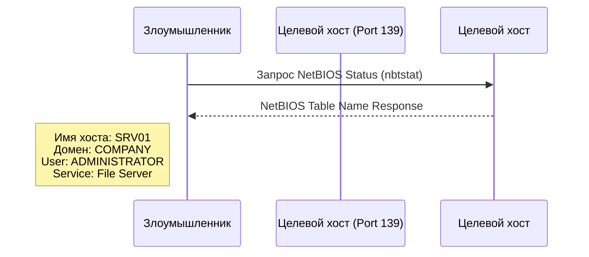
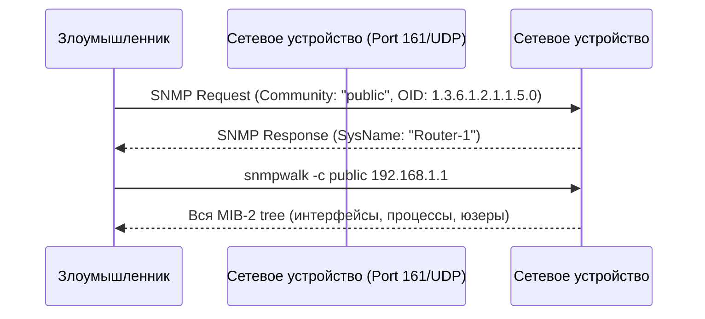
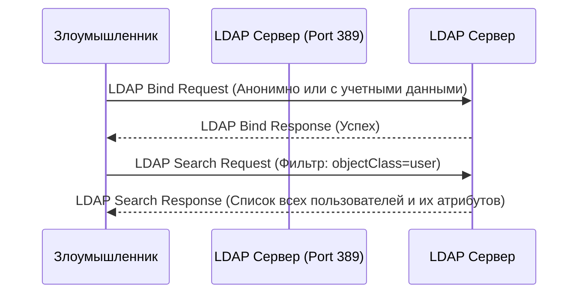
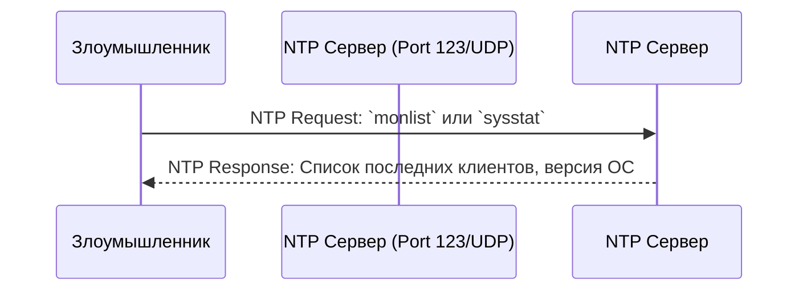
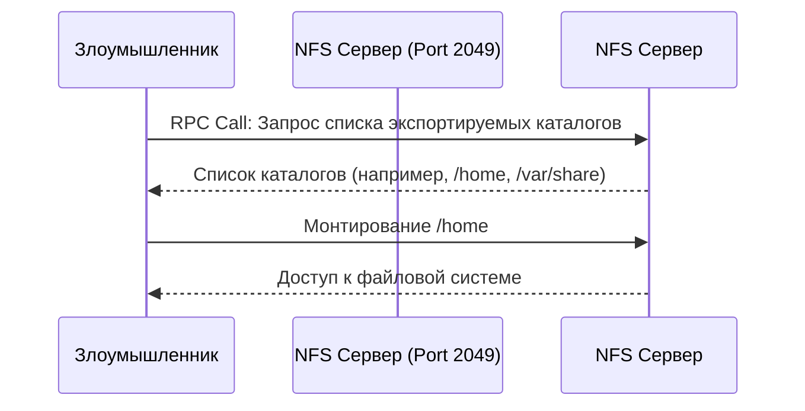
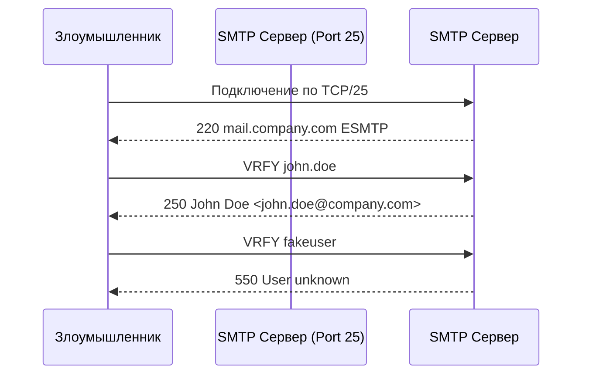
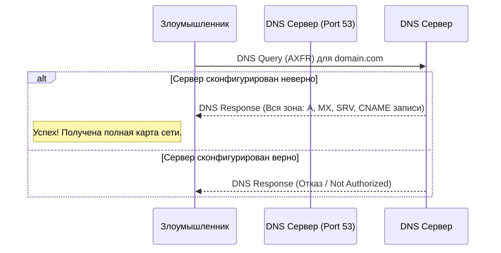
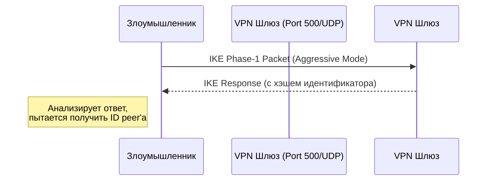
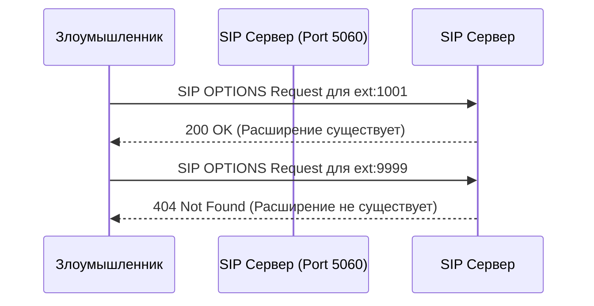
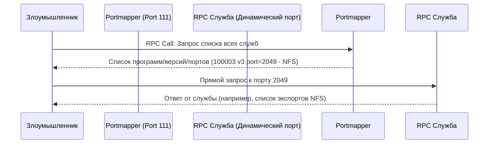

### 1. Концепции перечисления

**Объяснение:**
Перечисление — это процесс извлечения идентификаторов, имен машин, общих ресурсов, служб и других деталей из сетевой среды. В отличие от сканирования (которое отвечает на вопрос "Что работает?"), перечисление отвечает на вопрос "Кто и что это такое?".

**Основные цели:**
*   Сбор списков пользователей и групп.
*   Определение общих сетевых ресурсов.
*   Определение типов и версий ОС и служб.
*   Сбор информации о сетевых протоколах и службах (например, с помощью SNMP).

---

### 2. Техники перечисления

**Объяснение:**
Это общие методы, используемые для извлечения информации. Конкретные техники зависят от используемых протоколов и служб.

**Основные техники:**
*   **Активные запросы:** Прямое подключение к службам (по TCP/UDP) и отправка запросов.
*   **Анализ ответов:** Изучение "баннеров" и сообщений об ошибках, которые могут раскрывать информацию.
*   **Использование уязвимых конфигураций:** Например, анонимный доступ к общим папкам или LDAP.
*   **Эскалация привилегий в рамках протокола:** Использование учетных данных с низкими привилегиями для получения более детальной информации.

---

### 3. Перечисление NetBIOS

**Объяснение:**
NetBIOS — это старый сетевой протокол, используемый в сетях Windows для разрешения имен и общего доступа к файлам и принтерам. Перечисление NetBIOS позволяет получить список доменов, машин, пользователей и общих ресурсов.

**Как работает:**
1.  Злоумышленник подключается к целевой машине по портам **135 (RPC Endpoint Mapper)**, **139 (NetBIOS Session Service)**.
2.  С помощью инструментов вроде `nbtstat` или `nbtscan` отправляются запросы для получения NetBIOS-таблицы имени.
3.  Эта таблица содержит имя машины, домен, а также службы, запущенные на хосте.

**Диаграмма последовательности NetBIOS:**

**Инструменты:** `nbtstat`, `nbtscan`, `Nmap` (скрипты).

---

### 4. Перечисление SNMP

**Объяснение:**
SNMP (Simple Network Management Protocol) используется для управления сетевыми устройствами. Он хранит огромное количество информации в структуре MIB (Management Information Base). Если строки сообщества (community strings, аналоги паролей) известны или установлены по умолчанию (`public` для чтения), можно получить детальную информацию.

**Как работает:**
1.  Злоумышленник обнаруживает открытый порт **161/UDP**.
2.  Используя утилиты вроде `snmpwalk` и зная строку сообщества (например, `public`), он опрашивает MIB устройства.
3.  Из MIB можно извлечь имена интерфейсов, таблицы маршрутизации, список запущенных процессов, контактную информацию и многое другое.

**Диаграмма последовательности SNMP:**

**Инструменты:** `snmpwalk`, `snmp-check`, `onesixtyone`.

---

### 5. Перечисление LDAP

**Объяснение:**
LDAP (Lightweight Directory Access Protocol) используется для доступа к службам каталогов, таким как Microsoft Active Directory или OpenLDAP. Он содержит богатейшую информацию о пользователях, группах, компьютерах и политиках.

**Как работает:**
1.  Злоумышленник подключается к серверу каталогов по порту **389** (или **636** для LDAPS).
2.  Если разрешен анонимный доступ (или есть учетные данные), он может выполнять поисковые запросы по каталогу.
3.  Можно получить полный список пользователей, их атрибуты (email, телефон, отдел), членство в группах и структуру домена.

**Диаграмма последовательности LDAP:**

**Инструменты:** `ldapsearch`, `AdExplorer`, `windapsearch`.

---

### 6. Перечисление NTP

**Объяснение:**
NTP (Network Time Protocol) используется для синхронизации времени. Серверы NTP могут раскрывать информацию о себе и своих клиентах.

**Как работает:**
1.  Злоумышленник подключается к NTP-серверу по порту **123/UDP**.
2.  С помощью команд `ntpdc` или `ntpq` отправляются специальные запросы, такие как `listpeers` или `sysinfo`.
3.  Это может раскрыть список клиентов, доверяющих серверу, версию ОС и конфигурацию сервера.

**Диаграмма последовательности NTP:**

**Инструменты:** `ntpdc`, `ntpq`, `Nmap` (скрипты).

---

### 7. Перечисление NFS

**Объяснение:**
NFS (Network File System) позволяет монтировать удаленные файловые системы по сети. Если экспорт не ограничен должным образом, можно получить список доступных ресурсов.

**Как работает:**
1.  Злоумышленник обнаруживает порт **2049** (NFS).
2.  С помощью команды `showmount` он запрашивает список каталогов, экспортированных для монтирования.
3.  Получив список, он может попытаться смонтировать эти ресурсы и изучить их содержимое.

**Диаграмма последовательности NFS:**

**Инструменты:** `showmount -e <target>`, `mount`.

---

### 8. Перечисление SMTP

**Объяснение:**
SMTP (Simple Mail Transfer Protocol) используется для отправки почты. С помощью специальных команд (`VRFY`, `EXPN`, `RCPT TO`) можно проверить существование пользователей на почтовом сервере.

**Как работает:**
1.  Злоумышленник подключается к SMTP-серверу по порту **25**.
2.  Он использует команды:
    *   `VRFY <username>`: Проверяет, существует ли пользователь.
    *   `EXPN < mailing list>`: Раскрывает членов почтовой рассылки.
3.  Сервер подтверждает существование пользователя, что позволяет создать список валидных учетных записей для последующей атаки.

**Диаграмма последовательности SMTP:**

**Инструменты:** `telnet`, `smtp-user-enum`, `Nmap` (скрипты).

---

### 9. Перечисление DNS

**Объяснение:**
DNS (Domain Name System) содержит карту сети. Перечисление DNS — это попытка получить детальную информацию о зоне DNS, такую как список всех машин (записи A), серверов почты (MX), имен сервисов (SRV) и т.д.

**Как работает:**
1.  **Трансфер зоны (Zone Transfer):** Злоумышленник пытается выполнить запрос AXFR на DNS-сервер. Если сервер неправильно сконфигурирован, он отправит всю копию зоны.
2.  **Рекурсивные запросы:** Поиск записей SRV для поиска ключевых серверов (например, `_ldap._tcp.dc._msdcs` для контроллеров домена).
3.  **Обратные запросы (PTR):** Поиск имен хостов по диапазонам IP-адресов.

**Диаграмма последовательности DNS (Zone Transfer):**

**Инструменты:** `dig`, `nslookup`, `dnsrecon`, `Nmap`.

---

### 10. IPSec перечисление

**Объяснение:**
IPSec используется для создания VPN-туннелей. Перечисление IPSec пытается обнаружить хосты, использующие IPSec, и собрать информацию о их конфигурации (например, идентификаторы peer-ов).

**Как работает:**
1.  Злоумышленник использует инструменты вроде `ike-scan`.
2.  Он отправляет пакеты IKE (Internet Key Exchange) на целевой хост.
3.  Анализируя ответы, можно определить, поддерживает ли хост IPSec, а также получить информацию о методах аутентификации и идентификаторах.

**Диаграмма последовательности IPSec:**

**Инструменты:** `ike-scan`.

---

### 11. VoIP перечисление

**Объяснение:**
VoIP (Voice over IP) — это телефонная связь по IP. Перечисление VoIP направлено на обнаружение SIP-серверов, номеров расширений и пользователей.

**Как работает:**
1.  Злоумышленник сканирует порты **5060/UDP/TCP** (SIP).
2.  С помощью SIP-запросов, таких как `REGISTER`, `INVITE` или `OPTIONS`, он может проверить существование пользователей (номеров).
3.  Сервер вернет код ответа (например, `200 OK` для существующего пользователя, `404 Not Found` для несуществующего).

**Диаграмма последовательности VoIP:**

**Инструменты:** `svwar`, `sipvicious`, `Nmap`.

---

### 12. RPC перечисление

**Объяснение:**
RPC (Remote Procedure Call) позволяет программам выполнять процедуры на удаленных системах. Служба Portmapper (port **111**) перенаправляет клиентов к нужным RPC-службам (которые используют динамические порты).

**Как работает:**
1.  Злоумышленник запрашивает Portmapper, чтобы получить список всех зарегистрированных RPC-служб и их портов.
2.  Затем он может подключиться напрямую к этим службам (например, NFS, NIS, mountd) для получения дополнительной информации.

**Диаграмма последовательности RPC:**

**Инструменты:** `rpcinfo`, `rpcclient`.

---

### 13. Unix перечисление

**Объяснение:**
Это общий термин для сбора информации о Unix-подобных системах с использованием их собственных служб и команд.

**Как работает:**
*   **NIS (Network Information Service):** Если служба NIS (port **789**) неправильно сконфигурирована, можно получить базу данных паролей (`/etc/passwd`).
*   **RPC-службы:** Как описано выше.
*   **Анализ общих ресурсов:** NFS, Samba.
*   **Сбор информации о хосте:** Использование команд типа `finger`, `rpcinfo`, `showmount`.

**Инструменты:** `yp-tools` (для NIS), `rpcinfo`, `showmount`.

### Общие меры противодействия перечислению

*   **Отключение ненужных служб:** Чем меньше служб, тем меньше поверхность для атаки.
*   **Настройка брандмауэров:** Блокировка доступа к портам служб от недоверенных сетей.
*   **Патчинг и обновления:** Регулярное обновление ПО для устранения уязвимостей.
*   **Строгая конфигурация:**
    *   Запрет анонимного доступа (LDAP, SMB).
    *   Изменение стандартных строк сообщества SNMP.
    *   Запрет трансферов зоны для неавторизованных клиентов (DNS).
    *   Отключение ненужных команд SMTP (`VRFY`, `EXPN`).
*   **Мониторинг и аудит:** Обнаружение и реагирование на подозрительную активность, связанную с перечислением.