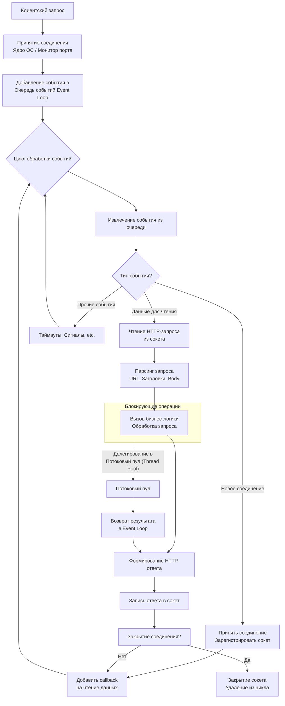

### Основная концепция: Модель событийного цикла (Event Loop)

Современные веб-серверы (такие как Nginx, Node.js, серверы на Python с ASGI) используют **асинхронную, неблокирующую модель** на основе событийного цикла. Это позволяет обрабатывать тысячи одновременных подключений, не создавая для каждого из них отдельный поток (что было бы очень расточительным для ресурсов).

---

### Диаграмма процессов

Диаграмма ниже иллюстрирует жизненный цикл HTTP-запроса в таком сервере.

---

### Пошаговое объяснение диаграммы

#### 1. Принятие соединения
*   **Процесс:** Веб-сервер прослушивает определенный порт (например, 80 или 443). За это отвечает либо сам сервер, либо монитор портов в ядре ОС (например, `epoll` в Linux, `kqueue` в BSD).
*   **На диаграмме:** Блоки `A` и `B`. Когда клиент (браузер) устанавливает новое TCP-соединение, операционная система уведомляет об этом веб-сервер.
*   **Событие:** Генерируется событие **"Новое соединение"**.

#### 2. Очередь событий (Event Queue)
*   **Процесс:** Событие "Новое соединение" помещается в **Очередь событий** (Event Queue). Event Loop постоянно проверяет эту очередь.
*   **На диаграмме:** Блок `C`.

#### 3. Цикл обработки событий (Event Loop)
*   **Процесс:** Это бесконечный цикл, который является сердцем сервера. Его работа:
    1.  Проверить, есть ли в очереди события.
    2.  Если очередь пуста, ждать новых событий.
    3.  Извлечь событие из очереди (`E`).
    4.  Обработать его с помощью соответствующего обработчика (callback-функции).
*   **На диаграмме:** Блок `D` и стрелка, ведущая к `E`.

#### 4. Обработка событий
Event Loop смотрит на тип извлеченного события (`F`) и передает управление соответствующему обработчику.

*   **Событие "Новое соединение" (`F -> G`):**
    *   Сервер принимает соединение и получает файловый дескриптор (сокет) для общения с клиентом.
    *   Этот сокет регистрируется в событийном цикле **как неблокирующий** и для него задается callback-функция на событие **"Данные для чтения"** (`H`). Это ключевой момент: сервер не ждет данные от этого клиента, а продолжает работать с другими событиями.

*   **Событие "Данные для чтения" (`F -> I`):**
    *   Это самое частое событие. Оно означает, что в сокете готовы для чтения данные, которые отправил клиент (HTTP-запрос).
    *   Обработчик читает данные из сокета (`I`), парсит сырой HTTP-запрос в структурированный вид (`J`: метод, URL, заголовки, тело).
    *   Далее вызывается бизнес-логика приложения (`K`), например, обращение к базе данных или внешнему API.

#### 5. Важный нюанс: Блокирующие операции
*   **Проблема:** Если бизнес-логика (`K`) выполняется синхронно и долго (например, сложные вычисления в основном потоке), это **заблокирует** весь Event Loop. Сервер не сможет обрабатывать другие запросы, пока эта операция не завершится.
*   **Решение:** Все долгие или блокирующие операции (работа с файлами, тяжелые вычисления, запросы к БД) должны быть **асинхронными**.
*   **На диаграмме:** Пунктирная стрелка от `K` к `Q`.
    *   Событийный цикл делегирует выполнение блокирующей задачи в **отдельный пул потоков (Thread Pool)**.
    *   Как только задача в потоке завершается, она генерирует событие "Задача готова", которое помещается в очередь.
    *   Event Loop, дойдя до этого события, забирает результат и продолжает обработку запроса (`R -> L`), формируя и отправляя ответ клиенту.

#### 6. Отправка ответа и завершение
*   **Процесс:** После формирования HTTP-ответа (`L`), он записывается в сокет (`M`). Часто запись в сокет тоже неблокирующая и асинхронная.
*   **Завершение:** После отправки ответа сервер решает, закрывать ли соединение (например, если заголовок `Connection: close`) или оставить его открытым для последующих запросов (HTTP Keep-Alive) (`N`).

### Ключевые преимущества этой модели

1.  **Высокая производительность и масштабируемость:** Один процесс может обслуживать десятки тысяч одновременных подключений, не тратя ресурсы на переключение между потоками.
2.  **Эффективное использование ресурсов:** Сервер не простаивает в ожидании I/O-операций (чтение из сети, запись на диск), а сразу переходит к обработке других событий.

Эта модель является фундаментом для таких технологий, как **Nginx**, **Node.js**, и современных фреймворков на Python (**FastAPI**, **Django с ASGI**) и Java (**Netty**).