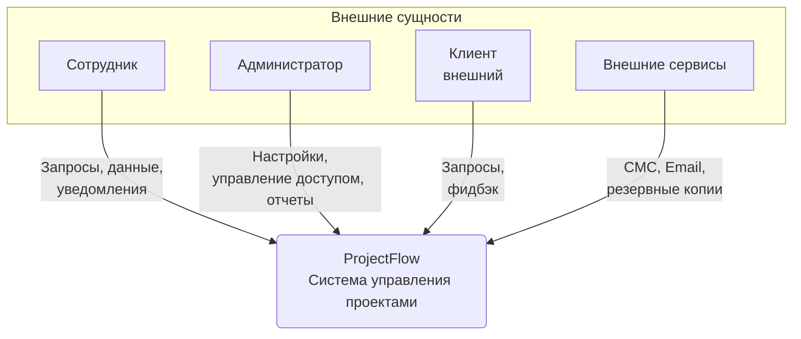
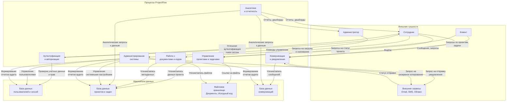

### Финальное задание (разбор)
https://docs.google.com/document/d/1T15Uwq4J7Y2mISzWA1WMHSY8agCuXFDqK4y7nlAGX04/edit?usp=sharing

### **Задание 1: Построение диаграммы потоков данных (DFD) для системы ProjectFlow**

DFD позволяет наглядно отобразить, какие данные обрабатываются в системе, кто их использует и куда они передаются. Это основа для выявления угроз и определения необходимых мер контроля.

---

### **1. Контекстная диаграмма (Уровень 0)**

Контекстная диаграмма отображает систему "ProjectFlow" как единый процесс и ее взаимодействие с внешними сущностями.

**Схема:**

**Пояснительная записка к контекстной диаграмме (Уровень 0):**

*   **Центральный процесс (1):**
    *   **ProjectFlow (Система управления проектами):** Единая система, представляющая собой весь функционал приложения.

*   **Внешние сущности:**
    *   **Сотрудник:** Пользователь системы (разработчик, менеджер, аналитик). Инициирует основные потоки данных: запросы на выполнение операций, загрузку/скачивание данных, получение уведомлений.
    *   **Администратор:** Сотрудник с повышенными привилегиями. Обеспечивает функционирование системы: настройку, управление пользователями и правами доступа, формирование отчетов.
    *   **Клиент (внешний):** Внешняя организация-заказчик. Может иметь ограниченный доступ к системе для просмотра статуса проектов, обмена документацией и оставления обратной связи.
    *   **Внешние сервисы:** Сторонние системы, интегрируемые с ProjectFlow для обеспечения функциональности. Например:
        *   Сервисы Email и SMS для рассылки уведомлений.
        *   Облачные хранилища (с российскими ЦОД) для резервного копирования.

*   **Ключевые потоки данных:**
    *   Потоки от пользователей к системе: это **команды и данные** (логин, загрузка файла, создание задачи).
    *   Потоки от системы к пользователям: это **ответы и уведомления** (интерфейс приложения, отчет, email-оповещение).
    *   Потоки с внешними сервисами: это **интеграционные обмены** (отправка запроса на API SMS-шлюза, выгрузка бэкапа в облако).

---

### **2. Диаграмма уровня 1**

Диаграмма уровня 1 детализирует центральный процесс, показывая основные подпроцессы и накопители данных внутри системы.

**Схема:**

**Пояснительная записка к диаграмме уровня 1:**

*   **Процессы (функциональные модули):**
    1.  **Аутентификация и авторизация:** Критический процесс контроля доступа. Проверяет личность пользователя и определяет его права в системе.
    2.  **Управление проектами и задачами:** Ядро системы. Обрабатывает создание, редактирование, отслеживание проектов, задач и их статусов.
    3.  **Работа с документами и кодом:** Управляет жизненным циклом файлов (документы, исходный код): загрузка, версионирование, скачивание.
    4.  **Коммуникации и уведомления:** Обеспечивает обмен сообщениями между пользователями и интеграцию с внешними каналами (email, SMS) для оповещений.
    5.  **Аналитика и отчетность:** Формирует сводные данные, дашборды и отчеты на основе информации из других процессов.
    6.  **Администрирование системы:** Процесс для администраторов, включающий управление пользователями, настройками системы, мониторинг и формирование отчетов аудита.

*   **Накопители данных:**
    *   **База данных пользователей и сессий:** Хранит учетные записи, хэши паролей, роли, активные сессии. Это ключевой объект для защиты (152-ФЗ).
    *   **База данных проектов и задач:** Хранит структурированные данные: описание проектов, задачи, статусы, связи, метаданные файлов.
    *   **Файловое хранилище:** Хранит бинарные данные — документы (договоры, ТЗ) и исходный код. Это самые ценные активы компании, требующие строгого контроля доступа и шифрования.
    *   **База данных коммуникаций:** Хранит историю переписки, комментарии к задачам, уведомления.

*   **Уточненные потоки данных:**
    *   Потоки между процессами и накопителями показывают, какой процесс с какими данными работает (например, "Запись файла" от Процесса 3 к Хранилищу 3).
    *   Появление **токена сессии** как потока от Процесса 1 к Сотруднику — это важный элемент безопасности, заменяющий передачу пароля при каждом запросе.
    *   Поток **"Запрос на отправку уведомления"** от Процесса 4 к Внешним сервисам детализирует интеграцию.

### **Выводы для этапа проектирования защиты**

На основе построенных DFD уже можно сделать первые выводы для security-архитектуры:

1.  **Критичные точки:**
    *   **Процесс 1 (Аутентификация):** Требует усиленной защиты (МФА, контроль аномалий).
    *   **Накопители 1, 2, 3:** Хранят конфиденциальную информацию и персональные данные. Необходимо шифрование (как хранимых данных, так и каналов передачи), строгий контроль доступа и мониторинг операций.
    *   **Потоки между пользователем и системой:** Требуется защищенный протокол (HTTPS/TLS).

2.  **Учет российского регулирования:**
    *   Для хранения персональных данных сотрудников и, возможно, клиентов (если они физ. лица) необходимо обеспечить соответствие **152-ФЗ**. Это влияет на выбор серверов (российские ЦОД), политики хранения и обработки.
    *   Если система будет использоваться для проектов госзаказчиков, необходимо заложить возможность выполнения требований **ФСТЭК России**.

3.  **Следующие шаги:**
    *   На основе DFD необходимо провести **анализ угроз** (например, с помощью методологии STRIDE) для каждого элемента диаграммы.
    *   Разработать **модель угроз**.
    *   Спроектировать **архитектуру безопасности**, включая конкретные механизмы защиты (межсетевые экраны, SIEM, DLP, криптография) для выявленных уязвимых мест.

### **Задание 2: Анализ угроз с использованием STRIDE**

**Обоснование:** Анализ проводится для каждого элемента DFD уровня 1. Вероятность и влияние оцениваются по 3-балльной шкале (Низкая, Средняя, Высокая) с учетом контекста компании "ТехноПрогресс" (гибридная инфраструктура, ценные активы).

---

### **Матрица анализа угроз**

| Элемент DFD | Категория STRIDE | Описание угрозы | Вероятность | Влияние | Обоснование |
| :--- | :--- | :--- | :--- | :--- | :--- |
| **1. Процесс "Аутентификация и авторизация"** | **Spoofing (Подмена)** | Злоумышленник крадет или подбирает учетные данные сотрудника для получения доступа к системе. | Высокая | Высокое | Использование стандартных паролей, фишинг-атаки на сотрудников. Доступ ко всей системе. |
| | **Tampering (Изменение)** | Изменение конфигурации политик авторизации для ослабления контроля доступа. | Средняя | Критическое | Требует доступа админа, но возможно через уязвимость в коде или инсайдера. |
| | **Repudiation (Отказ)** | Пользователь отрицает выполнение действий в системе (e.g., удаление файла). Аудит не ведется. | Средняя | Среднее | Без надлежащего логирования невозможно доказать действие. |
| | **Information Disclosure (Раскрытие)** | Утечка хэшей паролей или токенов сессий из БД или памяти процесса. | Средняя | Высокое | Позволяет захватить учетные записи. Критично для соблюдения 152-ФЗ. |
| | **Denial of Service (Отказ в обслуживании)** | "Атака" неправильными паролями, вызывающая блокировку учетных записей множества пользователей. | Средняя | Высокое | Нарушает бизнес-процессы компании. |
| | **Elevation of Privilege (Повышение привилегий)** | Обход проверок авторизации (e.g., из-за SQL-инъекции) для получения прав администратора. | Средняя | Критическое | Позволяет получить полный контроль над системой и данными. |
| **2. Процесс "Управление проектами и задачами"** | **Tampering (Изменение)** | Злоумышленник изменяет сроки, бюджет, статус проекта, что приводит к финансовым потерям. | Средняя | Высокое | Нарушение целостности бизнес-данных. |
| | **Information Disclosure (Раскрытие)** | Неавторизованный доступ к списку всех проектов и клиентов (коммерческая тайна). | Высокая | Критическое | Утечка стратегической информации конкурентам. |
| **3. Процесс "Работа с документами и кодом"** | **Tampering (Изменение)** | Внесение вредоносного кода в репозиторий или изменение критичной документации (ТЗ, договоры). | Средняя | Критическое | Прямая угроза интеллектуальной собственности и качеству продукта. |
| | **Information Disclosure (Раскрытие)** | Несанкционированное скачивание исходного кода или конфиденциальных документов клиента. | Высокая | Критическое | Потеря конкурентного преимущества, нарушение контрактов и 152-ФЗ. |
| **4. Процесс "Коммуникации и уведомления"** | **Information Disclosure (Раскрытие)** | Перехват конфиденциальных сообщений между сотрудниками или с клиентом по незащищенному каналу. | Средняя | Высокое | Утечка служебной и коммерческой информации. |
| | **Repudiation (Отказ)** | Отправка оскорбительного сообщения с последующим отрицанием этого факта. | Низкая | Среднее | Создает конфликтные ситуации внутри коллектива и с клиентами. |
| **5. Процесс "Администрирование системы"** | **Elevation of Privilege (Повышение)** | Обычный пользователь получает доступ к интерфейсу администрирования из-за ошибки контроля доступа. | Средняя | Критическое | Получение полного контроля над системой. |
| **6. Накопитель "База данных пользователей"** | **Tampering (Изменение)** | Прямой доступ к БД и изменение ролей пользователей или прав доступа. | Средняя | Критическое | Нарушение всей модели разграничения доступа. |
| | **Information Disclosure (Раскрытие)** | Кража таблицы с хэшами паролей и персональными данными сотрудников (e-mail, ФИО). | Высокая | Критическое | Прямое нарушение 152-ФЗ, компрометация всех учетных записей. |
| **7. Накопитель "Файловое хранилище"** | **Information Disclosure (Раскрытие)** | Прямой доступ к файловому серверу в обход приложения и скачивание исходных кодов. | Средняя | Критическое | Прямая угроза ключевым активам компании. |
| **8. Поток данных "Учетные данные"** | **Spoofing (Подмена)** | Перехват логина и пароля при передаче по незашифрованному каналу (HTTP). | Высокая | Высокое | Позволяет полностью захватить учетную запись пользователя. |
| **9. Внешняя сущность "Внешние сервисы"** | **Tampering (Изменение)** | Компрометация сервиса отправки Email и рассылка фишинговых писем от имени компании. | Средняя | Высокое | Подрыв репутации, компрометация сотрудников. |

---

### **Ключевые выводы и приоритеты для безопасности**

На основе проведенного анализа можно сформулировать четкие требования к системе защиты:

1.  **Высший приоритет (Критическое влияние):**
    *   **Защита исходного кода и документов:** Необходимо внедрить строгое разграничение доступа (на основе ролей), шифрование данных на уровне хранилища и журналирование всех операций доступа.
    *   **Защита персональных данных:** Для соответствия 152-ФЗ требуется шифрование БД пользователей, pseudonymization, и строгий контроль доступа.
    *   **Контроль целостности системы:** Внедрение подписей кода и механизмов контроля целостности файлов для предотвращения tampering.
    *   **Неотклоняемое логирование:** Централизованный сбор и защита логов всех критичных действий (аутентификация, доступ к файлам, изменения прав) для предотвращения repudiation и расследования инцидентов.

2.  **Средний приоритет (Высокое влияние):**
    *   **Усиленная аутентификация:** Внедрение **Многофакторной аутентификации (МФА/MFA)**, особенно для администраторов и доступа к критичным данным.
    *   **Защита каналов связи:** Обязательное использование TLS 1.2+ для всех соединений, как внутренних, так и с внешними сервисами.
    *   **Защита от DoS:** Использование WAF (Web Application Firewall) и ограничение частоты запросов к критичным endpoint'ам (логин, загрузка файлов).

3.  **Общие меры:**
    *   **Принцип минимальных привилегий:** Пользователи должны иметь доступ только к тем данным и функциям, которые необходимы для их работы.
    *   **Регулярный аудит безопасности:** Проведение пентестов и анализа уязвимостей, особенно для компонентов, доступных извне.
    *   **Security Awareness:** Обучение сотрудников правилам кибергигиены для противодействия фишингу и спуфингу.

Данный анализ является основой для следующего этапа — проектирования архитектуры безопасности и выбора конкретных контрмер (межсетевые экраны, SIEM, DLP, Vault).

### **Задание 3: Оценка рисков с использованием DREAD**

**Методика оценки:** Каждому параметру DREAD присваивается оценка от 0 до 5 баллов. Общий показатель риска вычисляется как среднее арифметическое всех пяти параметров.
`DREAD = (D + R + E + A + D) / 5`

---

### **Матрица оценки рисков по методике DREAD**

| Угроза (из задания 2) | **D** Ущерб | **R** Воспроиз- водимость | **E** Эксплуати- руемость | **A** Затронутые пользователи | **D** Обнаружа- емость | **Средний балл** | **Уровень риска** |
| :--- | :--- | :--- | :--- | :--- | :--- | :--- | :--- |
| **1. Information Disclosure:** Несанкционированное скачивание исходного кода (Процесс "Работа с документами и кодом") | **5** Полная потеря ИС, ущерб репутации, судебные иски | **4** Доступ можно получать многократно | **3** Требуется учетная запись сотрудника (инсайдер) или уязвимость в системе контроля доступа | **3** Затронута вся компания (потеря актива) и клиенты (нарушение конфиденциальности) | **4** Злоумышленник может легко обнаружить уязвимости контроля доступа | **3.8** | **Высокий** |
| **2. Information Disclosure:** Кража таблицы с хэшами паролей и персональными данными сотрудников (Накопитель "БД пользователей") | **5** Нарушение 152-ФЗ, штрафы, компрометация всех учетных записей | **5** После получения досканать данные можно многократно | **2** Требуется уязвимость, позволяющая прямой доступ к БД (напр., SQL-инъекция) | **5** Затронуты абсолютно все сотрудники (200 человек) | **4** Уязвимости типа SQLi хорошо известны и легко обнаруживаются сканерами | **4.2** | **Критический** |
| **3. Elevation of Privilege:** Обход проверок авторизации для получения прав администратора (Процесс "Аутентификация и авторизация") | **5** Полный контроль над системой и данными | **4** После обнаружения уязвимости ее можно эксплуатировать постоянно | **2** Требуется высокая квалификация для поиска уязвимости в коде | **5** Под угрозой вся система и все пользователи | **3** Логические уязвимости сложно обнаружить автоматически | **3.8** | **Высокий** |
| **4. Tampering:** Внесение вредоносного кода в репозиторий (Процесс "Работа с документами и кодом") | **5** Подрыв качества продукта, внедрение бэкдоров, компрометация клиентов | **3** После внесения изменение может быть обнаружено системами контроля версий | **3** Требуется учетная запись с правами на запись или уязвимость | **5** Затронуты все клиенты, использующие данный код | **2** Сложно обнаружить без анализа кода и ревью | **3.6** | **Высокий** |
| **5. Spoofing:** Подмена учетных данных пользователя (Процесс "Аутентификация и авторизация") | **4** Получение доступа ко всем данным жертвы, совершение действий от ее имени | **5** Атаку можно проводить многократно против разных пользователей | **4** Фишинг или брутфорс не требуют глубоких технических знаний | **4** Любой сотрудник может стать жертвой | **5** Учетные данные передаются постоянно, вектор атаки очевиден | **4.4** | **Критический** |

---

### **Приоритизация рисков и рекомендации по контрмерам**

На основе оценки DREAD риски распределяются в следующий порядок приоритетности для устранения:

**1. Критический риск: Угроза №5 (Spoofing - Подмена учетных данных)**
*   **Риск:** 4.4
*   **Рекомендуемые контрмеры:**
    *   **Обязательное внедрение Многофакторной аутентификации (МФА/MFA)** для всех пользователей.
    *   Реализация политики **сложных паролей** и их регулярная смена.
    *   Проведение **регулярного обучения** сотрудников по теме фишинга и социальной инженерии.
    *   Внедрение системы обнаружения аномальных входов (например, вход из незнакомого местоположения).

**2. Критический риск: Угроза №2 (Information Disclosure - Кража БД пользователей)**
*   **Риск:** 4.2
*   **Рекомендуемые контрмеры:**
    *   **Хэширование паролей** с использованием стойких алгоритмов (bcrypt, Argon2) с **"солью"**.
    *   **Шифрование** полей с персональными данными в базе данных.
    *   Регулярный **аудит кода и пентесты** на наличие уязвимостей (SQL-инъекции).
    *   Строгое **разграничение доступа** к БД, использование принципа минимальных привилегий.

**3. Высокий риск: Угроза №1 (Information Disclosure - Утечка исходного кода)**
*   **Риск:** 3.8
*   **Рекомендуемые контрмеры:**
    *   Внедрение **системы контроля доступа на основе ролей (RBAC)** с детализированными разрешениями.
    *   **Шифрование файлового хранилища** на уровне дисков и/или приложения.
    *   **Неотклоняемое логирование** всех операций доступа к файлам (кто, когда, что скачал).

**4. Высокий риск: Угроза №3 (Elevation of Privilege - Повышение привилегий)**
*   **Риск:** 3.8
*   **Рекомендуемые контрмеры:**
    *   **Строгий код-ревью** всех компонентов, отвечающих за авторизацию.
    *   **Регулярное проведение пентестов** с фокусом на логику приложения.
    *   Принцип **минимальных привилегий** для сервисных учетных записей и компонентов системы.

**5. Высокий риск: Угроза №4 (Tampering - Изменение кода)**
*   **Риск:** 3.6
*   **Рекомендуемые контрмеры:**
    *   Внедрение процедуры **обязательного ревью кода** перед слиянием в основную ветку.
    *   Использование **подписанных коммитов** в системе контроля версий.
    *   Настройка **оповещений** о прямых пушах в главные ветки.

### **Общий вывод**

Методика DREAD наглядно показала, что наибольшую непосредственную опасность представляют угрозы, связанные с компрометацией учетных записей (Spoofing) и утечкой аутентификационных данных (Information Disclosure в БД пользователей). Это подтверждает необходимость первоочередных инвестиций в **усиление аутентификации (МФА) и защиту данных на уровне хранилищ (шифрование)**. Все выявленные высокие и критические риски требуют обязательного включения соответствующих контрмер в план проекта по внедрению системы ProjectFlow.

На основе проведенного анализа угроз и рисков переходим к ключевому этапу — проектированию системы защиты, которая будет встроена в архитектуру "ProjectFlow" с учетом российских требований.

### **Задание 4: Выявление уязвимостей на этапе проектирования и проектирование контрмер**

---

### **Часть 1: Ключевые архитектурные решения**

#### **1.1. Схема аутентификации и авторизации**

**Архитектурное решение:** Многоуровневая система контроля доступа на основе ролей (RBAC) с обязательной многофакторной аутентификацией (MFA).

*   **Аутентификация:**
    1.  **Единая точка входа (SSO):** Интеграция с российским сервисом единого входа (например, на базе **OpenID Connect**), если в компании есть корпоративный портал. Если нет — собственная реализация OAuth 2.0/OpenID Connect.
    2.  **Многофакторная аутентификация (MFA):** Обязательное использование второго фактора для всех пользователей. В качестве фактора использовать **TOTP-приложение** (например, Google Authenticator или Яндекс.Ключ) или **SMS** (менее предпочтительно из-за рисков SIM-свопинга). Для администраторов — только TOTP или аппаратные ключи.
    3.  **Управление сессиями:** Использование короткоживущих JWT-токенов (access token) и долгоживущих refresh-токенов. Refresh-токены хранятся в защищенном хранилище (httpOnly cookie) и отзываются.

*   **Авторизация:**
    1.  **Ролевая модель (RBAC):** Определены роли (`Пользователь`, `Менеджер`, `Администратор`, `Клиент_внешний`). Права назначаются ролям, а не пользователям.
    2.  **Проверка прав на каждом уровне:**
        *   **Уровень представления:** В интерфейсе отображаются только доступные для роли функции.
        *   **Уровень контроллера (Backend):** Все API-эндпоинты защищены аннотациями/декораторами, проверяющими права доступа (например, `@PreAuthorize("hasRole('MANAGER')")`).
        *   **Уровень сервиса (Backend):** Бизнес-логика включает дополнительные проверки, что пользователь имеет доступ именно к данной сущности (например, к проекту Х, а не ко всем проектам).

**Обоснование:** Данная схема напрямую противостоит угрозам **Spoofing** и **Elevation of Privilege**, значительно усложняя компрометацию учетной записи и несанкционированный доступ.

#### **1.2. Модель управления доступом**

**Архитектурное решение:** Комбинированная модель **RBAC + ABAC (Attribute-Based Access Control)** для детализированного контроля.

*   **RBAC:** Определяет, *что* пользователь может делать в системе (создавать проекты, читать задачи).
*   **ABAC:** Определяет, *к каким конкретным данным* пользователь имеет доступ. Правила основаны на атрибутах:
    *   Атрибут пользователя: `Отдел`, `Команда`.
    *   Атрибут ресурса: `Владелец_проекта`, `Метка_конфиденциальности`.
    *   Правило: "Разработчик из `Команды_А` может читать исходный код только проектов, где `Владелец_проекта == Команда_А`".

**Обоснование:** Позволяет реализовать принцип минимальных привилегий, предотвращая угрозы **Information Disclosure** и **Tampering** на уровне данных, а не только функций.

#### **1.3. Схема защиты данных**

**Архитектурное решение:** Сквозное шифрование и сегментация данных.

*   **Шифрование в состоянии покоя:**
    1.  **Базы данных:** Использование прозрачного шифрования дисков (например, LUKS в Linux) для всех данных. Для персональных данных и паролей — дополнительное **прикладное шифрование** с использованием российских криптографических алгоритмов (ГОСТ 34.12-2015 "Кузнечик") и ключей, хранящихся в **HashiCorp Vault** или российском аналоге.
    2.  **Файловое хранилище:** Шифрование на уровне блочного хранилища. Для исходного кода и критичных документов — дополнительное шифрование на уровне приложения перед записью в хранилище.

*   **Шифрование в состоянии передачи:**
    *   Обязательное использование **TLS 1.2+** для всего HTTP-трафика. Все внутренние сервисы взаимодействуют по защищенным каналам (mTLS).

*   **Сегментация данных:**
    *   Разделение БД и файловых хранилищ для разных типов данных (пользователи, проекты, файлы) на разные логические/физические серверы или инстансы. Доступ к каждому сегменту ограничивается сетевыми политиками.

**Обоснование:** Прямая защита от угроз **Information Disclosure** даже в случае компрометации хранилища или перехвата трафика. Обеспечивает соответствие 152-ФЗ.

#### **1.4. Архитектура мониторинга безопасности**

**Архитектурное решение:** Централизованный сбор логов и система реагирования на инциденты (SIEM).

*   **Сбор данных:** Все компоненты (веб-серверы, приложение, БД, СУБД) направляют логи в центральную систему (например, на базе **ELK Stack** или **Splunk**).
*   **Ключевые события для мониторинга:**
    *   Неудачные попытки входа.
    *   Попытки доступа к запрещенным ресурсам (403 ошибки).
    *   Массовое скачивание или выгрузка файлов.
    *   Изменения в правах доступа пользователей.
    *   Доступ к интерфейсам администрирования.
*   **Автоматизация реагирования:** Настройка правил корреляции для генерации оповещений (например, "10 неудачных логинов за 1 минуту" -> блокировка IP в WAF; "Вход пользователя из Москвы, а через 5 минут из Владивостока" -> оповещение SOC).

**Обоснование:** Позволяет выявлять и оперативно реагировать на атаки (**DoS, Spoofing, Information Disclosure**), а также обеспечивает **неотклоняемое логирование** для расследования инцидентов и противодействия **Repudiation**.

---

### **Часть 2: Контрмеры для критичных угроз из задания 3**

| Критичная угроза | Технические контрмеры | Организационные меры | Процедуры мониторинга |
| :--- | :--- | :--- | :--- |
| **1. Spoofing (Подмена учетных данных)** | 1. **Внедрение MFA** для всех учетных записей. 2. **Политика сложных паролей** (мин. 12 символов, все категории). 3. **Блокировка учетной записи** после 5 неудачных попыток входа. | 1. **Обязательное обучение** по кибергигиене и фишингу. 2. **Регламент смены паролей** при подозрении на компрометацию. | 1. **Мониторинг аномалий входа:** геолокация, время, устройство. 2. **Аналитики в SIEM** для обнаружения брутфорс-атак. |
| **2. Information Disclosure (Кража БД пользователей)** | 1. **Хэширование паролей** алгоритмом **bcrypt** (стойкость 12). 2. **Шифрование** полей с ПДн (ФИО, email) в БД. 3. **Защита от SQL-инъекций:** использование ORM/prepared statements, регулярные пентесты. | 1. **Регламент обработки ПДн** в соответствии с 152-ФЗ. 2. **Разделение обязанностей:** доступ к продовой БД имеют только 2-3 ответственных администратора. | 1. **Мониторинг всех запросов** к БД с выделением аномальных (большие выборки, нестандартные запросы). 2. **Аудит доступа** к серверам БД. |
| **3. Information Disclosure (Утечка исходного кода)** | 1. **Детализированная модель RBAC+ABAC** для репозиториев. 2. **Шифрование файлового хранилища** на уровне приложения. 3. **WAF** для блокировки попыток скачивания по нестандартным путям. | 1. **Политика разграничения доступа** к проектам. 2. **Обязательный код-ревью** перед слиянием в главную ветку. | 1. **Логирование всех операций** с файлами (кто, что, когда скачал). 2. **Оповещения на массовое скачивание** (>50 файлов за 10 мин). |
| **4. Elevation of Privilege** | 1. **Строгая валидация прав на уровне backend** для каждого API-вызова. 2. **Регулярное обновление и сканирование зависимостей** (SAST) на уязвимости. 3. **Минимальные привилегии** для сервисных учетных записей. | 1. **Процедура код-ревью** с фокусом на безопасность. 2. **Проведение внутренних пентестов** не реже 2 раз в год. | 1. **Мониторинг попыток доступа** к эндпоинтам `/admin`, `/api/settings`. 2. **Оповещения о назначении** пользователям ролей `Администратор`. |
| **5. Tampering (Изменение кода)** | 1. **Система контроля версий** (Git) с запретом прямого пуша в `main`. 2. **Цифровая подпись коммитов.** 3. **CI/CD пайплайн** с этапами статического анализа кода (SAST) и проверки подписи. | 1. **Регламент разработки,** требующий 2 approval перед мержем. 2. **Политика "четыре глаза"** для развертывания в прод. | 1. **Мониторинг активности в Git** (принудительные пуши, удаление веток). 2. **Оповещения о сборке и деплое** из неподписанного кода. |

### **Итоговый вывод**

Предложенный набор архитектурных решений и контрмер формирует целостную систему защиты информации для "ProjectFlow". Ключевые принципы: **"Не доверяй, проверяй"** (Zero Trust в упрощенной форме), **глубокоэшелонированная оборона** (Defense in Depth) и **встроенная безопасность** (Security by Design). Реализация этих мер позволит компании "ТехноПрогресс" не только противостоять выявленным угрозам, но и создать устойчивую к эволюции угроз платформу, соответствующую требованиям российского законодательства.

### **Задание 5: Разработка требований безопасности**

---

### **Требования безопасности для системы ProjectFlow**

**Цель:** Обеспечить встроенную безопасность на всех этапах жизненного цикла разработки системы (SDLC). Все требования являются обязательными к реализации.

---

#### **1. Аутентификация и управление доступом**

**1.1. Требование:** Реализовать многофакторную аутентификацию (MFA) для всех пользовательских учетных записей.
*   **Критерий приемки:** Система блокирует вход после ввода корректного пароля до успешного ввода одноразового кода из TOTP-приложения (например, Google Authenticator). Для административных учетных записей отключение MFA невозможно.

**1.2. Требование:** Пароли пользователей должны храниться в виде стойких хэшей.
*   **Критерий приемки:** В базе данных вместо паролей хранятся только хэши, сгенерированные алгоритмом **bcrypt** с фактором стоимости не менее **12**. Проверка хэширования осуществляется в тестовой среде.

**1.3. Требование:** Реализовать ролевую модель управления доступом (RBAC) с проверкой прав на уровне backend.
*   **Критерий приемки:** Для каждой роли (`user`, `manager`, `admin`) определен четкий список разрешений (CRUD) для всех сущностей системы. Прямой доступ к API-эндпоинтам без проверки роли в коде сервиса невозможен. Автотесты проверяют, что пользователь с ролью `user` не может получить доступ к эндпоинтам, предназначенным для `admin`.

**1.4. Требование:** Сессии пользователей должны быть защищены от перехвата и должны иметь ограниченное время жизни.
*   **Критерий приемки:** Access Token (JWT) имеет время жизни не более 15 минут. Refresh Token хранится только в httpOnly cookie и имеет время жизни не более 7 дней. При выходе из системы Refresh Token отзывается.

---

#### **2. Защита данных (хранимых и передаваемых)**

**2.1. Требование:** Вся передача данных между клиентом и сервером, а также между внутренними сервисами должна быть зашифрована.
*   **Критерий приемки:** Все эндпоинты доступны только по протоколу **HTTPS (TLS 1.2+)**. Любые HTTP-запросы автоматически перенаправляются на HTTPS. Внутренние вызовы между микросервисами используют mTLS.

**2.2. Требование:** Конфиденциальные данные должны быть зашифрованы при хранении.
*   **Критерий приемки:**
    *   Персональные данные (ФИО, email) в базе данных шифруются на уровне приложения с использованием российского алгоритма **ГОСТ 34.12-2015 (Кузнечик)**.
    *   Исходный код и документы в файловом хранилище шифруются с использованием AES-256 перед записью на диск.
    *   Ключи шифрования хранятся в специализированном сервисе (HashiCorp Vault или российский аналог), а не в коде приложения.

**2.3. Требование:** Система должна быть защищена от внедрения SQL-команд.
*   **Критерий приемки:** В коде приложения отсутствуют строковые конкатенации для формирования SQL-запросов. Используются только параметризованные запросы (Prepared Statements) или ORM. Отчет статического анализатора кода (SAST) не содержит уязвимостей категории "SQL Injection".

---

#### **3. Безопасность приложения**

**3.1. Требование:** Все входящие данные от пользователей должны быть валидированы.
*   **Критерий приемки:** Реализована валидация на стороне сервера для всех полей ввода (тип данных, длина, допустимые символы). Попытка передать в поле `username` SQL-команду или HTML-тег приводит к ошибке валидации без выполнения кода.

**3.2. Требование:** Защитить приложение от межсайтовой подделки запроса (CSRF).
*   **Критерий приемка:** Для всех state-changing операций (POST, PUT, DELETE) требуется наличие и проверка CSRF-токена. Автоматизированные тесты подтверждают, что запрос без валидного токена отклоняется с ошибкой 403.

**3.3. Требование:** Реализовать безопасные заголовки HTTP.
*   **Критерий приемки:** Все HTTP-ответы содержат заголовки безопасности:
    *   `Content-Security-Policy: default-src 'self'`
    *   `X-Content-Type-Options: nosniff`
    *   `X-Frame-Options: DENY`
    *   `Strict-Transport-Security: max-age=31536000; includeSubDomains`
    Проверка осуществляется с помощью сканера безопасности или браузерных инструментов.

---

#### **4. Аудит и мониторинг**

**4.1. Требование:** Все критичные события в системе должны регистрироваться.
*   **Критерий приемки:** В логи приложения в структурированном формате (JSON) записываются события: успешные и неудачные входы, изменение прав доступа, создание/удаление проектов, загрузка/скачивание файлов объемом >10 МБ. Логи включают метку времени, идентификатор пользователя (ID) и IP-адрес.

**4.2. Требование:** Логи должны быть защищены от модификации.
*   **Критерий приемки:** Настройки логирования не могут быть изменены в рантайме без перезапуска приложения. Файлы логов передаются в централизованную систему (например, ELK) с минимальной задержкой. Прямой доступ к файлам логов на сервере приложения имеют только назначенные администраторы.

---

#### **5. Резервное копирование и восстановление**

**5.1. Требование:** Обеспечить регулярное резервное копирование всех критичных данных.
*   **Критерий приемки:**
    *   Реализованы автоматические ежедневные полные бэкапы и инкрементальные бэкапы каждый час для баз данных и файлового хранилища.
    *   Резервные копии шифруются и хранятся в географически удаленном российском ЦОД.
    *   Периодически (не реже 1 раза в квартал) проводится процедура тестового восстановления из бэкапа, которая документируется.

**5.2. Требование:** Ключи шифрования и секреты приложения должны быть отделены от кода и их резервные копии должны храниться безопасно.
*   **Критерий приемки:** Все секреты (ключи шифрования, API-ключи для внешних сервисов) хранятся только в Vault. Доступ к Vault строго регламентирован. Существует процедура аварийного восстановления мастер-ключа Vault, хранящегося в сейфе у CISO.

### Финальный экзамен (разбор)

**ЧАСТЬ 1: ТЕОРЕТИЧЕСКИЕ ОСНОВЫ**

**1. Множественный выбор**
Правильные ответы: **б) Целостность** и **д) Допустимость**.

*   **Обоснование:** В компьютерной криминалистике цифровые улики должны соответствовать ряду критериев, чтобы быть принятыми судом. Основополагающими и обязательными являются:
    *   **Целостность (б):** Гарантия того, что улики не были изменены с момента их изъятия до предоставления в суд. Это обеспечивается хешированием (например, MD5, SHA-256) и строгим учетом цепочки сохранности.
    *   **Допустимость (д):** Юридическое требование, означающее, что улики были получены законным способом, с соблюдением всех процессуальных норм, и их релевантность для дела доказана. Без допустимости улики не могут быть рассмотрены в суде.
    *   Конфиденциальность (а), доступность (в) и достоверность (г) являются важными аспектами информационной безопасности и качества данных, но не являются *обязательными юридическими* критериями для цифровой улики как таковой.

**2. Соответствие**
Правильные соответствия:
*   **1 – Б:** Стеганография — техника сокрытия факта передачи информации путем размещения данных внутри графических, аудио- или видеофайлов.
*   **2 – В:** Руткиты — набор программных средств для скрытого получения контроля над системой (скрытие процессов, файлов, сетевых соединений).
*   **3 – А:** Data Wiping (Уничтожение данных) — безопасное удаление информации путем многократной перезаписи секторов диска случайными данными, что делает восстановление невозможным.
*   **4 – Г:** Шифрование — криптографическое преобразование данных в нечитаемый формат (шифротекст), который может быть прочтен только при наличии ключа.
*   **5 – Д:** Timestomping — злонамеренное изменение меток времени файлов (время создания, модификации, доступа) для сокрытия следов деятельности и сбивания следователя с толку.

**3. Развернутый ответ**

**Жизненный цикл расследования киберинцидента**

Расследование киберинцидента — структурированный процесс, следующий стандартным методикам (NIST, SANS). Его жизненный цикл включает следующие ключевые этапы:

**1. Подготовка (Preparation)**
*   **Ключевые действия:** Разработка политик и планов реагирования на инциденты (IRP), создание инструментария и рабочих станций для анализа, обучение команды, настройка мониторинга.
*   **Документация:** План реагирования на инциденты, регламенты, чек-листы, контакты ответственных лиц.
*   **Участники:** Руководство (утверждение политик), ИБ-отдел/CSIRT-команда, юридическая служба, отдел кадров.
*   **Временные рамки:** Постоянная/проактивная деятельность. Предопределяет скорость и эффективность всех последующих этапов.

**2. Обнаружение и анализ (Detection & Analysis)**
*   **Ключевые действия:** Выявление аномалий (через SIEM, IDS, сообщения пользователей). Триггерирование инцидента. Первоначальный сбор данных (логи, образы памяти, сетевой трафик). Определение масштаба, тактик, техник и процедур (TTP) злоумышленника, критичности инцидента.
*   **Документация:** Первоначальный отчет об инциденте, записи в системе управления инцидентами (ticket), скриншоты, образцы вредоносного ПО.
*   **Участники:** SOC-аналитики, инженеры по безопасности, сетевая команда.
*   **Временные рамки:** От нескольких минут до часов/дней. **Критически важный этап** для быстрого сдерживания.

**3. Сдерживание, ликвидация и восстановление (Containment, Eradication & Recovery)**
*   *Сдерживание:* Изоляция зараженных систем (отключение от сети, блокировка портов, учетных записей) для предотвращения распространения. Различают краткосрочное (быстрое) и долгосрочное (окончательное) сдерживание.
*   *Ликвидация:* Удаление причины инцидента — деинсталляция вредоносного ПО, удаление бэкдоров, закрытие уязвимостей, сброс паролей.
*   *Восстановление:* Возврат систем в рабочее состояние (из чистых резервных копий, переустановка ОС). Включение мониторинга для проверки эффективности.
*   **Документация:** Отчет о предпринятых мерах (дата/время изоляции, измененные правила фаервола), отчеты антивирусного сканирования, план восстановления.
*   **Участники:** CSIRT-команда, системные и сетевые администраторы, владельцы бизнес-приложений.
*   **Временные рамки:** Часы — дни. Приоритет — минимизация бизнес-ущерба.

**4. Последующие действия/Извлечение уроков (Post-Incident Activity/Lessons Learned)**
*   **Ключевые действия:** Подробный разбор инцидента. Ответ на вопросы: «Что произошло? Как обнаружили? Как отреагировали? Что можно улучшить?». Обновление политик, инструментов и планов на основе выводов.
*   **Документация:** **Финальный отчет об инциденте** (хронология, корень причины, ущерб, предпринятые действия, рекомендации), обновленные планы и регламенты.
*   **Участники:** Вся команда по реагированию, руководство, при необходимости — юридический отдел и PR.
*   **Временные рамки:** Неделя — месяц после завершения активной фазы. **Ключевой этап** для повышения киберустойчивости.

**Важно отметить:** В рамках этого цикла, особенно на этапах 2 и 3, выполняется **компьютерно-криминалистическое расследование** для сбора доказательств. Оно включает:
*   **Изъятие и сохранение:** Криминалистическое копирование (создание бит-в-бит образов) носителей с верификацией хеш-суммами.
*   **Анализ:** Исследование образов на рабочей станции криминалиста, поиск артефактов, восстановление данных, анализ временных меток.
*   **Документирование и отчетность:** Составление **Протокола изъятия цифровых доказательств** и **Заключения эксперта/специалиста**, где подробно описывается цепочка сохранности, примененные методы и найденные доказательства, связывающие их с инцидентом. Эти документы обеспечивают **допустимость** и **целостность** улик в суде.

**ЧАСТЬ 2: ПРАКТИЧЕСКИЕ ЗАДАЧИ**

**4. Анализ сценария**

**План действий при обнаружении утечки данных через фишинговую атаку**

**1. Оценка и обеспечение безопасности места происшествия:**
*   **Действие:** Изолировать рабочее место, ограничить физический и сетевой доступ. Запретить посторонним прикасаться к технике. **Приоритет:** Не позволить злоумышленнику удаленно завершить сессию или уничтожить следы.
*   **Методы фиксации:** Фотографирование общего плана рабочего места, расположения всех устройств, состояния монитора (открытые вкладки). Ведение хронологического протокола (записной книжки следователя).

**2. Последовательность изъятия и фиксации энергозависимых данных:**
*   **Принцип:** От наиболее к наименее энергозависимым данным.
    *   **Оперативная память (RAM):**
        *   **Инструменты:** `WinPMEM`, `Magnet RAM Capture`, `Belkasoft Live RAM Capturer`.
        *   **Метод:** Запуск предустановленного на загрузочной флешке инструмента для дампа памяти. Фиксация хеш-суммы (MD5/SHA-256) полученного файла. Сохранение на внешний носитель следователя.
    *   **Активные сетевые соединения и процессы:**
        *   **Инструменты:** `NetworkMiner` (пассивный сбор), `Fiddler` (для браузера), консольные утилиты (`netstat -anob`, `tasklist`).
        *   **Метод:** Скриншоты или вывод команд в файл с последующим хешированием.
    *   **Данные с экрана (сессия браузера):**
        *   **Метод:** Детальная фото- и видеосъемка всех открытых вкладок, истории, сохраненных паролей (если видны). Запись URL-адресов, заголовков, содержимого форм.
    *   **Подключенный мобильный телефон:**
        *   **Действие:** **Важно!** Отключать от компьютера только после фиксации факта подключения и состояния (зарядка/передача данных). Сразу перевести в режим полета или выключить для предотвращения удаленной команды на стирание.
        *   **Изъятие:** Изъять как физическое доказательство, упаковать в экранирующий (Фарадеев) пакет для блокировки сетевых сигналов. Дальнейший анализ проводит мобильный криминалист.

**3. Изъятие и копирование данных с системного блока:**
*   **Обеспечение целостности:** Подключить **аппаратный write-blocker** к системному диску компьютера.
*   **Создание образа:** Используя инструмент (например, `FTK Imager`, `Guymager`), создать криминалистический образ диска в формате **E01** (с интегрированными хешами и возможностью сжатия) на внешний носитель следователя.
*   **Неизвестная USB-флешка:**
    *   **Действие:** Не извлекать программно. Аккуратно изъять физически. **Ни в коем случае не подключать к своему компьютеру напрямую.**
    *   **Анализ:** Создать образ флешки через аппаратный write-blocker. Проанализировать авторан-инфу, метки времени, файлы.

**4. Документирование и обеспечение цепочки сохранности:**
*   **Методы:** На каждом этапе в протоколе указывать дату/время, действие, ФИО исполнителя, серийные номера устройств, рассчитанные хеш-суммы образов.
*   **Обеспечение целостности:** Все полученные файлы-доказательства (образы RAM, диска, дампы) должны сопровождаться расчетом контрольных сумм (хешей) **перед** и **после** любого перемещения или анализа. Хранение на защищенных носителях в опечатанном помещении.

---

**5. Сравнительный анализ**

| Критерий                | Подход А: Аппаратный write blocker + E01                      | Подход Б: Программный write blocker + RAW (dd)              |
| ----------------------- | ------------------------------------------------------------- | ------------------------------------------------------------ |
| **Надежность**          | **Высокая.** Аппаратная гарантия от записи на этапе передачи сигнала. Независим от ОС. | **Средняя.** Зависит от стабильности ПО и ОС. Риск сбоя или случайной записи выше. |
| **Скорость выполнения** | Средняя/Высокая. E01 может использовать сжатие на лету, что иногда ускоряет процесс передачи. | **Высокая.** RAW-образ (dd) создается побайтно без обработки, что максимально быстро. |
| **Стоимость реализации** | **Высокая.** Требует покупки специализированного аппаратного устройства.     | **Низкая.** Используется бесплатное ПО (например, в составе дистрибутивов на базе Linux). |
| **Допустимость в суде** | **Максимальная.** Аппаратный блокиратор — «золотой стандарт», легко объясним суду и вызывает полное доверие. | **Может оспариваться.** Требует дополнительных пояснений эксперта о корректности работы ПО, что может вызвать вопросы защиты. |
| **Возможность верификации** | Отличная. Формат E01 содержит встроенные контрольные суммы (CRC32) для каждого сектора и общий хеш (MD5/SHA-1), что позволяет проверить целостность любого фрагмента. | Базовая. Проверить можно только общую хеш-сумму всего образа. Проверка целостности внутренних секторов без дополнительных вычислений невозможна. |

**Вывод:** Подход А — предпочтительный для официальных расследований, где критична юридическая безупречность. Подход Б — подходит для оперативного анализа, инцидент-респонса в условиях ограниченного бюджета или когда аппаратный блокиратор недоступен.

---

**6. Расчет времени и ресурсов**

**1. Время создания образа:**
*   Объем: 2 ТБ = 2 * 1024 ГБ = 2048 ГБ = **2 097 152 МБ**
*   Скорость: 50 МБ/с
*   **Время = Объем / Скорость = 2 097 152 МБ / 50 МБ/с = 41 943 секунды.**
*   Перевод в часы: 41 943 / 3600 ≈ **11.65 часов (около 11 часов 39 минут).**

**2. Объем хранилища для E01:**
*   Коэффициент сжатия 1.4:1 означает, что сжатый образ будет в 1.4 раза меньше исходного.
*   Исходный объем: 2048 ГБ
*   **Объем E01 = 2048 ГБ / 1.4 ≈ 1 462.86 ГБ.**

**3. Количество HDD для архивирования:**
*   Объем одного дела: 500 ГБ
*   Количество дел: 100
*   **Общий требуемый объем = 100 * 500 ГБ = 50 000 ГБ = 50 ТБ.**
*   При использовании архивных HDD объемом, например, 10 ТБ:
    *   **Количество HDD = 50 ТБ / 10 ТБ = 5 жестких дисков.**
    *   *На практике нужно закладывать минимум +1 диск для резервного копирования и файловой системы, итого ~6-7 дисков.*

**4. Стоимость хранилища в месяц:**
*   Общий объем сырых данных (без учета сжатия): 50 ТБ = 50 * 1024 ГБ = **51 200 ГБ.**
*   **Стоимость в месяц = 51 200 ГБ * 50 руб/ГБ = 2 560 000 рублей.** *Примечание: цена 50 руб/ГБ в месяц крайне высока для холодного архива. Более реалистичная цена облачного/ленточного архива — 1.5-5 руб/ГБ/мес, что составит от 76 800 до 256 000 руб/мес.*

**ЧАСТЬ 3: СЛОЖНЫЕ КЕЙСЫ**

**7. Расследование сложного инцидента**

**План расследования сервера с признаками компрометации**

**1. Идентификация руткитов и скрытых процессов:**
*   **Методы:**
    *   **Анализ расхождений (Cross-View):** Сравнение списков процессов, файлов, сетевых соединений и модулей ядра, полученных разными способами.
        *   *Пример:* Сравнить вывод `ps`, `ls`, `netstat` с анализом сырых данных в `/proc`, дампа памяти и сетевого трафика. Расхождения указывают на скрытые объекты.
    *   **Анализ целостности ядра и системных вызовов:** Проверка хеш-сумм критичных системных файлов (`ls`, `ps`, `netstat`, `ss`, `libc`, модули ядра) с эталонными (из доверенных источников). Использование `strace`/`ltrace` для отслеживания вызовов, которые могут быть перехвачены.
    *   **Прямой анализ дампа оперативной памяти:** Поиск инъекций кода, скрытых процессов по смещениям EPROCESS, скрытых драйверов, хуков.
*   **Инструменты:** Live-анализ: `rkhunter`, `chkrootkit`, `Volatility` (плагины `psxview`, `apihooks`, `driverirp`, `ldrmodules`), `GMER`, `OSSEC`. Анализ образов: `Autopsy`, `FTK`, `Belkasoft Evidence Center`.

**2. Анализ зашифрованных данных:**
*   **Способы:**
    *   **Поиск ключей в памяти:** Ключи шифрования часто находятся в оперативной памяти (особенно при использовании программного шифрования). Анализ дампа RAM с помощью `Volatility` (плагины `truecryptsummary`, `bitlocker`) или `Bulk Extractor` для поиска криптографических артефактов, мастер-ключей.
    *   **Форезика контейнеров:** Попытка идентифицировать программное обеспечение для шифрования (TrueCrypt/VeraCrypt, BitLocker, 7-Zip) по остаточным артефактам: ярлыкам, предзагрузочным записям, записям в реестре Windows, файлам-контейнерам с характерными заголовками.
    *   **Атака на слабые места:** Анализ наличия недешифруемых резервных копий, теневое копирование тома (VSS), расшифрованных временных файлов в папках TEMP или swap-файлах.
*   **Инструменты:** `Elcomsoft Forensic Disk Decryptor`, `Passware Kit Forensic`, `VeraCrypt` (для монтажа при наличии ключа/пароля), криминалистические дистрибутивы (CAINE, DEFT) с инструментами брутфорса.

**3. Восстановление метаданных:**
*   **Инструменты и подходы:**
    *   **Журналы файловой системы:** Анализ журналов NTFS ($UsnJrnl, $LogFile) или EXT4 журналов с помощью `analyzeMFT`, `MFTExplorer`, `extundelete` для отслеживания изменений, даже если файлы удалены.
    *   **Анализ мастер-файловой таблицы (MFT) и индексов:** Поиск "потерянных" записей MFT, указывающих на удаленные или перемещенные файлы. Восстановление имен, временных меток, исходных путей.
    *   **Анализ Prefetch (Windows) и файлов журналов приложений:** Восстановление истории запуска программ и доступа к файлам.
    *   **Инструменты:** `The Sleuth Kit (TSK)` с `Autopsy` (`istat`, `fls`, `icat`), `Forensic Explorer`, `X-Ways Forensics`.

**4. Процедура документирования результатов:**
*   **Структура отчета (Заключения эксперта):**
    1.  **Вводная часть:** Основание для экспертизы, описание представленных материалов (сервер, образы дисков/RAM), поставленные вопросы.
    2.  **Исследовательская часть:** Последовательное описание примененных методов и инструментов с обоснованием их выбора. Детальное изложение всех найденных артефактов:
        *   Список выявленных скрытых процессов, модулей, сетевых соединений.
        *   Описание модифицированных системных файлов.
        *   Результаты анализа зашифрованных данных (контейнеры, обнаруженные ключи).
        *   Восстановленная хронология событий на основе метаданных.
    3.  **Выводы:** Четкие, по пунктам, ответы на поставленные вопросы. Установление причинно-следственных связей (например, "внедрение руткита X позволило скрыть процесс Y, который осуществлял шифрование данных с использованием ключа, обнаруженного в памяти").
*   **Обязательные приложения:** Логи инструментов, скриншоты ключевых находок, таблицы с хеш-суммами файлов, цепочка сохранности.

---

**8. Анализ антифорензик-методов**

| Артефакт | Возможная техника антифорензики | Методы обнаружения | Инструменты для анализа | Способы нейтрализации / Обход |
| :--- | :--- | :--- | :--- | :--- |
| **Файлы с аномальными размерами** | **Стеганография.** Сокрытие данных внутри медиафайлов (изображения, аудио, видео) или в неиспользуемом пространстве файлов (EOF, slack space). | **Статистический анализ:** Поиск файлов с неестественно большим размером для своего типа (например, JPEG в 50 МБ). Анализ энтропии (высокая энтропия у сжатого/зашифрованного контента). **Визуальное/аудиальное сравнение** оригинала и подозрительной копии. **Анализ сигнатур.** | `StegExpose`, `StegDetect`, `binwalk`, `hex`-редакторы (HxD, 010 Editor), `Autopsy` (анализ энтропии), `Foremost`. | Извлечение скрытых данных с помощью специализированных стегано-инструментов (`steghide`, `OpenStego`) при наличии или подборе пароля. Анализ шестнадцатеричного дампа файла. |
| **Несколько циклов перезаписи на диске** | **Data Wiping / Уничтожение данных.** Использование инструментов (например, `shred`, `DBAN`, `CCleaner` с функцией безопасного удаления) для необратимого удаления файлов путем многократной перезаписи случайными данными. | **Прямое обнаружение невозможно для перезаписанных данных.** Косвенные признаки: наличие самих программ-вайперов в истории установок, журналах, Prefetch. Обнаружение больших областей с высокоэнтропийными (случайными) данными на диске, что нетипично для обычной работы ОС. | Анализ журналов событий, Prefetch-файлов, реестра. Инструменты для анализа нераспределенного пространства и поиска паттернов (`The Sleuth Kit`, `X-Ways`). | **Нейтрализация невозможна** — данные утеряны безвозвратно. Задача следователя — зафиксировать факт использования вайпера как улику о намеренном сокрытии информации. |
| **Подозрительные процессы в памяти** | **Живой анализ антифорензики.** Процессы, которые скрывают свою деятельность от стандартных мониторов, маскируются под системные (`svchost.exe`, `lsass.exe`), используют код-пакеры или инъекции в легитимные процессы. | **Дамп оперативной памяти** — основной метод. Анализ списка процессов через низкоуровневые API. Поиск несоответствий в путях исполняемых файлов, родительских процессах, привилегиях. Поиск инъекций в память других процессов. | `Volatility` (плагины: `psscan`, `dlllist`, `malfind`, `ldrmodules`), `Rekall`, `Magnet RAM Capture`, живые дистрибутивы (GRR, KAPE с сбором памяти). | Немедленный дамп памяти для последующего статического анализа. Использование детекторов руткитов, которые работают на уровне ядра. Завершение процесса может уничтожить улики, поэтому приоритет — сбор доказательств перед нейтрализацией. |
| **Измененные временные метки** | **Timestomping.** Использование утилит (например, `timestomp` из Meterpreter, `SetMace`, `Touch` в Unix) для изменения атрибутов времени файлов (Modified, Accessed, Created, Entry Modified - MAC(M/B)). | **Выявление временных несоответствий:** Сравнение времени M, A, C, MFT Entry Modified. Анализ журналов (например, `$UsnJrnl` в NTFS), которые могут хранить истинное время изменений. Несоответствие времени файла и связанных с ним событий в логах системы/приложений. | Любой криминалистический пакет (`Autopsy`, FTK, X-Ways), позволяющий сортировать файлы по времени и видеть все 4 атрибута. `The Sleuth Kit` (`istat`). Специализированные скрипты для анализа `$UsnJrnl`. | **Нейтрализация как таковая не требуется.** Критически важно **обнаружить и задокументировать** факт изменения. Восстановить исходные временные метки часто невозможно, но их аномалия сама по себе является доказательством целенаправленного сокрытия. |

**ЧАСТЬ 4: ПРОЦЕССУАЛЬНЫЕ ВОПРОСЫ**

**9. Юридические аспекты**

**1. Процедура получения разрешения на изъятие оборудования:**
Разрешение зависит от контекста (корпоративное расследование или уголовный процесс).
*   **В рамках уголовного дела:** Изъятие производится **только на основании судебного решения** (постановления суда) или в исключительных случаях — постановления следователя в рамках следственных действий (обыска, выемки) с санкции прокурора. Сотрудник полиции/следователь обязан предъявить данный документ владельцу помещения/оборудования. В ходе обыска составляется **протокол**, куда вносятся все изымаемые предметы.
*   **В корпоративной среде:** Основанием является **внутренний регламент или политика безопасности компании**, подписанная каждым сотрудником при трудоустройстве. Дополнительно требуется письменное **распоряжение генерального директора** или руководителя подразделения ИБ. Желательно уведомить юридический отдел и отдел кадров. Если оборудование личное, необходимо письменное **согласие сотрудника**.

**2. Оформление цепи сохранности (Chain of Custody):**
Это непрерывный учет всех лиц, которые имели доступ к доказательствам, с фиксацией даты, времени, цели и действий.
*   **Процедура:**
    1.  Заведение **единого формуляра (бланка) цепи сохранности** на каждый вещественный доказатель или носитель.
    2.  Внесение исходных данных: описание предмета, серийный номер, место/время изъятия, ФИО и должность изъявшего, ФИО свидетелей.
    3.  Расчет и запись **контрольных хеш-сумм** (MD5, SHA-256) для цифровых носителей сразу после изъятия.
    4.  Каждая последующая передача доказательства (от эксперта в лабораторию, на хранение, в суд) фиксируется в бланке с подписью передающего и принимающего.
    5.  Хранение осуществляется в **опечатанном сейфе или помещении**, доступ к которому ограничен. Любое вскрытие упаковки для анализа документируется.
*   **Цель:** Гарантировать, что доказательство, представленное в суде, идентично изъятому, и не было подменено или изменено.

**3. Подготовка заключения эксперта (или специалиста):**
*   **Правовая основа:** Ст. 204 УПК РФ (для уголовного процесса). Заключение готовит аттестованный **эксперт** (при назначении судом/следователем) или **специалист** (при привлечении стороной).
*   **Структура и содержание:**
    1.  **Вводная часть:** Основания для проведения исследования (постановление следователя/определение суда), данные об эксперте (ФИО, образование, специальность), перечень представленных материалов, предупреждение об ответственности за дачу заведомо ложного заключения.
    2.  **Исследовательская часть:** Подробное описание хода исследования: примененные методики, программно-аппаратные средства, последовательность действий. Все выводы должны быть **обоснованы и воспроизводимы**.
    3.  **Выводы:** Ответы на поставленные перед экспертом вопросы. Должны быть **четкими, объективными, научно обоснованными** и не выходить за рамки специальных знаний эксперта. Если ответить невозможно, эксперт указывает причины.
*   **Требования:** Заключение должно быть написано ясным языком, без необоснованного использования узкоспециальной терминологии.

**4. Представление доказательств в суде:**
*   **Оглашение заключения эксперта:** Эксперт или следователь зачитывает заключение в судебном заседании.
*   **Допрашивание эксперта:** Стороны (прокурор, защита, судья) имеют право задавать эксперту вопросы для разъяснения или дополнения заключения. Эксперт обязан дать пояснения в доступной форме.
*   **Визуализация:** Для наглядности используются **скриншоты, схемы, диаграммы**, выдержки из логов, подготовленные в качестве приложений к заключению. Демонстрация оригиналов доказательств (носителей) обычно не производится во избежание порчи.
*   **Ключевой момент:** Суд оценивает доказательства по **внутреннему убеждению**, основанному на их **относимости, допустимости, достоверности**, а также на оценке профессиональной компетентности и беспристрастности эксперта. Любое нарушение процедуры изъятия или цепи сохранности может привести к признанию доказательств **недопустимыми**.

**10. Этика и профессиональные стандарты**

**Анализ этических дилемм:**

**1. Работа с персональными данными (ПДн):**
*   **Дилемма:** Эксперт в ходе исследования неизбежно получает доступ к конфиденциальной информации (переписка, фото, финансовая информация), не имеющей прямого отношения к делу.
*   **Этическое и правовое решение:**
    *   Соблюдение **принципа пропорциональности (соразмерности)**. Исследование должно быть сфокусировано строго на целях, указанных в постановлении/задаче. Не следует "копаться" в личных файлах без необходимости.
    *   В корпоративных расследованиях — строгое следование **политике конфиденциальности компании** и трудовому законодательству.
    *   Все нерелевантные ПДн, выявленные случайно, **не подлежат документированию или разглашению**. В заключении упоминается только информация, имеющая отношение к делу.

**2. Конфликт интересов:**
*   **Дилемма:** Эксперт или его организация могут иметь личные, финансовые или профессиональные связи со стороной процесса (обвиняемым, потерпевшим, компанией-заказчиком), что ставит под сомнение его объективность.
*   **Этическое и правовое решение:**
    *   **Обязательство на декларирование.** При получении задания эксперт обязан заявить о любых обстоятельствах, которые могут вызвать сомнения в его беспристрастности (например, ранее работал в компании-ответчике).
    *   **Самоотвод.** При наличии реального конфликта интересов эксперт должен отказаться от выполнения исследования. Принятие задания в такой ситуации является грубым нарушением профессиональной этики и может привести к дисквалификации заключения.

**3. Ответственность за ошибки в исследовании:**
*   **Дилемма:** Обнаружена техническая ошибка или неверная интерпретация данных, которая может повлиять на исход дела.
*   **Этическое и правовое решение:**
    *   **Абсолютная обязанность исправить.** При обнаружении ошибки **до суда** эксперт обязан незамедлительно проинформировать заказчика исследования и выдать **дополнительное или уточненное заключение**.
    *   Если ошибка выявлена **в суде**, эксперт обязан честно в этом признаться и дать корректные пояснения. Сокрытие ошибки является профессиональной недобросовестностью и может повлечь уголовную ответственность (ст. 307 УК РФ — заведомо ложное заключение эксперта).
    *   Следование проверенным методикам, перепроверка результатов и консультации с коллегами минимизируют риски ошибок.

**4. Конфиденциальность результатов:**
*   **Дилемма:** Давление со стороны заказчика (например, руководства компании) на разглашение предварительных или неподтвержденных данных, либо на сокрытие части результатов.
*   **Этическое и правовое решение:**
    *   Результаты расследования являются **конфиденциальной информацией** и могут быть раскрыты только уполномоченным лицам (суд, следователь) в установленном порядке.
    *   Эксперт должен **противостоять неправомерному давлению**. Его лояльность — по отношению к фактам и профессиональной истине, а не к заказчику.
    *   Разглашение информации третьим лицам без санкции является нарушением закона (например, о коммерческой или следственной тайне) и профессионального кодекса.
