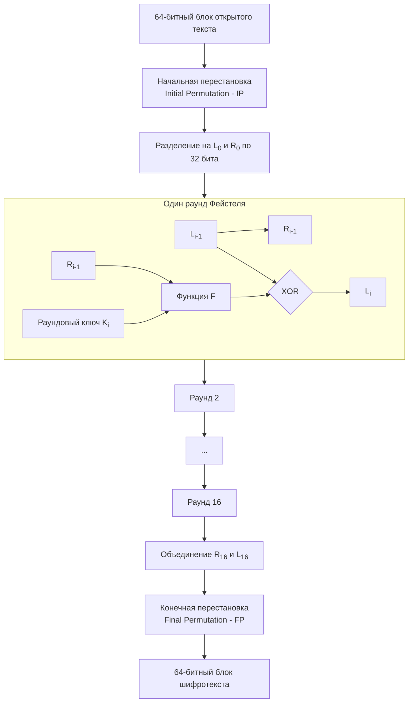
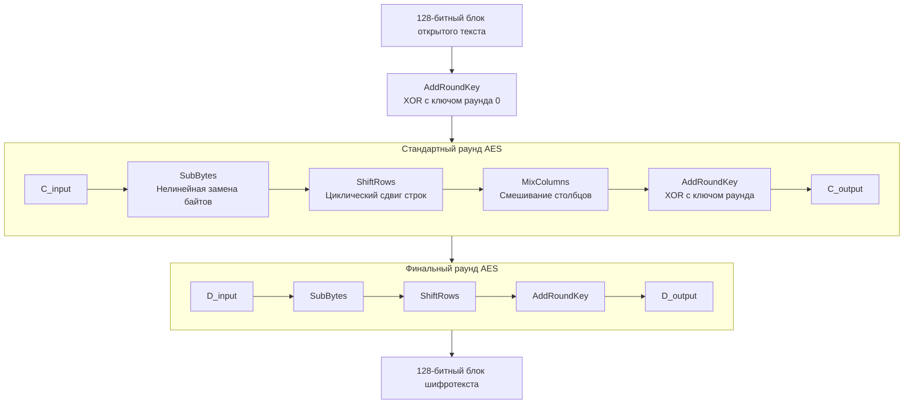
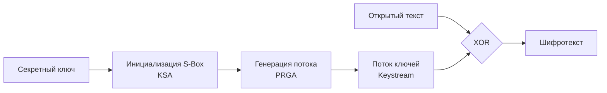
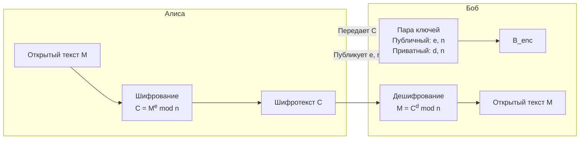
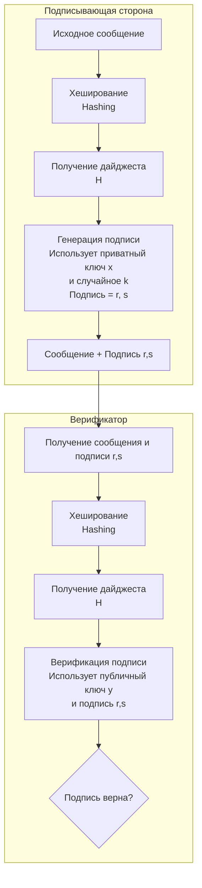
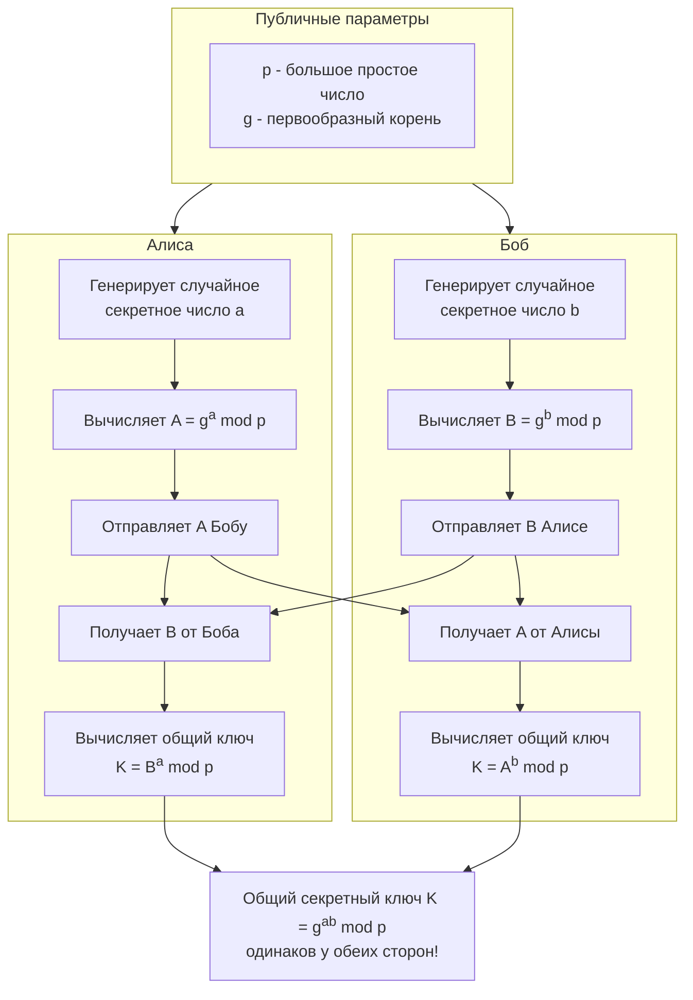
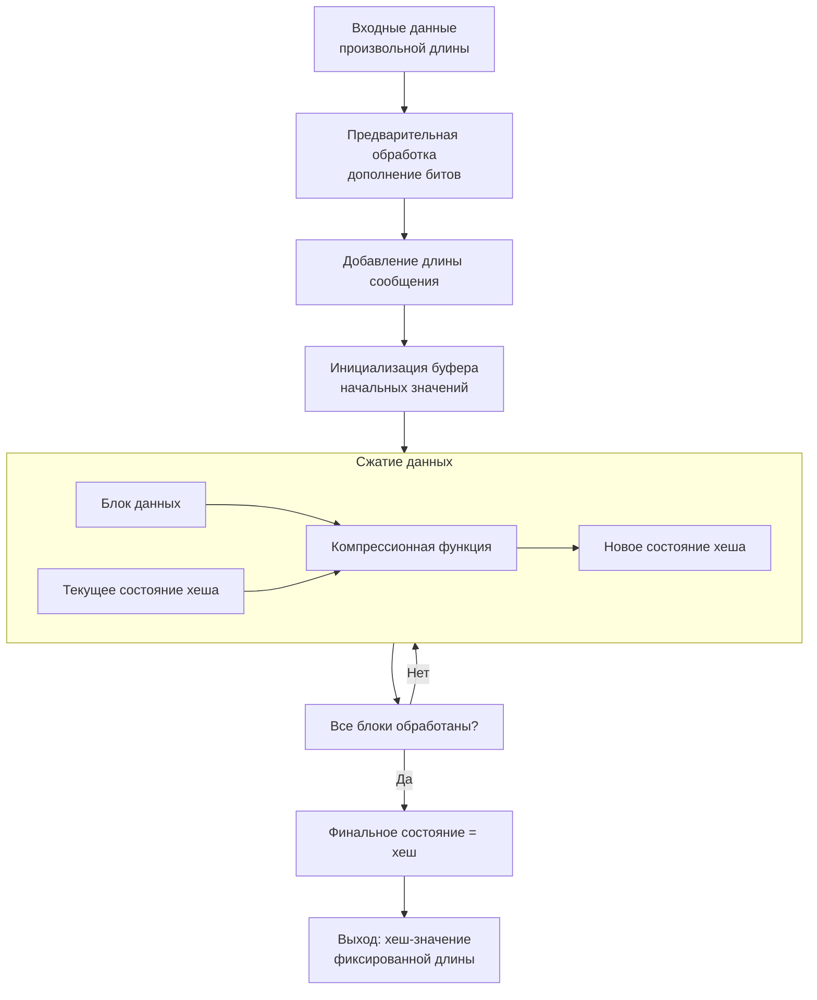
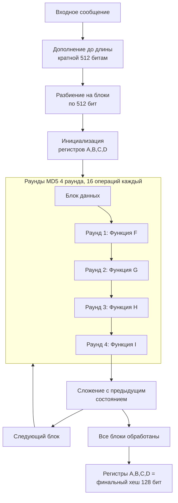
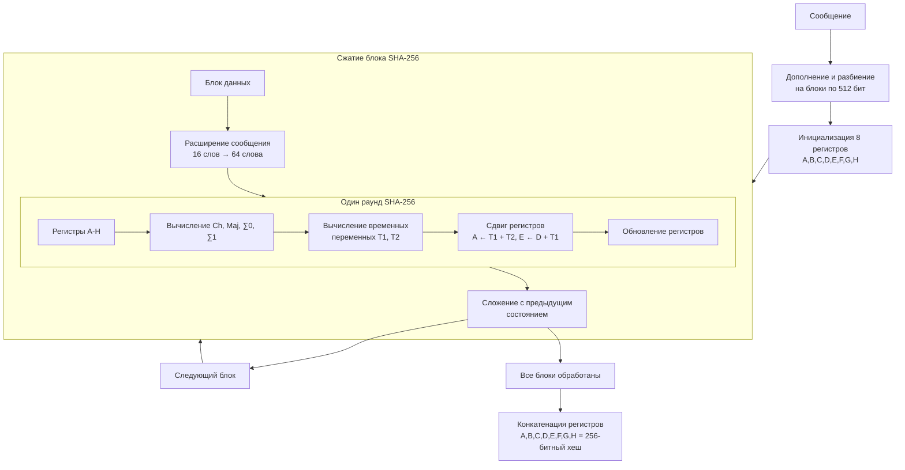
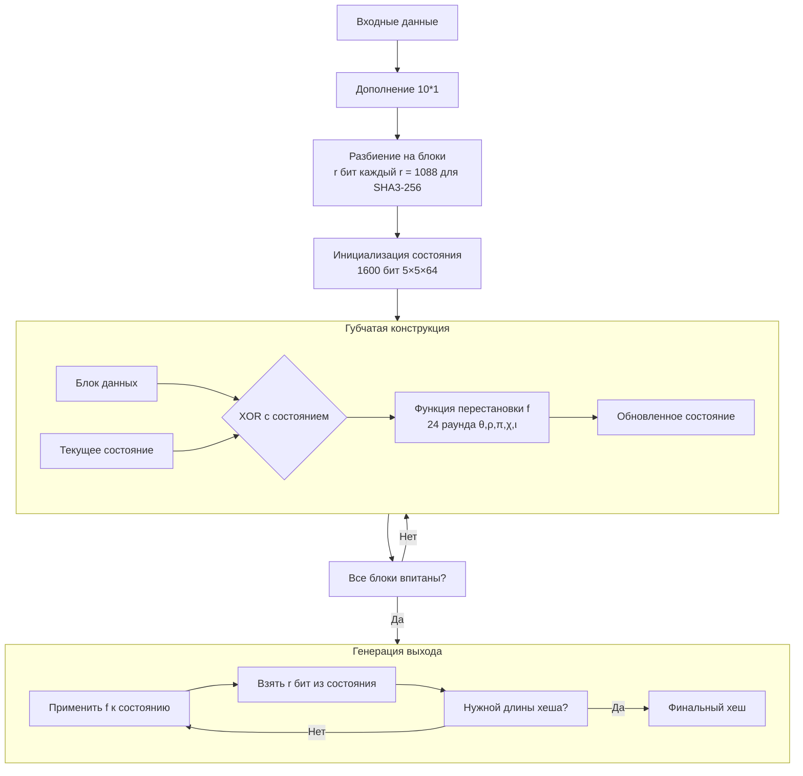

### 1. Концепции криптографии

Основная цель криптографии — обеспечение конфиденциальности, целостности, аутентификации и невозможности отказа от авторства.

*   **Шифрование (Encryption):** Процесс преобразования открытого текста (plaintext) в зашифрованный текст (ciphertext) с использованием ключа.
*   **Дешифрование (Decryption):** Обратный процесс преобразования ciphertext обратно в plaintext с использованием ключа.
*   **Ключ (Key):** Секретная информация, определяющая результат работы алгоритма шифрования/дешифрования.
*   **Симметричное шифрование:** Один и тот же ключ используется для шифрования и дешифрования (например, AES, DES).
*   **Асимметричное шифрование (Криптография с открытым ключом):** Используется пара ключей: открытый (public key) для шифрования и закрытый (private key) для дешифрования (например, RSA).

### 2. Алгоритмы шифрования & Шифры

**Алгоритм шифрования** — это математическая функция, реализующая процесс шифрования/дешифрования. **Шифр** — это конкретная реализация или экземпляр алгоритма.

---

### 3. Data Encryption Standard (DES)

**Тип:** Симметричный, блочный шифр.
**Размер блока:** 64 бита.
**Размер ключа:** 56 бит (изначально 64 бита, но 8 используются для проверки четности).

**Как работает:** DES использует сеть Фейстеля. Данные разбиваются на блоки, и каждый блок проходит 16 идентичных раундов преобразований.


**Пояснение:**
1.  Блок текста проходит начальную перестановку (IP).
2.  Блок делится на левую (L₀) и правую (R₀) половины.
3.  В каждом из 16 раундов:
    *   Левая половина следующего раунда (Lᵢ) становится правой половиной предыдущего (Rᵢ₋₁).
    *   Правая половина следующего раунда (Rᵢ) вычисляется как `Lᵢ₋₁ XOR F(Rᵢ₋₁, Kᵢ)`, где **F** — это функция, включающая расширение, XOR с раундовым ключом, подстановку (S-boxes) и перестановку (P-box).
4.  После 16 раундов левая и правая части объединяются (причем порядок меняется местами: R₁₆|L₁₆) и проходят через конечную перестановку (FP).

**Недостаток:** Короткий 56-битный ключ уязвим для атаки полным перебором (brute-force). Считается устаревшим.

---

### 4. Advanced Encryption Standard (AES)

**Тип:** Симметричный, блочный шифр.
**Размер блока:** 128 бит.
**Размеры ключа:** 128, 192 или 256 бит.

**Как работает:** AES использует структуру под названием **Сеть подстановок-перестановок (Substitution-Permutation Network, SPN)**. Алгоритм состоит из начального преобразования, нескольких раундов и финального раунда.


**Пояснение этапов раунда:**
*   **SubBytes:** Каждый байт состояния заменяется на другой согласно постоянной таблице подстановки (S-box). Это вносит нелинейность.
*   **ShiftRows:** Байты в строках состояния циклически сдвигаются. Нулевая строка не сдвигается, первая сдвигается на 1 и т.д. Это обеспечивает "размазывание" байтов.
*   **MixColumns:** Байты в столбцах состояния преобразуются с использованием линейного преобразования. Каждый столбец рассматривается как полином и умножается на фиксированный полином. Это обеспечивает диффузию.
*   **AddRoundKey:** Текущее состояние объединяется операцией XOR с раундовым ключом, который генерируется из основного ключа.

Количество раундов (N) зависит от размера ключа: 10 для 128-битного, 12 для 192-битного, 14 для 256-битного.

---

### 5. RC4, RC5, RC6

Это семейство потоковых и блочных шифров, созданных Роном Ривестом.

#### RC4 (Rivest Cipher 4)
**Тип:** Симметричный, поточный шифр.
**Как работает:** Генерирует псевдослучайный поток битов (keystream), который затем объединяется с открытым текстом с помощью XOR.


**Процесс:**
1.  **KSA (Key-Scheduling Algorithm):** Инициализирует массив S (перестановку чисел 0...255) на основе ключа.
2.  **PRGA (Pseudo-Random Generation Algorithm):** Генерирует каждый байт keystream на основе текущего состояния массива S. Этот байт затем XOR-ится с байтом открытого текста.

**Недостаток:** Уязвим к нескольким атакам, считается ненадежным для современных применений.

---

### 6. Rivest Shamir Adleman (RSA)

**Тип:** Асимметричный алгоритм (для шифрования и цифровой подписи).

**Как работает:** Основан на сложности разложения больших чисел на простые множители.

**Генерация ключей:**
1.  Выбираются два больших простых числа `p` и `q`.
2.  Вычисляется модуль `n = p * q`.
3.  Вычисляется функция Эйлера `φ(n) = (p-1)*(q-1)`.
4.  Выбирается открытая экспонента `e` (обычно 65537), взаимно простая с `φ(n)`.
5.  Вычисляется секретная экспонента `d`, такая что `d * e ≡ 1 mod φ(n)`.
6.  **Открытый ключ:** `(e, n)`
7.  **Закрытый ключ:** `(d, n)`

**Схема шифрования и дешифрования:**

**Пояснение:**
*   Любой, кто хочет отправить сообщение Бобу, шифрует его с помощью его **открытого ключа (e, n)**: `C = Mᵉ mod n`.
*   Расшифровать сообщение может только Боб, используя свой **закрытый ключ (d, n)**: `M = Cᵈ mod n`.

---

### 7. DSA и схемы подписи

**DSA (Digital Signature Algorithm)** — это стандарт для создания **цифровых подписей**.

**Тип:** Асимметричный алгоритм (только для подписи, не для шифрования).

**Как работает (упрощенно):**



**Процесс:**
1.  **Генерация ключей:**
    *   Выбираются параметры: простое `p`, делитель `q` числа `p-1`, и образующий элемент `g` подгруппы порядка `q`.
    *   **Закрытый ключ:** Случайное число `x` (0 < x < q).
    *   **Открытый ключ:** `y = gˣ mod p`.

2.  **Создание подписи:**
    *   Сообщение `M` хешируется, получается хеш-значение `H`.
    *   Генерируется случайное секретное число `k`.
    *   Вычисляются две компоненты подписи:
        *   `r = (gᵏ mod p) mod q`
        *   `s = (k⁻¹ * (H + x*r)) mod q`
    *   Подпись — это пара `(r, s)`.

3.  **Проверка подписи:**
    *   Получатель получает сообщение `M` и подпись `(r, s)`.
    *   Вычисляет хеш `H` от `M`.
    *   Проверяет вычисления, используя открытый ключ `y`. Если проверка прошла успешно, подпись верна.

Цифровая подпись обеспечивает аутентификацию (подписавший владеет закрытым ключом), целостность (любое изменение сообщения приведет к несовпадению хешей) и невозможность отказа от авторства (non-repudiation).


## 1. Diffie-Hellman (Протокол обмена ключами)

**Назначение:** Безопасный обмен секретным ключом по незащищенному каналу без его передачи.

### Как работает:



**Математическая основа:**
- **Секретные значения:** `a` (секрет Алисы), `b` (секрет Боба)
- **Публичные значения:** `p` (простое число), `g` (генератор)
- **Вычисления:**
  - Алиса: `A = gᵃ mod p` → отправляет Бобу
  - Боб: `B = gᵇ mod p` → отправляет Алисе
  - Общий ключ: `K = Bᵃ mod p = Aᵇ mod p = gᵃᵇ mod p`

**Безопасность:** Основана на сложности задачи дискретного логарифмирования.

---

## 2. Функции хеширования

**Назначение:** Преобразование произвольных данных в фиксированную-length "отпечаток" (хеш).

### Общая схема работы:



**Свойства хорошей хеш-функции:**
- **Детерминированность:** Один вход → один выход
- **Быстрота вычисления**
- **Устойчивость к коллизиям**
- **Необратимость**

---

## 3. MD4, MD5 семейство

### Общая архитектура MD-семейства:



**Эволюция MD-семейства:**
- **MD4:** 3 раунда, 128-битный хеш → уязвим
- **MD5:** 4 раунда, 128-битный хеш → также уязвим для коллизий
- **Применение:** Контрольные суммы, проверка целостности

---

## 4. SHA семейство (SHA-1, SHA-256, SHA-512, SHA-3)

### Архитектура SHA-256:



**Сравнение SHA семейства:**

| Алгоритм | Длина хеша | Блок | Безопасность |
|----------|------------|------|--------------|
| SHA-1    | 160 бит    | 512  | ❌ Уязвим    |
| SHA-256  | 256 бит    | 512  | ✅ Безопасен |
| SHA-512  | 512 бит    | 1024 | ✅ Безопасен |

---

## 5. SHA-3 (Keccak)

**Особенность:** Использует губчатую конструкцию (sponge construction)

### Схема работы SHA-3:



**Преимущества SHA-3:**
- Отличная от SHA-2 математическая основа
- Устойчивость к атакам, эффективным против SHA-2
- Гибкость (можно получать хеш любой длины)

---

## 6. HMAC (Hash-based Message Authentication Code)

**Назначение:** Аутентификация сообщений с использованием хеш-функций и секретного ключа.

### Схема работы HMAC:

```mermaid
flowchart TD
    A[Секретный ключ K] --> B{Длина ключа ><br>размер блока?}
    B -->|Да| C[Хешировать ключ K]
    B -->|Нет| D[Дополнить ключ нулями]
    C --> E[Ключ нужной длины]
    D --> E
    
    E --> F[Вычислить ipad = 0x36<br>и opad = 0x5C повторенные]
    F --> G[K ⊕ ipad]
    F --> H[K ⊕ opad]
    
    I[Сообщение M] --> J[Конкатенация: K ⊕ ipad || M]
    J --> K[Хешировать внутренний<br>результат: H K ⊕ ipad || M]
    K --> L[Конкатенация: K ⊕ opad || внутренний хеш]
    L --> M[Хешировать финальный<br>результат: H K ⊕ opad || внутренний хеш]
    M --> N[HMAC результат]
```

**Математическая формула:**
```
HMAC(K, M) = H( (K ⊕ opad) || H( (K ⊕ ipad) || M ) )
```

**Применение:**
- Аутентификация API запросов
- Проверка целостности и подлинности сообщений
- Веб-токены

---

## 7. PREMID-6

**Примечание:** PREMID-6 не является стандартным криптографическим алгоритмом. Возможно, имеется в виду:

- **PRINCE** - блочный шифр с низкой задержкой
- **PRIDE** - легковесный блочный шифр  
- **Опечатка** в оригинальном вопросе

Если уточните, что именно имелось в виду под PREMID-6, я смогу дать более точное объяснение с диаграммами.

Все представленные схемы демонстрируют фундаментальные принципы работы современных криптографических систем, обеспечивающих безопасность цифровых коммуникаций.