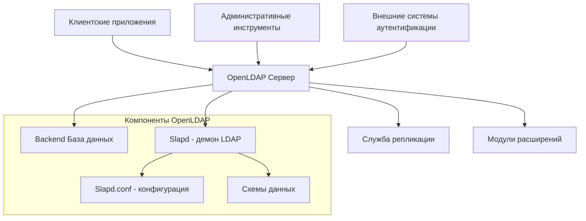
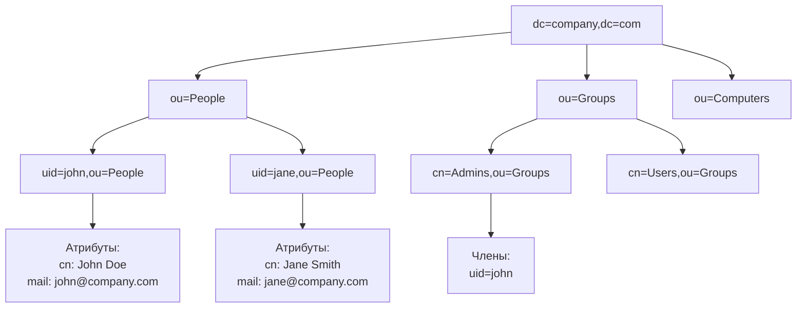
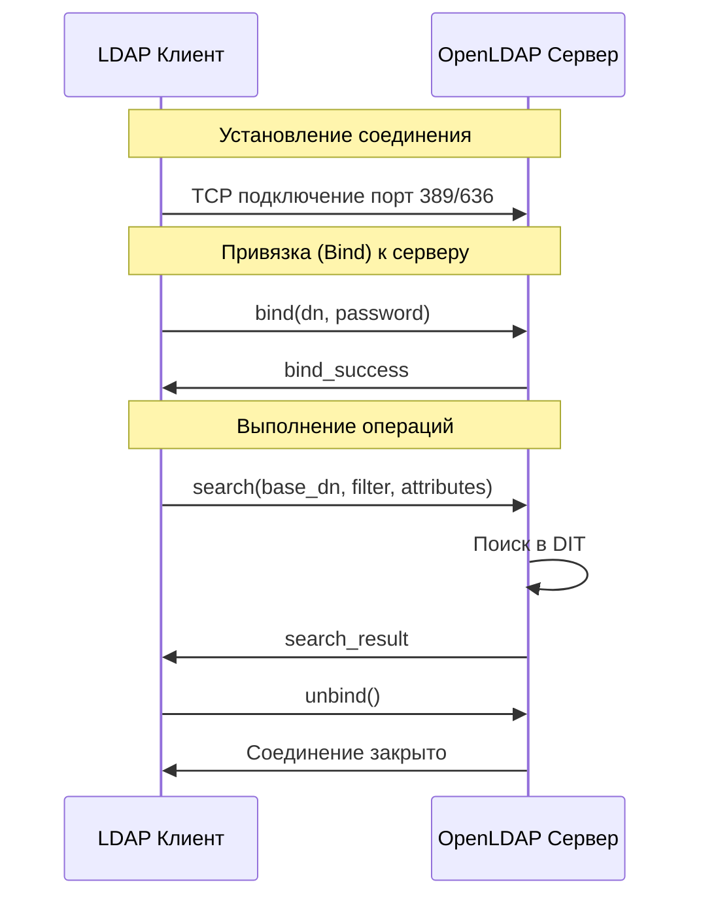
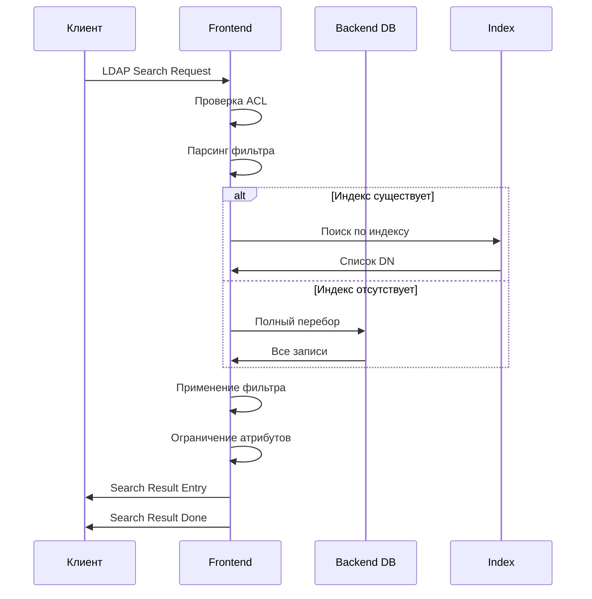
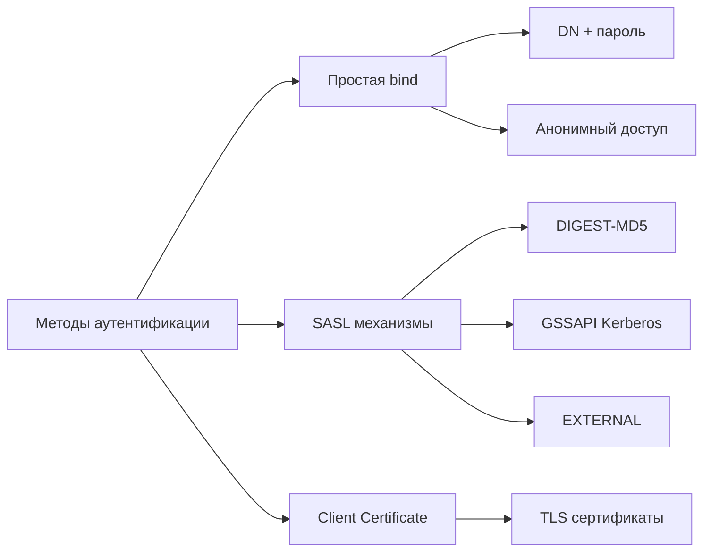
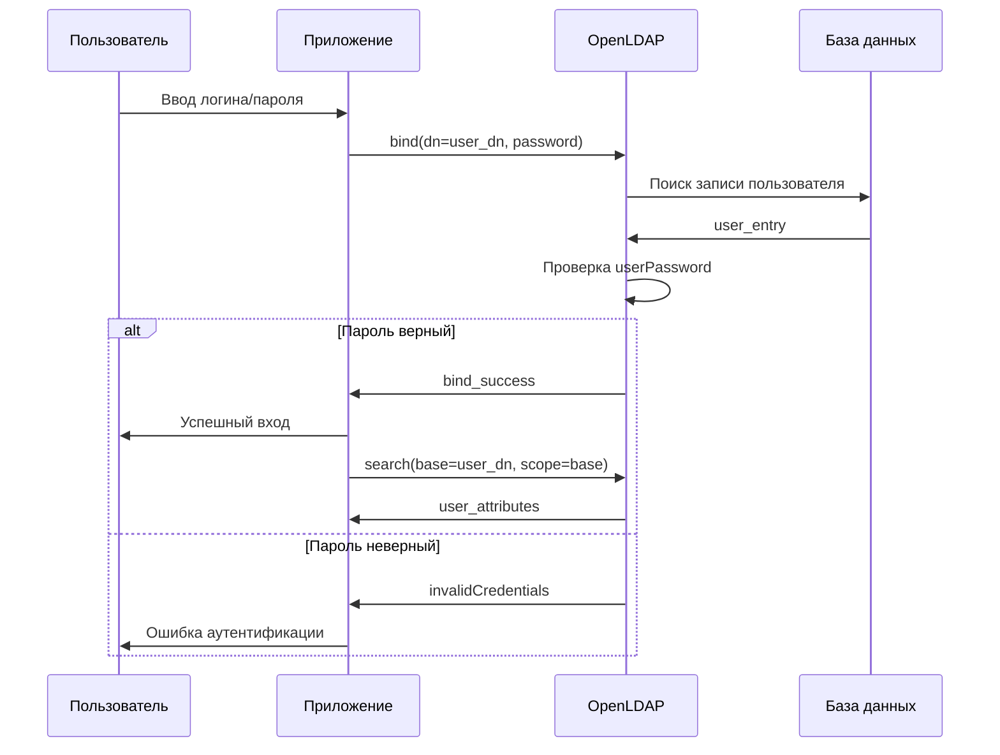
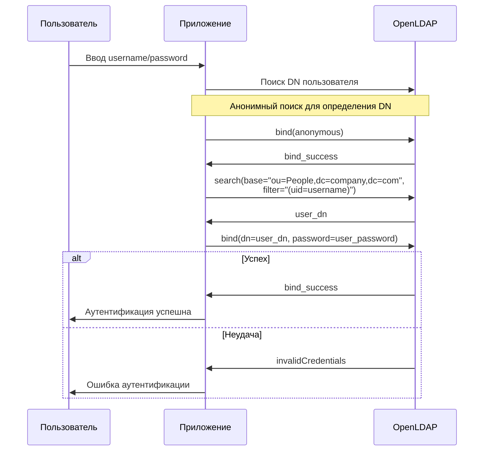
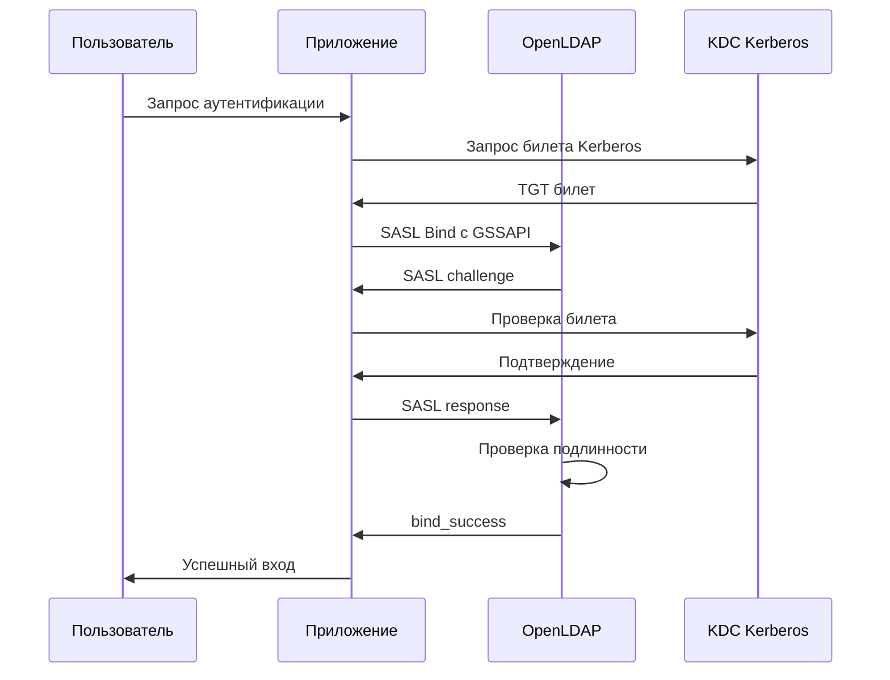
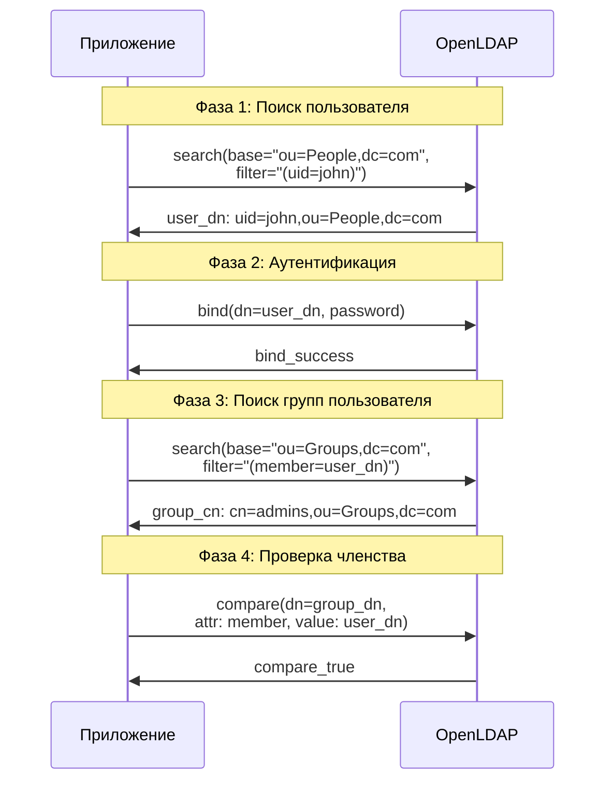
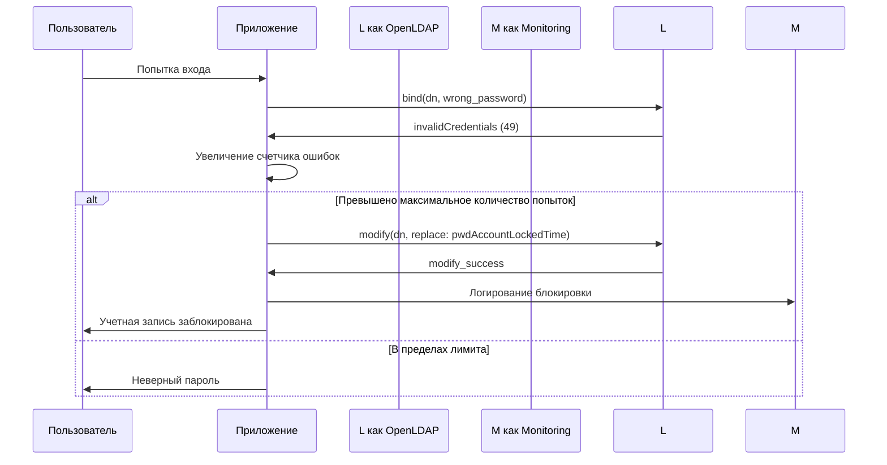

# OpenLDAP: подробное руководство с диаграммами последовательностей

## 1. Что такое OpenLDAP?

### **Основные понятия**

**OpenLDAP** — это открытая реализация протокола LDAP (Lightweight Directory Access Protocol), представляющая собой иерархическую базу данных для хранения и управления информацией о пользователях, группах, устройствах и других объектах в сети.

### **Архитектура OpenLDAP**



### **Ключевые компоненты**

#### **Slapd (Stand-alone LDAP Daemon)**
- Основной демон, обрабатывающий LDAP-запросы
- Управляет подключениями, аутентификацией и операциями с данными

#### **Backend базы данных**
- **BDB/HDB:** Berkeley DB для хранения данных
- **MDB:** Memory-Mapped DB (современная, более производительная)
- **LDAP:** Прокси к другим LDAP-серверам

#### **Схемы данных (Schemas)**
- Определяют структуру и типы данных
- Стандартные схемы: core, cosine, inetorgperson, nis

### **DIT (Directory Information Tree)**



## 2. LDAP запросы

### **Структура LDAP запроса**



### **Типы LDAP операций**

#### **Операции поиска (Search)**
```ldif
# Базовый поиск
ldapsearch -x -b "dc=company,dc=com" "(objectClass=*)"

# Поиск с фильтром
ldapsearch -x -b "ou=People,dc=company,dc=com" "(uid=john*)"

# Поиск определенных атрибутов
ldapsearch -x -b "dc=company,dc=com" "(cn=John*)" cn mail telephoneNumber
```

#### **Операции модификации**
```ldif
# Добавление записи
dn: uid=newuser,ou=People,dc=company,dc=com
objectClass: inetOrgPerson
objectClass: organizationalPerson
objectClass: person
objectClass: top
cn: New User
sn: User
uid: newuser
userPassword: {SSHA}hashedpassword

# Изменение записи
dn: uid=john,ou=People,dc=company,dc=com
changetype: modify
replace: mail
mail: john.new@company.com

# Удаление записи
dn: uid=olduser,ou=People,dc=company,dc=com
changetype: delete
```

### **LDAP фильтры**

#### **Базовые операторы фильтров**
```ldif
# Равенство
(cn=John Doe)
(uid=john*)

# Логические операторы
(&(objectClass=person)(cn=John*))
(|(department=IT)(department=Sales))
(!(status=disabled))

# Присутствие атрибута
(telephoneNumber=*)
(mail=*@company.com)

# Диапазоны
(uidNumber>=1000)
(createTimestamp<=20240101000000Z)
```

#### **Сложные фильтры**
```ldif
# Поиск пользователей в определенном отделе с email
(&(objectClass=inetOrgPerson)
  (department=IT)
  (mail=*@company.com)
  (!(employeeType=contractor)))

# Поиск групп, содержащих пользователя
(&(objectClass=groupOfNames)
  (member=uid=john,ou=People,dc=company,dc=com))
```

### **Процесс выполнения LDAP запроса**



## 3. Аутентификация OpenLDAP

### **Методы аутентификации**



### **Процесс простой аутентификации (Simple Bind)**



### **Поиск DN пользователя для аутентификации**



### **SASL аутентификация**



### **Настройка аутентификации в конфигурации**

#### **slapd.conf основные параметры**
```
# Базовая конфигурация
database mdb
suffix "dc=company,dc=com"
rootdn "cn=admin,dc=company,dc=com"
rootpw {SSHA}hashedpassword

# Политики паролей
password-hash {SSHA}
password-min-length 8
password-check-quality on

# ACL для аутентификации
access to attrs=userPassword
    by self write
    by anonymous auth
    by * none

access to *
    by self write
    by users read
    by anonymous auth
```

### **Поиск пользователя и групп**



### **Обработка ошибок аутентификации**



## 4. Практические примеры использования

### **Интеграция с PAM**
```
# /etc/pam.d/system-auth
auth sufficient pam_ldap.so
account sufficient pam_ldap.so
password sufficient pam_ldap.so
session optional pam_ldap.so
```

### **Интеграция с SSH**
```
# /etc/ssh/sshd_config
PubkeyAuthentication yes
PasswordAuthentication yes
ChallengeResponseAuthentication no
UsePAM yes
LDAPURI ldap://ldap.company.com
LDAPBaseDC ou=People,dc=company,dc=com
```

### **Web-приложения**
```
# PHP LDAP аутентификация
$ldapconn = ldap_connect("ldap.company.com");
ldap_set_option($ldapconn, LDAP_OPT_PROTOCOL_VERSION, 3);

$user_dn = "uid=" . $username . ",ou=People,dc=company,dc=com";
$auth = ldap_bind($ldapconn, $user_dn, $password);

if ($auth) {
    // Пользователь аутентифицирован
    $search = ldap_search($ldapconn, $user_dn, "(objectClass=*)");
    $user_info = ldap_get_entries($ldapconn, $search);
}
```

