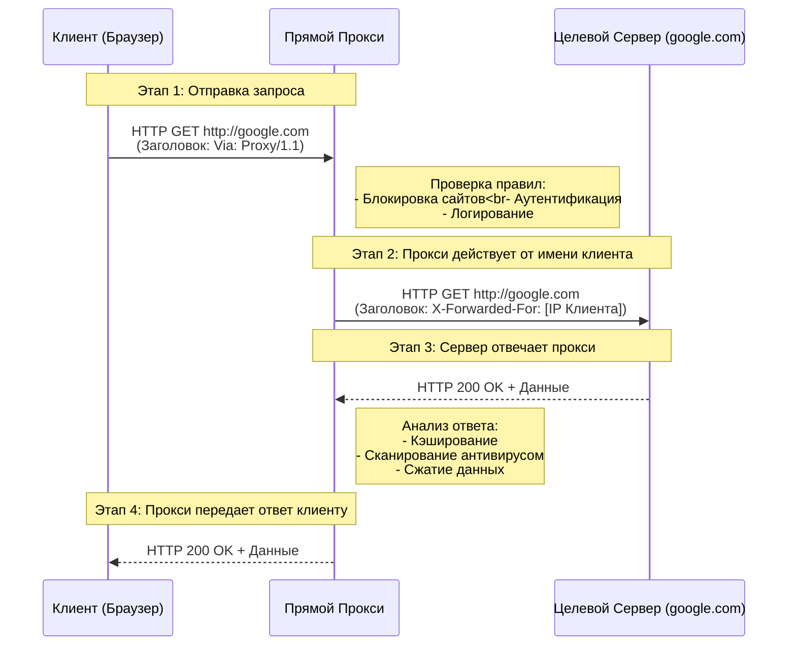
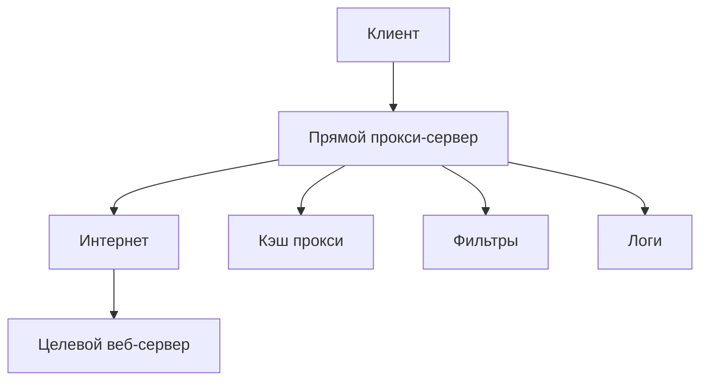
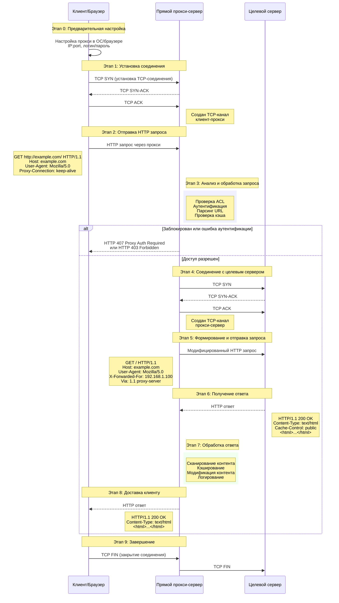
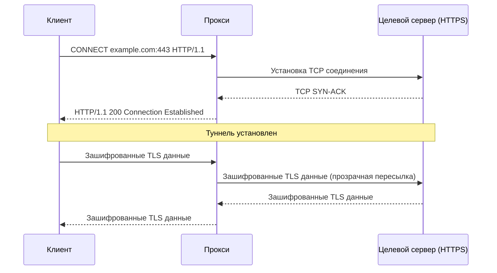
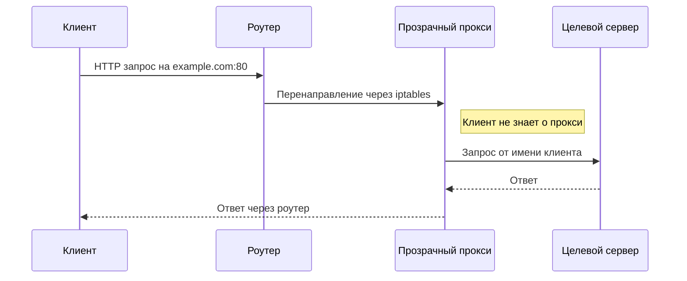
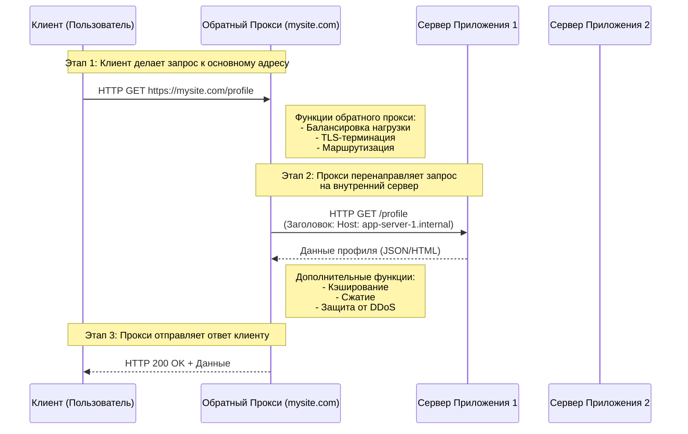

 **Прямой (Forward) прокси** и **Обратный (Reverse) прокси**

### 1. Прямой (Forward) Прокси

Этот тип прокси используется клиентами (например, пользователями в корпоративной сети) для выхода в интернет. Он представляет интересы клиента перед внешними серверами.

**Участники (Actors):**
*   **Клиент (Client):** Ваш браузер или приложение.
*   **Прокси-Сервер (Proxy Server):** Промежуточный сервер, сконфигурированный в настройках сети клиента.
*   **Целевой Сервер (Target Server):** Веб-сайт (например, `google.com`), к которому вы хотите обратиться.

**Как это работает:**

1.  Клиент настраивает свое ПО (браузер, ОС) на использование прокси-сервера.
2.  Все HTTP/HTTPS запросы от клиента перенаправляются не напрямую к целевому серверу, а на прокси-сервер.
3.  Прокси-сервер принимает запрос, может его проверить (логирование, блокировка, аутентификация) и затем, от своего имени, пересылает его целевому серверу.
4.  Целевой сервер видит запрос от прокси-сервера и отправляет ответ ему.
5.  Прокси-сервер, получив ответ, может его проанализировать (кэширование, проверка на вирусы) и затем передать клиенту.

---

#### Диаграмма последовательности для Прямого прокси (HTTP)



**Пояснение к диаграмме:**

*   **`Via: Proxy/1.1`**: Специальный HTTP-заголовок, который прокси добавляет в запрос, указывая, что запрос прошел через него.
*   **`X-Forwarded-For: [IP Клиента]`**: Важнейший заголовок. Поскольку целевой сервер видит соединение только от прокси, этот заголовок сообщает ему настоящий IP-адрес исходного клиента.
*   **Промежуточные действия (Notes):** Показывают ключевые функции прокси: фильтрация, кэширование, логирование.

Давайте максимально подробно разберем работу **прямого (forward) прокси-сервера**. Я разберу процесс на уровне сетевых взаимодействий, заголовков и внутренней логики прокси.

## Как работает прямой прокси-сервер: Детальный разбор

### Архитектура и участники



---

## Детальная диаграмма последовательности HTTP запроса через прокси



---

## Детальное описание каждого этапа

### Этап 0: Предварительная настройка
**На стороне клиента:**
- Прокси настраивается в:
  - Настройках ОС (Windows: Панель управления → Сети → Прокси)
  - Настройках браузера
  - Файле `proxy.pac` (автоматическая конфигурация)
- Параметры: `IP:port`, логин/пароль (если требуется)
- Типы аутентификации: Basic, NTLM, Digest

### Этап 1: Установка TCP соединения
```
Клиент (192.168.1.100) → Прокси (10.0.0.1:8080)
    TCP SYN [Seq=0]
Прокси → Клиент
    TCP SYN-ACK [Seq=0, Ack=1]  
Клиент → Прокси
    TCP ACK [Seq=1, Ack=1]
```
**Результат:** Установлено TCP-соединение между клиентом и прокси.

### Этап 2: Отправка HTTP запроса через прокси

**Обычный HTTP запрос (без прокси):**
```http
GET / HTTP/1.1
Host: example.com
User-Agent: Mozilla/5.0
```

**HTTP запрос ЧЕРЕЗ прокси:**
```http
GET http://example.com/ HTTP/1.1
Host: example.com
User-Agent: Mozilla/5.0
Proxy-Connection: keep-alive
```
**Ключевые отличия:**
- **Полный URL** в строке запроса вместо относительного пути
- **Proxy-Connection** заголовок для управления соединением

### Этап 3: Внутренняя обработка на прокси

Прокси выполняет последовательные проверки:

#### 3.1. Аутентификация
```python
# Псевдокод логики аутентификации
def authenticate_request(request):
    if proxy_requires_auth:
        auth_header = request.headers.get('Proxy-Authorization')
        if not auth_header:
            return HTTP_407_Proxy_Auth_Required  # Требует аутентификацию
        
        if not validate_credentials(auth_header):
            return HTTP_403_Forbidden  # Неверные учетные данные
    
    return None  # Аутентификация успешна
```

#### 3.2. Проверка правил доступа (ACL - Access Control List)
```python
def check_access_rules(client_ip, target_url):
    rules = load_access_rules()
    
    for rule in rules:
        if rule.matches(client_ip, target_url):
            if rule.action == "DENY":
                return HTTP_403_Forbidden  # Доступ запрещен
            elif rule.action == "ALLOW":
                break  # Доступ разрешен
    
    return None  # Правила пройдены
```

#### 3.3. Проверка кэша
```python
def check_cache(target_url):
    cache_key = generate_cache_key(target_url)
    cached_response = cache_store.get(cache_key)
    
    if cached_response and not cached_response.is_expired():
        return cached_response  # Возвращаем из кэша
    
    return None  # Не найдено в кэше
```

### Этап 4-5: Соединение с целевым сервером и отправка запроса

Прокси устанавливает новое TCP-соединение с целевым сервером и формирует модифицированный запрос:

**Исходный запрос от клиента:**
```http
GET http://example.com/ HTTP/1.1
Host: example.com
```

**Модифицированный запрос от прокси к целевому серверу:**
```http
GET / HTTP/1.1
Host: example.com
User-Agent: Mozilla/5.0
X-Forwarded-For: 192.168.1.100
Via: 1.1 proxy-server
Forwarded: for=192.168.1.100;proto=http;by=proxy-server
```

**Важные добавляемые заголовки:**

- **`X-Forwarded-For`**: IP-адрес исходного клиента
- **`Via`**: Указывает на прохождение через прокси
- **`Forwarded`**: Стандартизированная версия X-Forwarded-For
- **`X-Forwarded-Host`**: Оригинальный Host заголовок

### Этап 6-7: Обработка ответа

Получив ответ от целевого сервера, прокси выполняет:

#### 7.1. Сканирование контента
- Антивирусная проверка
- Фильтрация контента (реклама, опасный код)
- Проверка MIME-типов

#### 7.2. Кэширование
```python
def process_caching(response, target_url):
    if is_cacheable(response):
        cache_key = generate_cache_key(target_url)
        cache_control = response.headers.get('Cache-Control', '')
        
        if 'public' in cache_control and 'no-store' not in cache_control:
            # Сохраняем в кэш с TTL
            cache_store.set(cache_key, response, ttl=calculate_ttl(response))
```

#### 7.3. Модификация контента
- Сжатие (gzip)
- Оптимизация изображений
- Инъекция JavaScript для мониторинга

#### 7.4. Логирование
```python
def log_transaction(client_ip, target_url, response_code, bytes_transferred):
    log_entry = {
        'timestamp': datetime.now(),
        'client_ip': client_ip,
        'target_url': target_url,
        'http_method': 'GET',
        'response_code': response_code,
        'bytes_sent': bytes_transferred,
        'user_agent': extract_user_agent()
    }
    logger.info(log_entry)
```

### Этап 8: Доставка клиенту

Прокси отправляет финальный ответ клиенту, возможно с дополнительными заголовками:

```http
HTTP/1.1 200 OK
Content-Type: text/html; charset=UTF-8
Content-Length: 1256
Date: Mon, 23 Jan 2024 10:00:00 GMT
X-Proxy-Server: corporate-proxy/1.0
X-Cache: HIT from proxy-server  # или MISS

<!DOCTYPE html>
<html>
...
</html>
```

---

## Особые случаи и дополнительные функции

### Поддержка HTTPS через CONNECT метод

Для HTTPS трафика используется специальный метод:



### Прозрачный прокси (Transparent Proxy)



---

## Примеры конфигурации

### Squid Proxy (конфигурационный файл)
```squid
# Основные настройки
http_port 3128
visible_hostname corporate-proxy

# ACL - Access Control Lists
acl local_net src 192.168.1.0/24
acl blocked_sites dstdomain "/etc/squid/blocked_sites.txt"
acl work_hours time MTWHF 09:00-18:00

# Правила доступа
http_access allow local_net work_hours
http_access deny blocked_sites
http_access deny all

# Кэширование
cache_dir ufs /var/spool/squid 10000 16 256
maximum_object_size 256 MB

# Логирование
access_log /var/log/squid/access.log
```

Эта детализация показывает, что прямой прокси - это сложная система с множеством функций фильтрации, кэширования и контроля доступа, работающая как посредник между клиентом и интернетом.
---

### 2. Обратный (Reverse) Прокси

Этот тип прокси используется серверами. Он находится перед одним или несколькими серверами и представляет их интересы перед клиентами из интернета. Клиент может даже не подозревать о его существовании.

**Участники (Actors):**
*   **Клиент (Client):** Пользователь из интернета.
*   **Обратный Прокси (Reverse Proxy):** "Лицо" веб-приложения (например, `www.mysite.com`).
*   **Сервер Приложения (App Server):** Фактический сервер, который обрабатывает логику. Их может быть много.

**Как это работает:**

1.  Клиент отправляет запрос на публичный адрес веб-сайта.
2.  Этот запрос попадает на обратный прокси-сервер (часто он же и балансировщик нагрузки).
3.  Прокси решает, какому из внутренних серверов приложения переслать этот запрос (на основе нагрузки, типа запроса и т.д.).
4.  Сервер приложения обрабатывает запрос и отправляет ответ обратному прокси.
5.  Обратный прокси передает ответ клиенту.

---

#### Диаграмма последовательности для Обратного прокси



**Пояснение к диаграмме:**

*   **Балансировка нагрузки:** Прокси выбирает наименее загруженный сервер приложения (`AppServer1` или `AppServer2`).
*   **TLS-терминация:** HTTPS-шифрование (SSL/TLS) часто расшифровывается на обратном прокси. Это снимает нагрузку с серверов приложения. Внутренний трафик между прокси и бэкенд-серверами может быть уже незашифрованным.
*   **Маршрутизация:** На основе URL (например, `/profile` vs `/images`) прокси может перенаправлять запросы к разным группам серверов.
*   **Заголовок `Host:`:** При перенаправлении запроса к бэкенду, прокси может изменить заголовок `Host`.

---

### Сводная таблица функций

| Функция | Прямой Прокси | Обратный Прокси |
| :--- | :--- | :--- |
| **Представляет** | Клиента | Сервер(ы) |
| **Кто его настраивает** | Клиент или администратор клиентской сети | Администратор серверной инфраструктуры |
| **Известен клиенту?** | Да (явно указан в настройках) | Нет (клиент видит только адрес сайта) |
| **Основные цели** | Обход блокировок, контент-фильтры, анонимность, кэширование | Балансировка нагрузки, защита бэкенда, кэширование, SSL-терминация |

Эти диаграммы и пояснения показывают фундаментальное различие между двумя типами прокси-серверов и их внутреннюю логику работы на уровне последовательности событий.