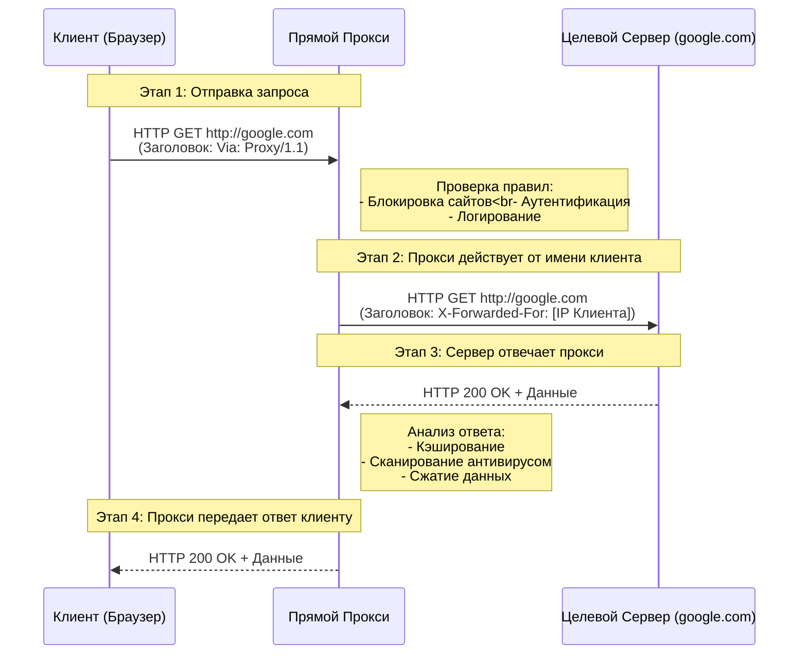
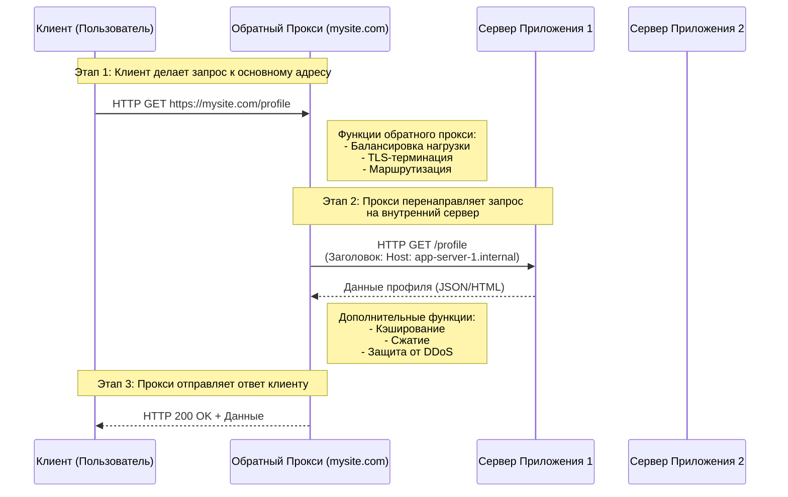

 **Прямой (Forward) прокси** и **Обратный (Reverse) прокси**

### 1. Прямой (Forward) Прокси

Этот тип прокси используется клиентами (например, пользователями в корпоративной сети) для выхода в интернет. Он представляет интересы клиента перед внешними серверами.

**Участники (Actors):**
*   **Клиент (Client):** Ваш браузер или приложение.
*   **Прокси-Сервер (Proxy Server):** Промежуточный сервер, сконфигурированный в настройках сети клиента.
*   **Целевой Сервер (Target Server):** Веб-сайт (например, `google.com`), к которому вы хотите обратиться.

**Как это работает:**

1.  Клиент настраивает свое ПО (браузер, ОС) на использование прокси-сервера.
2.  Все HTTP/HTTPS запросы от клиента перенаправляются не напрямую к целевому серверу, а на прокси-сервер.
3.  Прокси-сервер принимает запрос, может его проверить (логирование, блокировка, аутентификация) и затем, от своего имени, пересылает его целевому серверу.
4.  Целевой сервер видит запрос от прокси-сервера и отправляет ответ ему.
5.  Прокси-сервер, получив ответ, может его проанализировать (кэширование, проверка на вирусы) и затем передать клиенту.

---

#### Диаграмма последовательности для Прямого прокси (HTTP)

**Пояснение к диаграмме:**

*   **`Via: Proxy/1.1`**: Специальный HTTP-заголовок, который прокси добавляет в запрос, указывая, что запрос прошел через него.
*   **`X-Forwarded-For: [IP Клиента]`**: Важнейший заголовок. Поскольку целевой сервер видит соединение только от прокси, этот заголовок сообщает ему настоящий IP-адрес исходного клиента.
*   **Промежуточные действия (Notes):** Показывают ключевые функции прокси: фильтрация, кэширование, логирование.

---

### 2. Обратный (Reverse) Прокси

Этот тип прокси используется серверами. Он находится перед одним или несколькими серверами и представляет их интересы перед клиентами из интернета. Клиент может даже не подозревать о его существовании.

**Участники (Actors):**
*   **Клиент (Client):** Пользователь из интернета.
*   **Обратный Прокси (Reverse Proxy):** "Лицо" веб-приложения (например, `www.mysite.com`).
*   **Сервер Приложения (App Server):** Фактический сервер, который обрабатывает логику. Их может быть много.

**Как это работает:**

1.  Клиент отправляет запрос на публичный адрес веб-сайта.
2.  Этот запрос попадает на обратный прокси-сервер (часто он же и балансировщик нагрузки).
3.  Прокси решает, какому из внутренних серверов приложения переслать этот запрос (на основе нагрузки, типа запроса и т.д.).
4.  Сервер приложения обрабатывает запрос и отправляет ответ обратному прокси.
5.  Обратный прокси передает ответ клиенту.

---

#### Диаграмма последовательности для Обратного прокси

**Пояснение к диаграмме:**

*   **Балансировка нагрузки:** Прокси выбирает наименее загруженный сервер приложения (`AppServer1` или `AppServer2`).
*   **TLS-терминация:** HTTPS-шифрование (SSL/TLS) часто расшифровывается на обратном прокси. Это снимает нагрузку с серверов приложения. Внутренний трафик между прокси и бэкенд-серверами может быть уже незашифрованным.
*   **Маршрутизация:** На основе URL (например, `/profile` vs `/images`) прокси может перенаправлять запросы к разным группам серверов.
*   **Заголовок `Host:`:** При перенаправлении запроса к бэкенду, прокси может изменить заголовок `Host`.

---

### Сводная таблица функций

| Функция | Прямой Прокси | Обратный Прокси |
| :--- | :--- | :--- |
| **Представляет** | Клиента | Сервер(ы) |
| **Кто его настраивает** | Клиент или администратор клиентской сети | Администратор серверной инфраструктуры |
| **Известен клиенту?** | Да (явно указан в настройках) | Нет (клиент видит только адрес сайта) |
| **Основные цели** | Обход блокировок, контент-фильтры, анонимность, кэширование | Балансировка нагрузки, защита бэкенда, кэширование, SSL-терминация |

Эти диаграммы и пояснения показывают фундаментальное различие между двумя типами прокси-серверов и их внутреннюю логику работы на уровне последовательности событий.