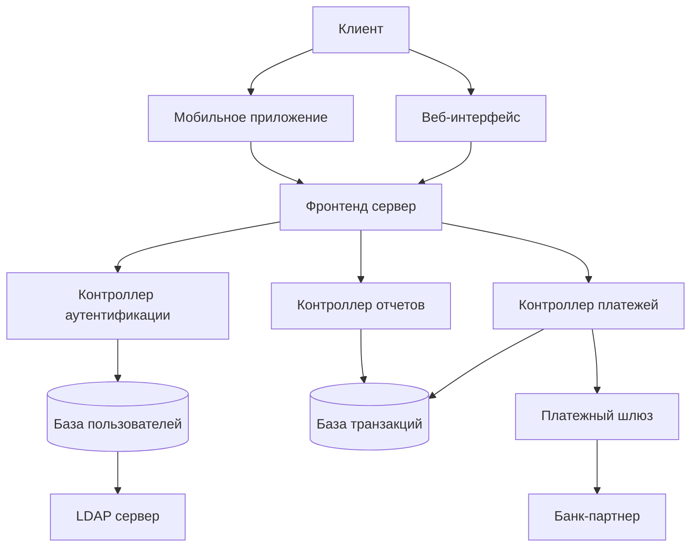
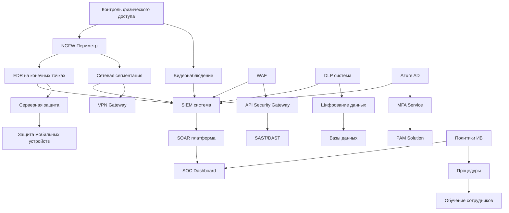

Подробно разберем процесс моделирования угроз безопасности информации — ключевую практику в современной разработке защищенных систем.

## 1. Подход STRIDE

STRIDE — это мнемоническая модель классификации угроз, разработанная Microsoft. Каждая буква обозначает категорию угроз:

### **S - Spoofing (Подмена/Фальсификация)**
- **Суть:** Неавторизованный доступ через подмену идентичности
- **Примеры:** 
  - Подделка IP-адреса, email-отправителя
  - Кража учетных данных
  - Подделка сессионных токенов
- **Контрмеры:** Аутентификация, цифровые подписи

### **T - Tampering (Изменение данных)**
- **Суть:** Несанкционированная модификация данных
- **Примеры:**
  - Изменение файлов конфигурации
  - Модификация передаваемых данных
  - Изменение кода приложения
- **Контрмеры:** Контроль целостности, хеши, цифровые подписи

### **R - Repudiation (Отказ от действий)**
- **Суть:** Возможность отрицать выполнение действия
- **Примеры:**
  - Пользователь отрицает отправку сообщения
  - Администратор отрицает изменение настроек
- **Контрмеры:** Логирование, аудит, цифровые подписи

### **I - Information Disclosure (Раскрытие информации)**
- **Суть:** Несанкционированный доступ к информации
- **Примеры:**
  - Перехват трафика
  - Неправильные настройки прав доступа
  - Утечка данных через ошибки
- **Контрмеры:** Шифрование, контроль доступа

### **D - Denial of Service (Отказ в обслуживании)**
- **Суть:** Нарушение доступности сервиса
- **Примеры:**
  - DDoS-атаки
  - Блокировка учетных записей
  - Исчерпание ресурсов
- **Контрмеры:** Балансировка нагрузки, ограничение запросов

### **E - Elevation of Privilege (Повышение привилегий)**
- **Суть:** Получение прав выше разрешенных
- **Примеры:**
  - Исполнение кода с правами администратора
  - Обход проверок авторизации
3. **Контрмеры:** Принцип минимальных привилегий, проверка прав

## 2. Модели оценки угроз

### **Модель DREAD**

Используется для количественной оценки угроз по 5-параметрам:

#### **D - Damage Potential (Потенциальный ущерб)**
- 0: Никакого ущерба
- 5: Полный контроль над системой, кража всех данных

#### **R - Reproducibility (Воспроизводимость)**
- 0: Очень сложно воспроизвести
- 5: Атака работает всегда без специальных условий

#### **E - Exploitability (Эксплуатируемость)**
- 0: Требуется доступ к сети, глубокие знания
- 5: Атаку может провести обычный пользователь

#### **A - Affected Users (Количество затронутых пользователей)**
- 0: Ни одного
- 5: Все пользователи

#### **D - Discoverability (Обнаружаемость)**
- 0: Очень сложно обнаружить
- 5: Информация об уязвимости общедоступна

**Формула расчета:** `(D + R + E + A + D) / 5`

**Уровни риска:**
- Высокий: 4.0-5.0
- Средний: 2.0-3.9  
- Низкий: 0-1.9

### **Другие модели оценки**

#### **PASTA (Process for Attack Simulation and Threat Analysis)**
Семиэтапный процесс, сочетающий технические и бизнес-аспекты

#### **Trike**
Фреймворк, ориентированный на управление рисками с точки зрения стейкхолдеров

#### **OCTAVE (Operationally Critical Threat, Asset, and Vulnerability Evaluation)**
Подход, ориентированный на организационные риски и активы

## 3. Диаграммы потоков данных (DFD)

DFD — визуальное представление потоков информации в системе.

### **Элементы DFD:**

#### **Внешние сущности (External Entities)**
- Источники или получатели данных вне системы
- **Обозначение:** □ Прямоугольник
- **Примеры:** Пользователь, внешний API, банк

#### **Процессы (Processes)**
- Функции, преобразующие данные
- **Обозначение:** ○ Круг или прямоугольник с закругленными углами
- **Примеры:** "Аутентификация", "Обработка платежа"

#### **Накопители данных (Data Stores)**
- Места хранения информации
- **Обозначение:** ═ Две параллельные линии
- **Примеры:** База данных, кэш, файловая система

#### **Потоки данных (Data Flows)**
- Перемещение данных между элементами
- **Обозначение:** → Стрелка
- **Примеры:** "Учетные данные", "Токен доступа"

### **Уровни DFD:**

- **Уровень 0:** Контекстная диаграмма (система как один процесс)
- **Уровень 1:** Основные процессы системы
- **Уровень 2+:** Детализация отдельных процессов

## 4. Выявление уязвимостей на ранних этапах проектирования

### **Преимущества раннего выявления:**

- **Снижение стоимости:** Исправление на этапе проектирования в 100 раз дешевле, чем в продакшене
- **Проактивная защита:** Предотвращение инцидентов до реализации
- **Архитектурная безопасность:** Встроенные механизмы защиты

### **Методики:**

#### **Threat Modeling**
- Проведение сессий моделирования угроз для каждой компоненты
- Использование шаблонов атак (Attack Patterns)

#### **Security Requirements Engineering**
- Определение требований безопасности как нефункциональных требований
- Спецификация контроля доступа, аудита, шифрования

#### **Architecture Risk Analysis**
- Анализ архитектурных решений на предмет рисков
- Оценка компромиссов между безопасностью и производительностью

#### **Security Design Patterns**
- Использование проверенных шаблонов проектирования
- Примеры: фасад безопасности, посредник аутентификации

## 5. Практика: Построение DFD для сервиса онлайн-банкинга

### **Контекстная диаграмма (Уровень 0):**

```
[Клиент] --(Запрос на вход)--> [Система онлайн-банкинга] --(Запрос баланса)--> [Банковская система]
         --(Платежные данные)-->                           --(Транзакции)-->
```

### **Диаграмма Уровня 1:**



### **Элементы системы:**

- **Внешние сущности:** Клиент, Банк-партнер
- **Процессы:** Веб-интерфейс, Контроллер аутентификации, Контроллер платежей
- **Накопители:** База пользователей, База транзакций
- **Потоки данных:** Учетные данные, Платежные данные, Токены сессии

## 6. Определение угроз и рекомендации по защите

### **Анализ угроз с использованием STRIDE:**

#### **Угроза 1: Подмена клиента (Spoofing)**
- **Вектор:** Кража учетных данных
- **Элементы DFD:** Клиент → Контроллер аутентификации
- **Риск по DREAD:** (4+4+3+5+4)/5 = 4.0 (Высокий)
- **Контрмеры:**
  - Многофакторная аутентификация
  - Биометрия в мобильном приложении
  - OAuth 2.0 с PKCE

#### **Угроза 2: Изменение платежных данных (Tampering)**
- **Вектор:** MITM-атака на передаваемые данные
- **Элементы DFD:** Клиент → Платежный шлюз
- **Риск по DREAD:** (5+4+2+4+3)/5 = 3.6 (Средний)
- **Контрмеры:**
  - TLS 1.3 для всех соединений
  - Цифровые подписи запросов
  - Хеширование критичных данных

#### **Угроза 3: Раскрытие персональных данных (Information Disclosure)**
- **Вектор:** Неавторизованный доступ к базам данных
- **Элементы DFD:** База пользователей, База транзакций
- **Риск по DREAD:** (5+3+3+5+2)/5 = 3.6 (Средний)
- **Контрмеры:**
  - Шифрование данных на rest (AES-256)
  - Маскирование данных в логах
  - Строгий контроль доступа на основе ролей

#### **Угроза 4: Отказ в обслуживании (Denial of Service)**
- **Вектор:** DDoS-атака на фронтенд сервер
- **Элементы DFD:** Веб-интерфейс, Фронтенд сервер
- **Риск по DREAD:** (3+5+5+5+5)/5 = 4.6 (Высокий)
- **Контрмеры:**
  - WAF (Web Application Firewall)
  - CDN с DDoS-защитой
  - Rate limiting по IP и пользователям

### **Матрица рисков:**

| Угроза | Категория STRIDE | Риск DREAD | Приоритет |
|--------|------------------|------------|-----------|
| Подмена клиента | Spoofing | 4.0 | Высокий |
| Изменение платежей | Tampering | 3.6 | Средний |
| Раскрытие данных | Information Disclosure | 3.6 | Средний |
| Отказ в обслуживании | Denial of Service | 4.6 | Критический |

### **Рекомендации по защите:**

#### **Архитектурные рекомендации:**
1. **Микросервисная архитектура** с изоляцией критичных сервисов
2. **API Gateway** для централизованного управления доступом
3. **Service Mesh** для security policy enforcement

#### **Технические контрмеры:**
1. **Аутентификация:**
   - JWT с коротким временем жизни
   - Refresh tokens с отзывом
   - Анализ аномалий входа

2. **Авторизация:**
   - RBAC (Role-Based Access Control)
   - Attribute-Based Access Control для сложных политик
   - Мандатное управление доступом для критичных операций

3. **Шифрование:**
   - End-to-end encryption для платежных данных
   - Key Management System для управления ключами
   - Регулярная ротация ключей

4. **Мониторинг и аудит:**
   - SIEM-система для корреляции событий
   - DLP для предотвращения утечек
   - Полное логирование критичных операций

#### **Организационные меры:**
1. **Регулярные penetration testing**
2. **Security Code Review** для всего нового кода
3. **Threat Modeling** для каждого нового функционала
4. **Security Training** для разработчиков

### **Процесс непрерывного улучшения:**

1. **Plan:** Обновление модели угроз при изменениях в системе
2. **Do:** Внедрение контрмер согласно приоритету рисков
3. **Check:** Мониторинг эффективности контрмер
4. **Act:** Корректировка подходов на основе метрик

Такой систематический подход позволяет создавать безопасные системы с минимальными затратами, где безопасность встроена в архитектуру, а не добавляется как заплатка после инцидента.

Подробное руководство по построению комплексной системы защиты информации (ЗИ).

## 1. Жизненный цикл управления защитой информации

### **Модель PDCA (Plan-Do-Check-Act) для управления ЗИ**

#### **Этап 1: Plan (Планирование)**
**Цель:** Определение стратегии и требований безопасности

- **Анализ рисков:**
  - Идентификация активов (данные, системы, услуги)
  - Оценка угроз и уязвимостей
  - Расчет потенциального ущерба
  - Определение приемлемого уровня риска

- **Разработка политик:**
  - Политика информационной безопасности
  - Стандарты и процедуры
  - Планы обработки инцидентов

- **Пример метрик:** 
  - Уровень остаточного риска: < 5%
  - Количество необработанных уязвимостей: < 10

#### **Этап 2: Do (Внедрение)**
**Цель:** Реализация запланированных мер защиты

- **Внедрение контролей:**
  - Технические средства защиты
  - Организационные меры
  - Обучение сотрудников

- **Настройка процессов:**
  - Управление доступом
  - Мониторинг безопасности
  - Резервное копирование

- **Пример метрик:**
  - Процент внедренных контролей: 95%
  - Охват обучением: 100% сотрудников

#### **Этап 3: Check (Проверка)**
**Цель:** Мониторинг эффективности системы защиты

- **Аудит и контроль:**
  - Проведение внутренних аудитов
  - Тестирование на проникновение
  - Анализ логов и инцидентов

- **Оценка эффективности:**
  - Соответствие KPI
  - Анализ отклонений
  - Пересмотр рисков

- **Пример метрик:**
  - Количество успешных атак: 0
  - Время обнаружения инцидентов: < 1 часа

#### **Этап 4: Act (Корректировка)**
**Цель:** Непрерывное улучшение системы ЗИ

- **Улучшение процессов:**
  - Корректирующие действия
  - Обновление политик
  - Внедрение новых технологий

- **Адаптация к изменениям:**
  - Учет новых угроз
  - Изменения в бизнес-процессах
  - Новые нормативные требования

### **Непрерывный цикл улучшения**

```
[Инцидент] → [Анализ причин] → [Корректирующие действия] → [Обновление политик] → [Обучение] → [Профилактика]
```

## 2. Политики и стандарты ИБ

### **Иерархия документов по ИБ**

#### **Уровень 1: Стратегический**
**Политика информационной безопасности (ПИБ)**
- **Статус:** Утверждается советом директоров
- **Содержание:**
  - Цели и принципы ИБ
  - Обязательства руководства
  - Распределение ответственности
  - Подход к управлению рисками
- **Пример:** "Компания обеспечивает конфиденциальность, целостность и доступность критичной информации"

#### **Уровень 2: Тактический**
**Стандарты и методики**
- **Статус:** Утверждается CISO
- **Содержание:**
  - Стандарт управления доступом
  - Стандарт шифрования данных
  - Методика оценки рисков
- **Пример:** "Все пароли должны быть длиной не менее 12 символов"

#### **Уровень 3: Операционный**
**Процедуры и инструкции**
- **Статус:** Утверждаются руководителями подразделений
- **Содержание:**
  - Инструкция по реагированию на инциденты
  - Процедура резервного копирования
  - Руководство по настройке МЭ
- **Пример:** "Шаг 1: При обнаружении инцидента сообщить в SOC..."

### **Ключевые политики организации**

#### **Политика управления доступом**
- **Принцип минимальных привилегий**
- **Segregation of Duties (SoD)**
- **Регулярный пересмотр прав**
- **Пример требований:**
  - Ежегодный пересмотр прав доступа
  - Запрет общих учетных записей
  - Многофакторная аутентификация для администраторов

#### **Политика классификации данных**
- **Категории данных:**
  - Открытые (публичные)
  - Внутренние (для служебного пользования)
  - Конфиденциальные (персональные данные)
  - Строго конфиденциальные (коммерческая тайна)

- **Метки классификации:**
  - "Public", "Internal", "Confidential", "Secret"
  - Автоматическое применение меток

#### **Политика непрерывности бизнеса**
- **RTO (Recovery Time Objective):** < 4 часов
- **RPO (Recovery Point Objective):** < 15 минут
  - План аварийного восстановления
  - Регулярные тестирования

## 3. Архитектурные подходы к построению защиты

### **Defense in Depth (Многоуровневая защита)**

#### **Уровень 1: Физическая безопасность**
- Контроль доступа в помещения
- Видеонаблюдение
- Защита от пожаров и наводнений

#### **Уровень 2: Периметровая защита**
- Межсетевые экраны следующего поколения (NGFW)
- IPS/IDS системы
- VPN шлюзы

#### **Уровень 3: Защита сети**
- Сегментация сети (микросегментация)
- NAC (Network Access Control)
- Мониторинг трафика (NetFlow)

#### **Уровень 4: Защита конечных точек**
- EDR (Endpoint Detection and Response)
- Антивирусное ПО
- Шифрование дисков

#### **Уровень 5: Защита приложений**
- WAF (Web Application Firewall)
- SAST/DAST тестирование
- Защита API

#### **Уровень 6: Защита данных**
- DLP (Data Loss Prevention)
- Шифрование данных
- Маскирование и анонимизация

#### **Уровень 7: Идентификация и аутентификация**
- IAM (Identity and Access Management)
- MFA (Multi-Factor Authentication)
- SSO (Single Sign-On)

#### **Уровень 8: Мониторинг и реагирование**
- SIEM (Security Information and Event Management)
- SOAR (Security Orchestration, Automation and Response)
- SOC (Security Operations Center)

### **Zero Trust Architecture**

#### **Принципы Zero Trust:**
- **"Never trust, always verify"** — никогда не доверяй, всегда проверяй
- **Assume breach** — предполагай компрометацию
- **Verify explicitly** — явная проверка каждого запроса

#### **Компоненты Zero Trust:**

**1. Identity Governance**
- Привилегированный доступ (PAM)
- Управление жизненным циклом учетных записей
- Анализ поведения пользователей

**2. Device Security**
- Соответствие устройств политикам безопасности
- Health Attestation
- Mobile Device Management

**3. Microsegmentation**
- Глубокая сегментация сети
- Программно-определяемые периметры (SDP)
- Защита рабочих нагрузок

**4. Data Security**
- Классификация данных в реальном времени
- Шифрование по умолчанию
- Политики доступа к данным

**5. Visibility and Analytics**
- Централизованный мониторинг
- UEBA (User and Entity Behavior Analytics)
- Машинное обучение для обнаружения аномалий

### **SABSA (Sherwood Applied Business Security Architecture)**

**Многоуровневая модель:**
- Контекстный уровень (бизнес-требования)
- Концептуальный уровень (архитектура безопасности)
- Логический уровень (сервисы безопасности)
- Физический уровень (компоненты)
- Компонентный уровень (инструменты)
- Операционный уровень (управление)

## 4. Интеграция технологий в единую систему

### **Этапы интеграции**

#### **Этап 1: Анализ и проектирование**
- **Инвентаризация активов**
- **Анализ стека технологий**
- **Проектирование эталонной архитектуры**
- **Определение точек интеграции**

#### **Этап 2: Выбор платформы**
- **Критерии выбора:**
  - Совместимость с существующей инфраструктурой
  - Масштабируемость
  - Поддержка открытых стандартов
  - TCO (Total Cost of Ownership)

#### **Этап 3: Реализация интеграции**
- **API-first подход**
- **Микросервисная архитектура**
- **Контейнеризация (Docker, Kubernetes)**
- **Orchestration систем безопасности**

### **Ключевые точки интеграции**

#### **Интеграция IAM системы**
```yaml
Компоненты:
  - Active Directory / Azure AD
  - MFA сервер
  - PAM решение
  - HR система (источник правды)
  
Интеграции:
  - SCIM для автоматизации provisioning
  - SAML 2.0 для SSO
  - REST API для кастомных интеграций
```

#### **Интеграция SOC платформы**
```yaml
Источники данных:
  - SIEM система (корреляция событий)
  - EDR решения (конечные точки)
  - NGFW (сетевой трафик)
  - CloudTrail / Activity Logs (облако)
  
Автоматизация:
  - SOAR для автоматического реагирования
  - Playbooks для типовых инцидентов
  - Integration с тикетной системой
```

#### **Единая консоль управления**
- **Панель мониторинга безопасности**
- **Управление политиками централизованно**
- **Отчетность в реальном времени**

## 5. Практика: Построение схемы системы ЗИ для типовой компании

### **Контекст компании**
- **Отрасль:** Финансовые услуги
- **Размер:** 500 сотрудников, 3 офиса
- **Инфраструктура:** Гибридная (on-premise + cloud)
- **Регуляторные требования:** ФЗ-152, PCI DSS, СОПБ

### **Архитектурная схема системы защиты**



### **Детализированная схема по компонентам**

#### **1. Центр управления безопасностью (SOC)**
```
Компоненты:
  ├─ SIEM: Splunk Enterprise Security
  ├─ SOAR: Phantom/Tines
  ├─ Тикетная система: Jira Service Desk
  ├─ Dashboard: Grafana + кастомные панели

Функциональность:
  ├─ Корреляция событий в реальном времени
  ├─ Автоматическое реагирование на инциденты
  ├─ Управление уязвимостями
  └─ Отчетность для руководства
```

#### **2. Управление доступом и идентификацией**
```
IAM система:
  ├─ Источник правды: Azure AD Connect + HR система
  ├─ Аутентификация: Azure MFA + Conditional Access
  ├─ Авторизация: RBAC + ABAC
  ├─ Привилегированный доступ: CyberArk
  └─ Аудит доступа: Regular access reviews

Интеграции:
  ├─ Все корпоративные приложения через SAML
  ├─ On-premise приложения через ADFS
  └─ Кастомные приложения через OAuth 2.0
```

#### **3. Защита данных**
```
Классификация данных:
  ├─ Автоматическая классификация: Microsoft AIP
  ├─ Ручная классификация: Метки в Office 365
  └─ Контекстная классификация: DLP политики

Защита в rest:
  ├─ Базы данных: TDE + Column-level encryption
  ├─ Файловые хранилища: BitLocker + Azure Storage Encryption
  └─ Резервные копии: Encryption + Air-gapped storage

Защита в motion:
  ├─ TLS 1.3 для всего трафика
  ├─ IPSec для site-to-site VPN
  └─ Secure File Transfer для обмена с партнерами
```

#### **4. Сетевая безопасность**
```
Периметровая защита:
  ├─ NGFW: Palo Alto Networks
  ├─ IPS: Cisco Firepower
  ├─ Web Gateway: Zscaler
  └─ Email Security: Proofpoint

Внутренняя сегментация:
  ├─ Software Defined Networking: VMware NSX
  ├─ Microsegmentation: Illumio
  ├─ Network Access Control: Cisco ISE
  └─ Zero Trust Network Access: Zscaler Private Access
```

### **Матрица соответствия требованиям**

| Требование | Реализация | Ответственный |
|------------|------------|---------------|
| ФЗ-152 (Персональные данные) | DLP + Шифрование + Access Control | DPO |
| PCI DSS (Платежные данные) | Segmentation + PAM + Monitoring | CISO |
| СОПБ (Критическая инфраструктура) | NGFW + SIEM + Incident Response | CISO |
| ISO 27001 | ISMS + Policies + Audit | CISO |

### **План внедрения (дорожная карта)**

#### **Фаза 1: Фундамент (0-6 месяцев)**
- [x] Разработка политик ИБ
- [ ] Внедрение базовых контролей (EDR, Backup)
- [ ] Создание SOC 1.0
- [ ] Обучение сотрудников

#### **Фаза 2: Развитие (6-18 месяцев)**
- [ ] Внедрение IAM системы
- [ ] Сегментация сети
- [ ] DLP система
- [ ] Автоматизация реагирования

#### **Фаза 3: Зрелость (18-36 месяцев)**
- [ ] Zero Trust Architecture
- [ ] AI/ML для обнаружения угроз
- [ ] Полная автоматизация
- [ ] Continuous Compliance

### **Метрики эффективности**

#### **Технические метрики:**
- MTTD (Mean Time to Detect): < 30 минут
- MTTR (Mean Time to Respond): < 1 часа
- Coverage: 100% критичных активов
- False Positive Rate: < 5%

#### **Бизнес-метрики:**
- Количество инцидентов: снижение на 50% год к году
- Стоимость инцидентов: < 0.1% от выручки
- Соответствие требованиям: 100% аудитов пройдено

### **Бюджетирование и ROI**

```
CAPEX (разовые инвестиции):
  ├─ Оборудование: $500,000
  ├─ Лицензии ПО: $300,000
  └─ Внедрение: $200,000

OPEX (ежегодные затраты):
  ├─ Поддержка: $150,000
  ├─ Обновления: $100,000
  └─ Персонал: $500,000

ROI расчет:
  ├─ Снижение потерь от инцидентов: $1,000,000/год
  ├─ Снижение штрафов: $500,000/год
  └─ ROI: (1,500,000 - 750,000) / 750,000 = 100%
```

