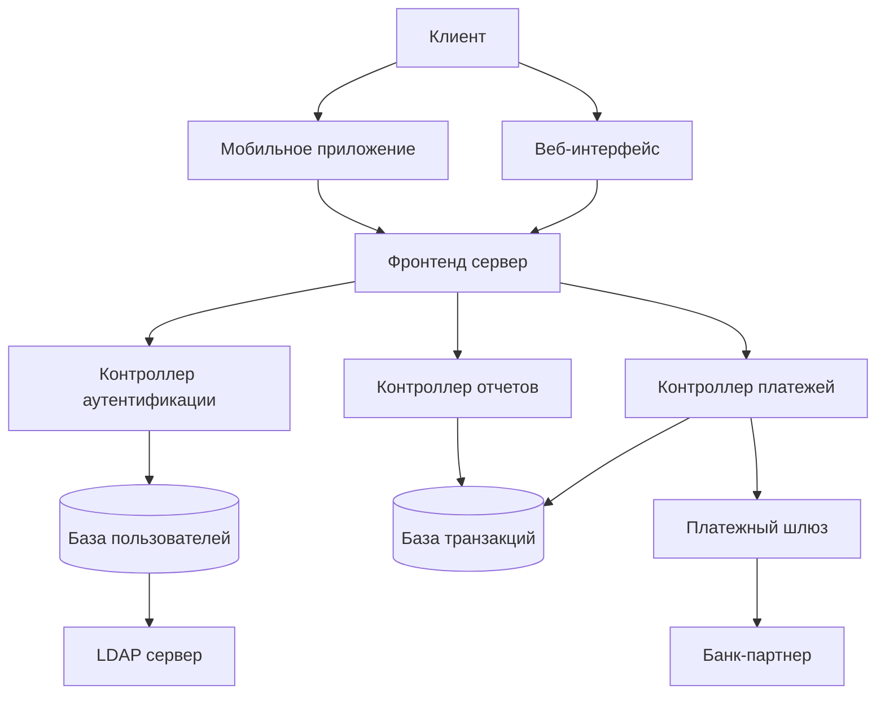

Подробно разберем процесс моделирования угроз безопасности информации — ключевую практику в современной разработке защищенных систем.

## 1. Подход STRIDE

STRIDE — это мнемоническая модель классификации угроз, разработанная Microsoft. Каждая буква обозначает категорию угроз:

### **S - Spoofing (Подмена/Фальсификация)**
- **Суть:** Неавторизованный доступ через подмену идентичности
- **Примеры:** 
  - Подделка IP-адреса, email-отправителя
  - Кража учетных данных
  - Подделка сессионных токенов
- **Контрмеры:** Аутентификация, цифровые подписи

### **T - Tampering (Изменение данных)**
- **Суть:** Несанкционированная модификация данных
- **Примеры:**
  - Изменение файлов конфигурации
  - Модификация передаваемых данных
  - Изменение кода приложения
- **Контрмеры:** Контроль целостности, хеши, цифровые подписи

### **R - Repudiation (Отказ от действий)**
- **Суть:** Возможность отрицать выполнение действия
- **Примеры:**
  - Пользователь отрицает отправку сообщения
  - Администратор отрицает изменение настроек
- **Контрмеры:** Логирование, аудит, цифровые подписи

### **I - Information Disclosure (Раскрытие информации)**
- **Суть:** Несанкционированный доступ к информации
- **Примеры:**
  - Перехват трафика
  - Неправильные настройки прав доступа
  - Утечка данных через ошибки
- **Контрмеры:** Шифрование, контроль доступа

### **D - Denial of Service (Отказ в обслуживании)**
- **Суть:** Нарушение доступности сервиса
- **Примеры:**
  - DDoS-атаки
  - Блокировка учетных записей
  - Исчерпание ресурсов
- **Контрмеры:** Балансировка нагрузки, ограничение запросов

### **E - Elevation of Privilege (Повышение привилегий)**
- **Суть:** Получение прав выше разрешенных
- **Примеры:**
  - Исполнение кода с правами администратора
  - Обход проверок авторизации
3. **Контрмеры:** Принцип минимальных привилегий, проверка прав

## 2. Модели оценки угроз

### **Модель DREAD**

Используется для количественной оценки угроз по 5-параметрам:

#### **D - Damage Potential (Потенциальный ущерб)**
- 0: Никакого ущерба
- 5: Полный контроль над системой, кража всех данных

#### **R - Reproducibility (Воспроизводимость)**
- 0: Очень сложно воспроизвести
- 5: Атака работает всегда без специальных условий

#### **E - Exploitability (Эксплуатируемость)**
- 0: Требуется доступ к сети, глубокие знания
- 5: Атаку может провести обычный пользователь

#### **A - Affected Users (Количество затронутых пользователей)**
- 0: Ни одного
- 5: Все пользователи

#### **D - Discoverability (Обнаружаемость)**
- 0: Очень сложно обнаружить
- 5: Информация об уязвимости общедоступна

**Формула расчета:** `(D + R + E + A + D) / 5`

**Уровни риска:**
- Высокий: 4.0-5.0
- Средний: 2.0-3.9  
- Низкий: 0-1.9

### **Другие модели оценки**

#### **PASTA (Process for Attack Simulation and Threat Analysis)**
Семиэтапный процесс, сочетающий технические и бизнес-аспекты

#### **Trike**
Фреймворк, ориентированный на управление рисками с точки зрения стейкхолдеров

#### **OCTAVE (Operationally Critical Threat, Asset, and Vulnerability Evaluation)**
Подход, ориентированный на организационные риски и активы

## 3. Диаграммы потоков данных (DFD)

DFD — визуальное представление потоков информации в системе.

### **Элементы DFD:**

#### **Внешние сущности (External Entities)**
- Источники или получатели данных вне системы
- **Обозначение:** □ Прямоугольник
- **Примеры:** Пользователь, внешний API, банк

#### **Процессы (Processes)**
- Функции, преобразующие данные
- **Обозначение:** ○ Круг или прямоугольник с закругленными углами
- **Примеры:** "Аутентификация", "Обработка платежа"

#### **Накопители данных (Data Stores)**
- Места хранения информации
- **Обозначение:** ═ Две параллельные линии
- **Примеры:** База данных, кэш, файловая система

#### **Потоки данных (Data Flows)**
- Перемещение данных между элементами
- **Обозначение:** → Стрелка
- **Примеры:** "Учетные данные", "Токен доступа"

### **Уровни DFD:**

- **Уровень 0:** Контекстная диаграмма (система как один процесс)
- **Уровень 1:** Основные процессы системы
- **Уровень 2+:** Детализация отдельных процессов

## 4. Выявление уязвимостей на ранних этапах проектирования

### **Преимущества раннего выявления:**

- **Снижение стоимости:** Исправление на этапе проектирования в 100 раз дешевле, чем в продакшене
- **Проактивная защита:** Предотвращение инцидентов до реализации
- **Архитектурная безопасность:** Встроенные механизмы защиты

### **Методики:**

#### **Threat Modeling**
- Проведение сессий моделирования угроз для каждой компоненты
- Использование шаблонов атак (Attack Patterns)

#### **Security Requirements Engineering**
- Определение требований безопасности как нефункциональных требований
- Спецификация контроля доступа, аудита, шифрования

#### **Architecture Risk Analysis**
- Анализ архитектурных решений на предмет рисков
- Оценка компромиссов между безопасностью и производительностью

#### **Security Design Patterns**
- Использование проверенных шаблонов проектирования
- Примеры: фасад безопасности, посредник аутентификации

## 5. Практика: Построение DFD для сервиса онлайн-банкинга

### **Контекстная диаграмма (Уровень 0):**

```
[Клиент] --(Запрос на вход)--> [Система онлайн-банкинга] --(Запрос баланса)--> [Банковская система]
         --(Платежные данные)-->                           --(Транзакции)-->
```

### **Диаграмма Уровня 1:**



### **Элементы системы:**

- **Внешние сущности:** Клиент, Банк-партнер
- **Процессы:** Веб-интерфейс, Контроллер аутентификации, Контроллер платежей
- **Накопители:** База пользователей, База транзакций
- **Потоки данных:** Учетные данные, Платежные данные, Токены сессии

## 6. Определение угроз и рекомендации по защите

### **Анализ угроз с использованием STRIDE:**

#### **Угроза 1: Подмена клиента (Spoofing)**
- **Вектор:** Кража учетных данных
- **Элементы DFD:** Клиент → Контроллер аутентификации
- **Риск по DREAD:** (4+4+3+5+4)/5 = 4.0 (Высокий)
- **Контрмеры:**
  - Многофакторная аутентификация
  - Биометрия в мобильном приложении
  - OAuth 2.0 с PKCE

#### **Угроза 2: Изменение платежных данных (Tampering)**
- **Вектор:** MITM-атака на передаваемые данные
- **Элементы DFD:** Клиент → Платежный шлюз
- **Риск по DREAD:** (5+4+2+4+3)/5 = 3.6 (Средний)
- **Контрмеры:**
  - TLS 1.3 для всех соединений
  - Цифровые подписи запросов
  - Хеширование критичных данных

#### **Угроза 3: Раскрытие персональных данных (Information Disclosure)**
- **Вектор:** Неавторизованный доступ к базам данных
- **Элементы DFD:** База пользователей, База транзакций
- **Риск по DREAD:** (5+3+3+5+2)/5 = 3.6 (Средний)
- **Контрмеры:**
  - Шифрование данных на rest (AES-256)
  - Маскирование данных в логах
  - Строгий контроль доступа на основе ролей

#### **Угроза 4: Отказ в обслуживании (Denial of Service)**
- **Вектор:** DDoS-атака на фронтенд сервер
- **Элементы DFD:** Веб-интерфейс, Фронтенд сервер
- **Риск по DREAD:** (3+5+5+5+5)/5 = 4.6 (Высокий)
- **Контрмеры:**
  - WAF (Web Application Firewall)
  - CDN с DDoS-защитой
  - Rate limiting по IP и пользователям

### **Матрица рисков:**

| Угроза | Категория STRIDE | Риск DREAD | Приоритет |
|--------|------------------|------------|-----------|
| Подмена клиента | Spoofing | 4.0 | Высокий |
| Изменение платежей | Tampering | 3.6 | Средний |
| Раскрытие данных | Information Disclosure | 3.6 | Средний |
| Отказ в обслуживании | Denial of Service | 4.6 | Критический |

### **Рекомендации по защите:**

#### **Архитектурные рекомендации:**
1. **Микросервисная архитектура** с изоляцией критичных сервисов
2. **API Gateway** для централизованного управления доступом
3. **Service Mesh** для security policy enforcement

#### **Технические контрмеры:**
1. **Аутентификация:**
   - JWT с коротким временем жизни
   - Refresh tokens с отзывом
   - Анализ аномалий входа

2. **Авторизация:**
   - RBAC (Role-Based Access Control)
   - Attribute-Based Access Control для сложных политик
   - Мандатное управление доступом для критичных операций

3. **Шифрование:**
   - End-to-end encryption для платежных данных
   - Key Management System для управления ключами
   - Регулярная ротация ключей

4. **Мониторинг и аудит:**
   - SIEM-система для корреляции событий
   - DLP для предотвращения утечек
   - Полное логирование критичных операций

#### **Организационные меры:**
1. **Регулярные penetration testing**
2. **Security Code Review** для всего нового кода
3. **Threat Modeling** для каждого нового функционала
4. **Security Training** для разработчиков

### **Процесс непрерывного улучшения:**

1. **Plan:** Обновление модели угроз при изменениях в системе
2. **Do:** Внедрение контрмер согласно приоритету рисков
3. **Check:** Мониторинг эффективности контрмер
4. **Act:** Корректировка подходов на основе метрик

Такой систематический подход позволяет создавать безопасные системы с минимальными затратами, где безопасность встроена в архитектуру, а не добавляется как заплатка после инцидента.

