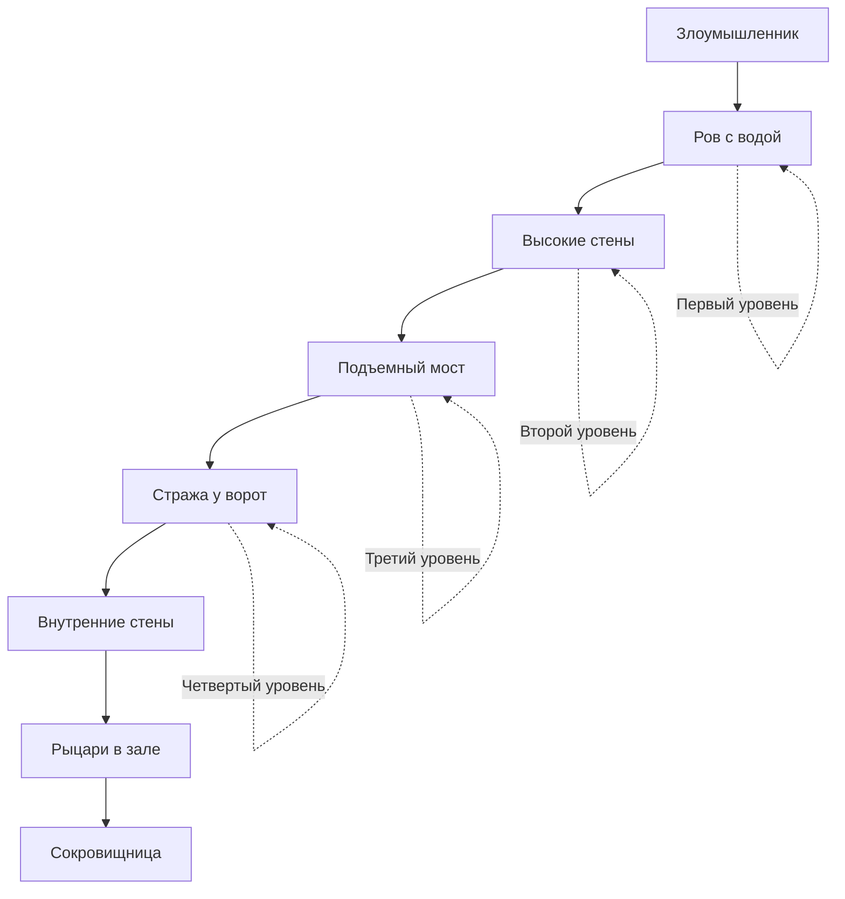
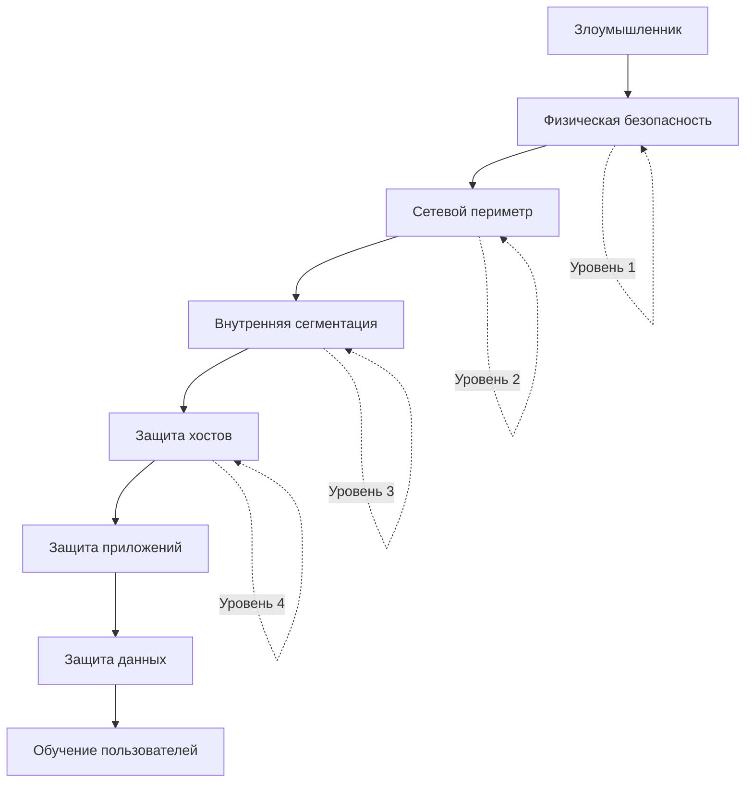
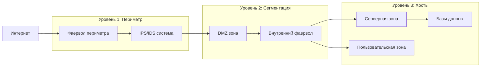
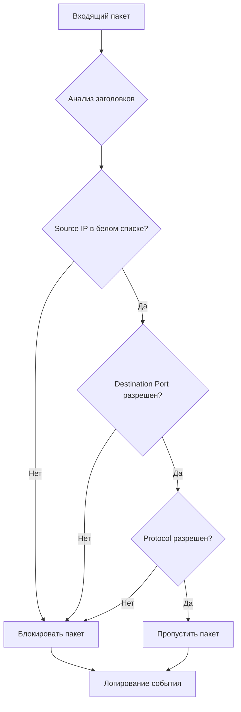
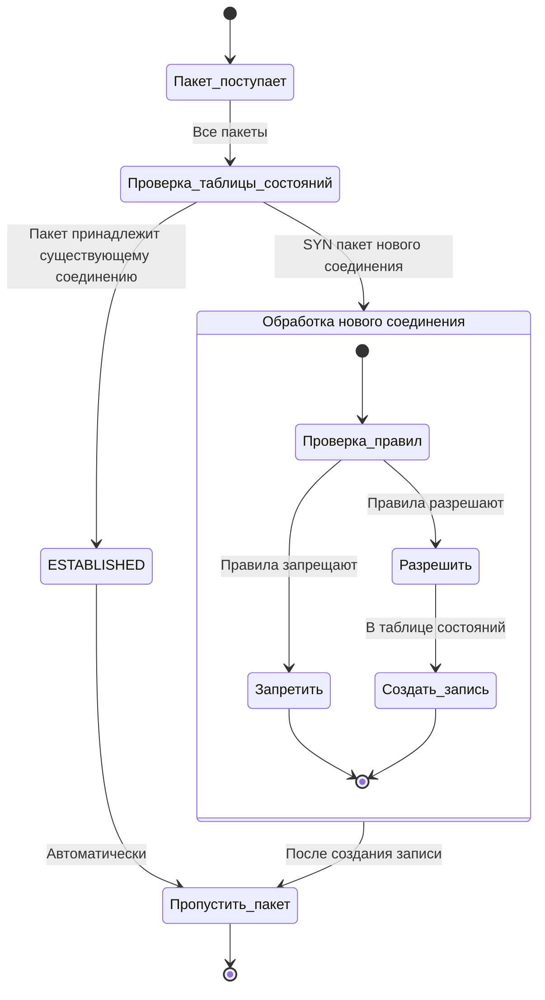
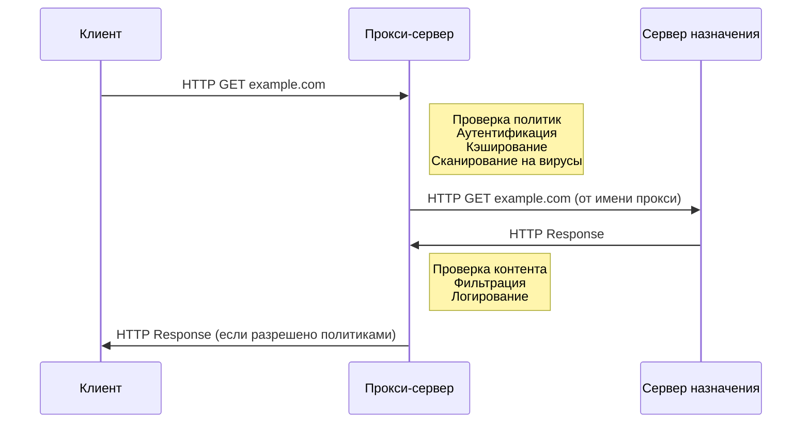
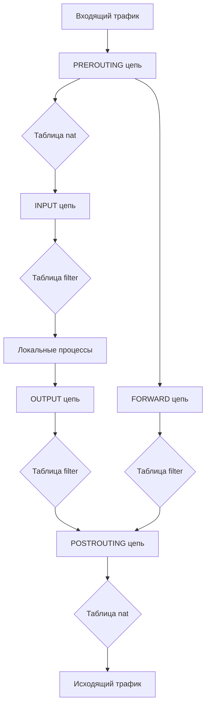
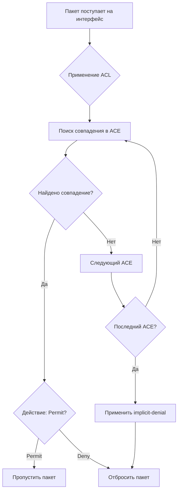
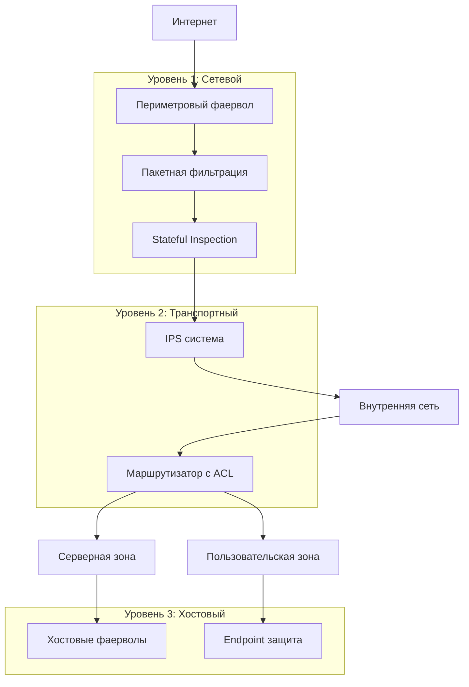

Отлично! Давайте подробно разберем эти концепции безопасности с диаграммами Mermaid.

---

## **🏰 КОНЦЕПЦИЯ ГЛУБОКОЭШЕЛОНИРОВАННОЙ ЗАЩИТЫ (DEFENSE IN DEPTH)**

### **Что это такое?**

**Глубокоэшелонированная защита** — это подход, когда безопасность обеспечивается множеством уровней защиты. Если злоумышленник преодолеет один уровень, его остановит следующий.

### **Аналогия: Средневековый замок**



### **Уровни защиты в ИТ-инфраструктуре:**



### **Реализация в корпоративной сети:**



---

## **🛡️ МЕЖСЕТЕВЫЕ ЭКРАНЫ (FIREWALLS)**

### **1. Пакетные фильтры (Packet Filtering)**

**Принцип работы:** Анализ отдельных пакетов по заданным правилам.



**Плюсы:**
- ✅ Высокая производительность
- ✅ Простота настройки
- ✅ Прозрачность для пользователей

**Минусы:**
- ❌ Не анализирует состояние соединения
- ❌ Уязвимы для IP-спуфинга
- ❌ Не понимают контекст приложений

### **2. Stateful Inspection**

**Принцип работы:** Отслеживание состояния соединений.



**Пример таблицы состояний:**
```bash
# Таблица Stateful Inspection
Protocol | Source IP:Port | Dest IP:Port | State     | Timeout
---------------------------------------------------------------
TCP      | 192.168.1.10:54321 | 8.8.8.8:443 | ESTABLISHED | 3600
TCP      | 192.168.1.11:49152 | 8.8.8.8:53  | SYN_SENT    | 60
UDP      | 192.168.1.12:55555 | 8.8.4.4:53  | ASSURED     | 30
```

### **3. Прокси-серверы (Proxy Servers)**

**Принцип работы:** Посредник между клиентом и сервером.



**Типы прокси:**
- **HTTP Proxy** — для веб-трафика
- **SOCKS Proxy** — для любого TCP/UDP трафика
- **Transparent Proxy** — не требует настройки клиента
- **Reverse Proxy** — защита серверов

---

## **🔧 ПРАКТИКА: НАСТРОЙКА IPTABLES**

### **Архитектура iptables:**



### **Базовые правила iptables:**

```bash
#!/bin/bash
# Базовая настройка фаервола

# Сброс всех правил
iptables -F
iptables -X
iptables -t nat -F
iptables -t nat -X

# Политики по умолчанию (DENY ALL)
iptables -P INPUT DROP
iptables -P FORWARD DROP
iptables -P OUTPUT DROP

# Разрешить loopback интерфейс
iptables -A INPUT -i lo -j ACCEPT
iptables -A OUTPUT -o lo -j ACCEPT

# Разрешить установленные соединения
iptables -A INPUT -m state --state ESTABLISHED,RELATED -j ACCEPT
iptables -A OUTPUT -m state --state ESTABLISHED,RELATED -j ACCEPT

# Разрешить SSH (порт 22)
iptables -A INPUT -p tcp --dport 22 -j ACCEPT

# Разрешить HTTP/HTTPS
iptables -A INPUT -p tcp --dport 80 -j ACCEPT
iptables -A OUTPUT -p tcp --dport 80 -j ACCEPT
iptables -A INPUT -p tcp --dport 443 -j ACCEPT
iptables -A OUTPUT -p tcp --dport 443 -j ACCEPT

# Разрешить DNS запросы
iptables -A OUTPUT -p udp --dport 53 -j ACCEPT
iptables -A INPUT -p udp --sport 53 -j ACCEPT

# Логирование отклоненных пакетов
iptables -A INPUT -j LOG --log-prefix "IPTABLES_INPUT_DENIED: "
iptables -A FORWARD -j LOG --log-prefix "IPTABLES_FORWARD_DENIED: "
iptables -A OUTPUT -j LOG --log-prefix "IPTABLES_OUTPUT_DENIED: "
```

### **CheckPoint правила:**

```bash
# Пример правил CheckPoint в формате Gaia
# Правило 1: Разрешить веб-трафик
add rule access.1 source=Any destination=Any service=http,https action=Accept

# Правило 2: Разрешить SSH только из trusted сетей  
add rule access.2 source=192.168.1.0/24 destination=Any service=ssh action=Accept

# Правило 3: Запретить всё остальное (неявно)
add rule access.3 source=Any destination=Any service=Any action=Drop

# Применить правила
pfctl install
```

---

## **📋 СПИСКИ КОНТРОЛЯ ДОСТУПА (ACL)**

### **Архитектура ACL:**



### **1. Стандартные ACL (Standard ACL)**

**Синтаксис Cisco:**
```bash
# Создание стандартной ACL
access-list 10 permit 192.168.1.0 0.0.0.255
access-list 10 permit 192.168.2.10
access-list 10 deny any

# Применение к интерфейсу
interface gigabitethernet0/0
ip access-group 10 in
```

**Особенности:**
- Фильтрация только по **Source IP**
- Номера 1-99, 1300-1999
- Применяются ближе к месту назначения

### **2. Расширенные ACL (Extended ACL)**

**Синтаксис Cisco:**
```bash
# Создание расширенной ACL
access-list 101 permit tcp 192.168.1.0 0.0.0.255 any eq 80
access-list 101 permit tcp 192.168.1.0 0.0.0.255 any eq 443
access-list 101 permit udp 192.168.1.0 0.0.0.255 any eq 53
access-list 101 deny tcp any any eq 23  # Блокировать Telnet
access-list 101 permit ip any any

# Применение к интерфейсу
interface gigabitethernet0/1
ip access-group 101 out
```

**Поля для фильтрации:**
- ✅ Source IP
- ✅ Destination IP  
- ✅ Protocol (TCP/UDP/ICMP)
- ✅ Source Port
- ✅ Destination Port
- ✅ TCP Flags
- ✅ Временные диапазоны

### **Практические примеры ACL:**

```bash
# Защита сети офиса
access-list 110 remark === OFFICE SECURITY ===
access-list 110 permit tcp 192.168.1.0 0.0.0.255 any established
access-list 110 permit udp 192.168.1.0 0.0.0.255 any eq domain
access-list 110 permit tcp 192.168.1.0 0.0.0.255 any eq www
access-list 110 permit tcp 192.168.1.0 0.0.0.255 any eq 443
access-list 110 deny ip any any log

# Защита серверной зоны
access-list 120 permit tcp 192.168.1.0 0.0.0.255 host 192.168.10.10 eq 22
access-list 120 permit tcp 192.168.2.0 0.0.0.255 host 192.168.10.20 eq 80
access-list 120 deny ip any 192.168.10.0 0.0.0.255
access-list 120 permit ip any any
```

### **Named ACL (Именованные ACL):**

```bash
# Создание именованной ACL
ip access-list extended WEB-SERVER-PROTECTION
 permit tcp 192.168.1.0 0.0.0.255 host 10.1.1.10 eq 80
 permit tcp 192.168.1.0 0.0.0.255 host 10.1.1.10 eq 443
 deny tcp any host 10.1.1.10 eq 22
 permit ip any any
 remark === END OF WEB SERVER ACL ===

# Применение
interface gigabitethernet0/0
 ip access-group WEB-SERVER-PROTECTION in
```

---

## **🎯 ИНТЕГРИРОВАННАЯ СИСТЕМА ЗАЩИТЫ**



### **Ключевые принципы:**

1. **Многоуровневость** — защита на каждом уровне сети
2. **Разделение обязанностей** — разные технологии для разных задач  
3. **Минимальные привилегии** — разрешать только необходимое
4. **Защита в глубину** — даже если один уровень падет, другие продолжат защищать
5. **Постоянный мониторинг** — обнаружение и реагирование на инциденты

Эта комплексная система обеспечивает надежную защиту корпоративной инфраструктуры от современных киберугроз! 🛡️🚀