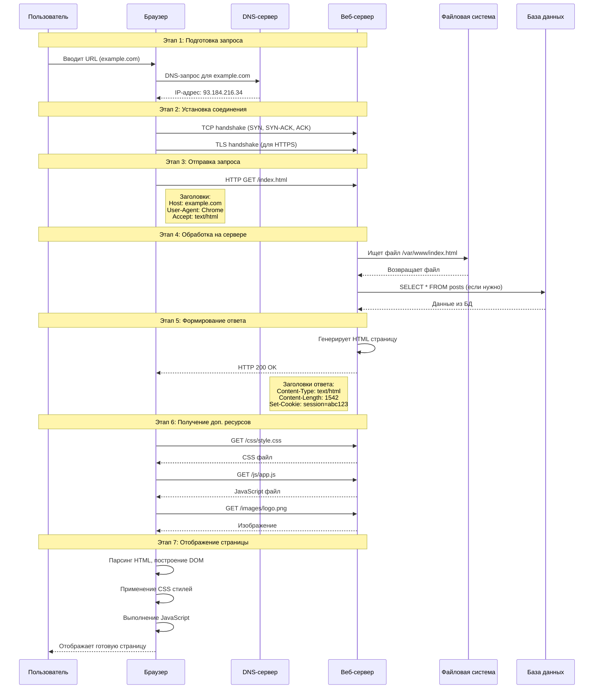
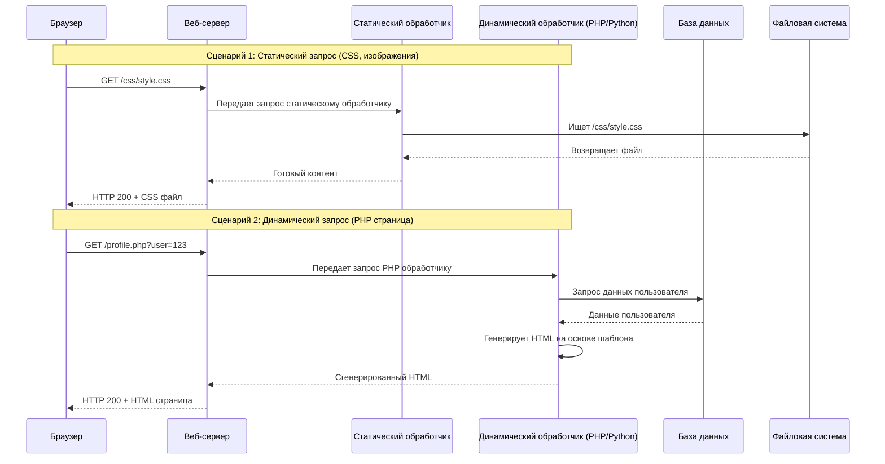
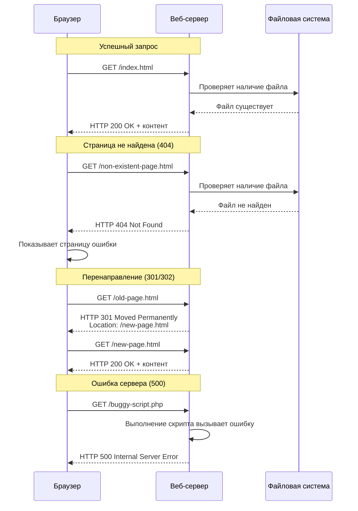
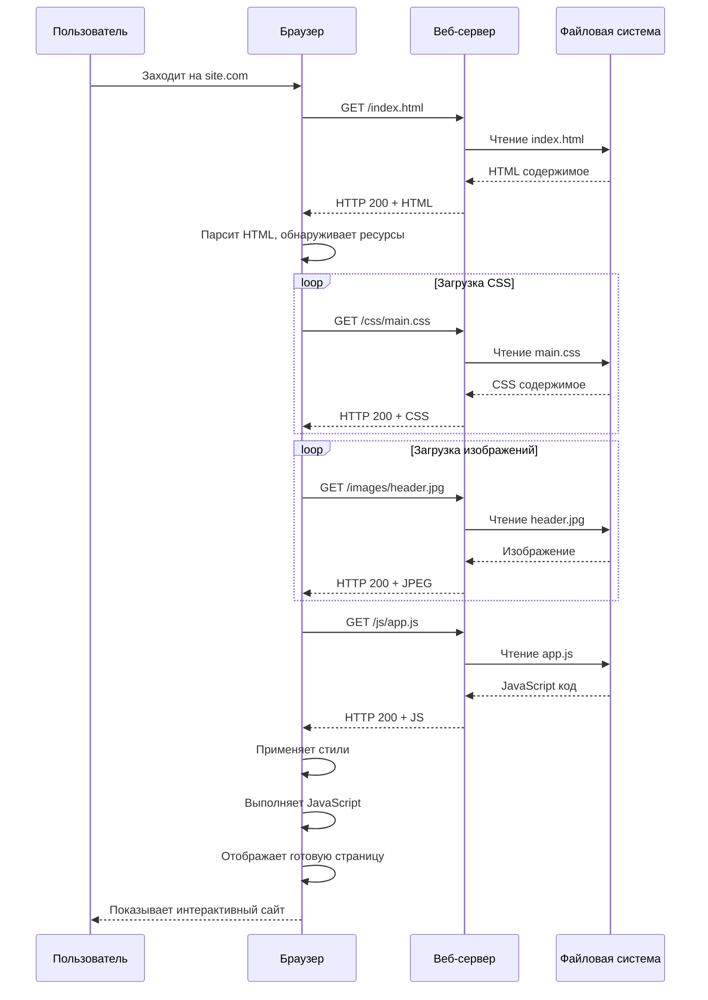
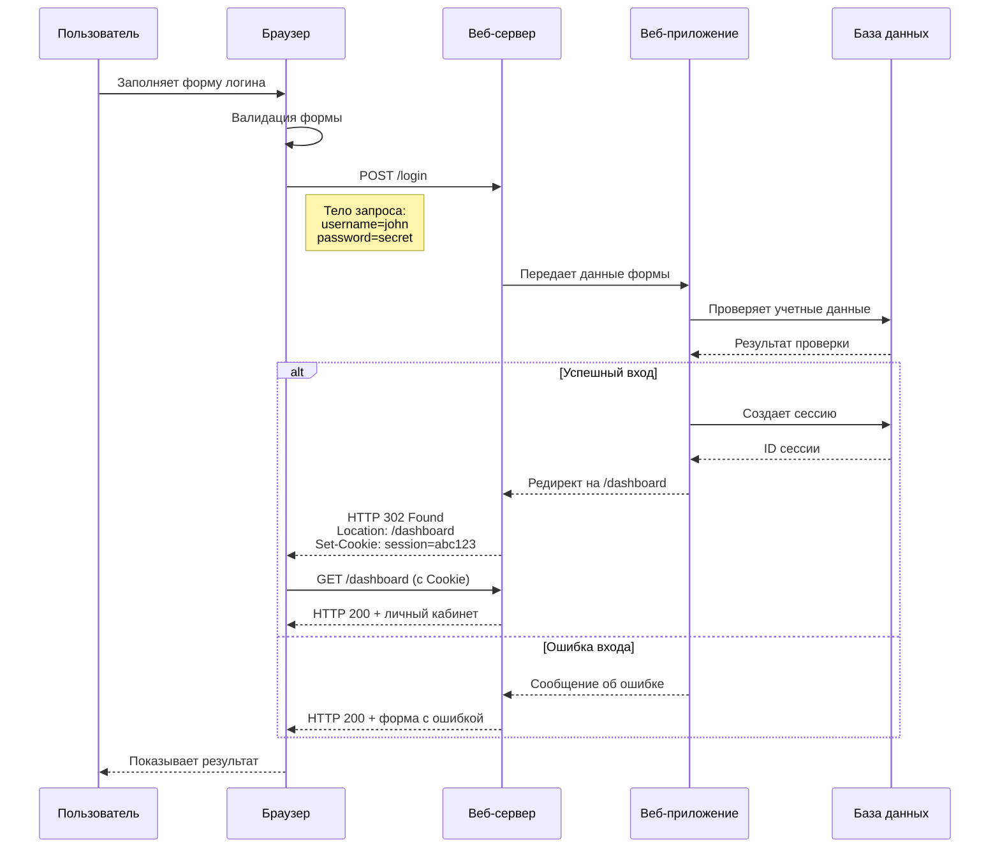

### Общая картина: Веб-сервер как ресторан

Представьте себе популярный ресторан.

*   **Клиент (Ваш браузер)** — это вы, посетитель, который делает заказ.
*   **Веб-сервер (Например, Nginx, Apache)** — это весь ресторан: кухня, зал, администратор и официанты.
*   **Сайт (HTML, CSS, картинки)** — это блюдо, которое вы заказали.
*   **Запрос (Request)** — это ваш заказ официанту.
*   **Ответ (Response)** — это готовое блюдо, которое вам приносят.

А теперь давайте проследим весь процесс от начала до конца.

---

### Подробное пошаговое объяснение

#### Шаг 0: Подготовка (Сервер "открывается на работу")

Прежде чем кто-либо сможет сделать заказ, ресторан должен быть готов к работе.

1.  **Сервер запускается.** Это как ресторан открывает свои двери в начале дня.
2.  **Сервер "слушает" порт.** У каждого сервера есть "дверь", которую он постоянно "слушает". Эта дверь называется **порт** (по умолчанию для веба — порт 80 для HTTP и 443 для HTTPS). Представьте, что официант стоит у входа и ждет, не появится ли клиент.
3.  **На сервере лежат файлы сайта.** На жестком диске сервера заранее размещены все файлы вашего сайта: HTML-страницы, CSS-стили, JavaScript-скрипты, картинки и т.д. Это как на кухне лежат все необходимые продукты и есть поваренная книга с рецептами (код сайта).

---

#### Шаг 1: Пользователь инициирует запрос (Вы делаете заказ)

Вы вводите адрес (например, `www.example.com`) в браузере и нажимаете Enter.

1.  **Браузер преобразует домен в IP-адрес.** Ваш браузер не понимает "словесные" адреса. Он использует **DNS-сервер** (как телефонная книга интернета), чтобы найти числовой адрес (IP-адрес), связанный с `www.example.com`. Например, `93.184.216.34`.
2.  **Браузер устанавливает соединение.** Теперь, зная точный адрес "ресторана", ваш браузер "звонит ему по телефону" — устанавливает соединение с сервером по найденному IP-адресу и порту (обычно 443).
3.  **Браузер отправляет HTTP-запрос.** Как только соединение установлено, браузер отправляет на сервер специально составленное сообщение — **HTTP-запрос**. Вот что внутри этого "заказа":

    *   **Метод запроса (HTTP Method):** Чаще всего `GET` (просьба "дать мне страницу") или `POST` (просьба "прими эти данные", например, из формы входа).
    *   **URL (Путь):** Конкретная страница или ресурс, который вы хотите. Например, `/blog/post-1.html`.
    *   **Заголовки (HTTP Headers):** Дополнительная информация о запросе: тип браузера, какие языки вы понимаете, куки (если вы были в этом "ресторане" раньше) и т.д.
    *   **Тело (Body):** Есть не у всех запросов. В основном у `POST`-запросов, куда помещаются данные из форм.

---

#### Шаг 2: Сервер обрабатывает запрос (Ресторан готовит ваш заказ)

Сервер получает ваш "заказ" и начинает его обрабатывать.

1.  **Парсинг (анализ) запроса.** Сервер "читает" ваше сообщение. Он понимает, что вы хотите получить страницу `/blog/post-1.html` методом `GET`.
2.  **Поиск и выполнение.** Сервер ищет запрошенный файл на своем жестком диске.
    *   **Если это статический файл** (например, `.html`, `.css`, `.jpg`), который уже лежит готовым, сервер просто находит его. Это как если бы вы заказали салат, который уже стоит в холодильнике порциями.
    *   **Если это динамический запрос** (например, `.php`, `.py`, доступ к базе данных), сервер запускает специальную программу (скрипт), которая генерирует страницу "на лету". Это как если бы вы заказали сложное горячее блюдо, которое повар готовит специально для вас по рецепту. Скрипт может обратиться к базе данных, чтобы получить список товаров, комментарии пользователей и т.д.

---

#### Шаг 3: Сервер отправляет ответ (Официант несет вам готовое блюдо)

После того как сервер подготовил ответ (нашел статический файл или выполнил скрипт), он отправляет его обратно вашему браузеру.

1.  **Формирование HTTP-ответа.** Сервер создает ответное сообщение. Оно состоит из:
    *   **Статус-код (Status Code):** Самая важная короткая информация. Например:
        *   `200 OK` — "Всё отлично, держи твой заказ!"
        *   `404 Not Found` — "Прости, но такого блюда (файла) у нас в меню нет."
        *   `500 Internal Server Error` — "На кухне случился пожар, мы не можем выполнить твой заказ."
        *   `301 Moved Permanently` — "Блюдо теперь подают в другом зале (по другому адресу), иди туда."
    *   **Заголовки ответа (Response Headers):** Информация о "блюде": какой это тип контента (`text/html`, `image/jpeg`), размер файла, дата приготовления и инструкции для браузера (например, кэшировать ли эту страницу).
    *   **Тело ответа (Response Body):** Сама суть — HTML-код страницы, данные картинки или любой другой запрошенный контент.

---

#### Шаг 4: Браузер рендерит страницу (Вы едите блюдо и наслаждаетесь)

Ваш браузер получает ответ от сервера.

1.  **Анализ ответа.** Браузер смотрит на статус-код. Если это `200 OK`, он понимает, что всё хорошо, и начинает "поедать" содержимое.
2.  **Парсинг HTML.** Браузер читает HTML-код и строит из него **DOM-дерево** — внутреннюю структуру страницы.
3.  **Запрос дополнительных ресурсов.** Часто в HTML-коде есть ссылки на другие файлы: CSS-стили, JavaScript-код, картинки. Для КАЖДОГО из этих файлов браузер проделывает **Шаги 1-3 заново**! Он отправляет новые HTTP-запросы на тот же сервер, чтобы получить `style.css`, `script.js` и `logo.png`.
4.  **Отображение (Рендеринг).** Когда все основные ресурсы загружены, браузер:
    *   Применяет CSS-стили к DOM-дереву.
    *   Выполняет JavaScript-код.
    *   И, наконец, отрисовывает готовую, красивую страницу в окне браузера.

---

### Ключевые выводы 

1.  **Это цикл "Запрос-Ответ"**. Взаимодействие всегда инициируется клиентом. Сервер не может сам решить "отправить" вам что-то. Он только отвечает на запросы.
2.  **HTTP/HTTPS — это язык общения.** Браузер и сервер "разговаривают" друг с другом по правилам протокола HTTP (или его защищенной версии HTTPS).
3.  **Статика vs. Динамика.** Сервер может просто отдавать готовые файлы, а может выполнять код для генерации уникальной страницы для каждого пользователя.
4.  **Браузер делает большую работу.** Сервер дает "сырые данные" (HTML, CSS, JS), а браузер — это мощный движок, который превращает эти данные в визуальную страницу.

## 1. Основная схема работы веб-сервера

## 2. Обработка статических vs динамических запросов

## 3. Обработка различных HTTP-статусов

## 4. Полный цикл с загрузкой дополнительных ресурсов

## 5. Работа с POST-запросами (формы, API)

## Объяснение ключевых компонентов:

### Участники процессов:
- **Браузер** - инициатор запросов
- **DNS-сервер** - преобразует домены в IP-адреса  
- **Веб-сервер** (Nginx/Apache) - принимает и обрабатывает запросы
- **Файловая система** - хранит статические файлы
- **База данных** - хранит динамические данные
- **Веб-приложение** (PHP/Python) - обрабатывает бизнес-логику

### Ключевые этапы:
1. **DNS-резолвинг** - поиск IP по доменному имени
2. **Установка соединения** - TCP и TLS handshake
3. **HTTP-запрос** - основной запрос с заголовками
4. **Обработка на сервере** - поиск файлов или выполнение кода
5. **HTTP-ответ** - возврат результата со статусом
6. **Рендеринг** - построение страницы в браузере

